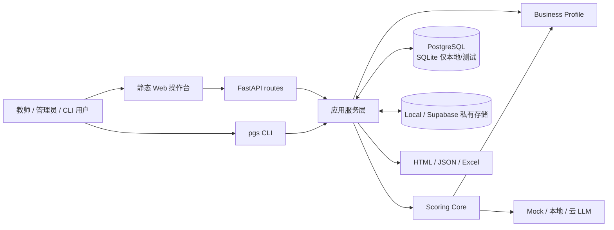
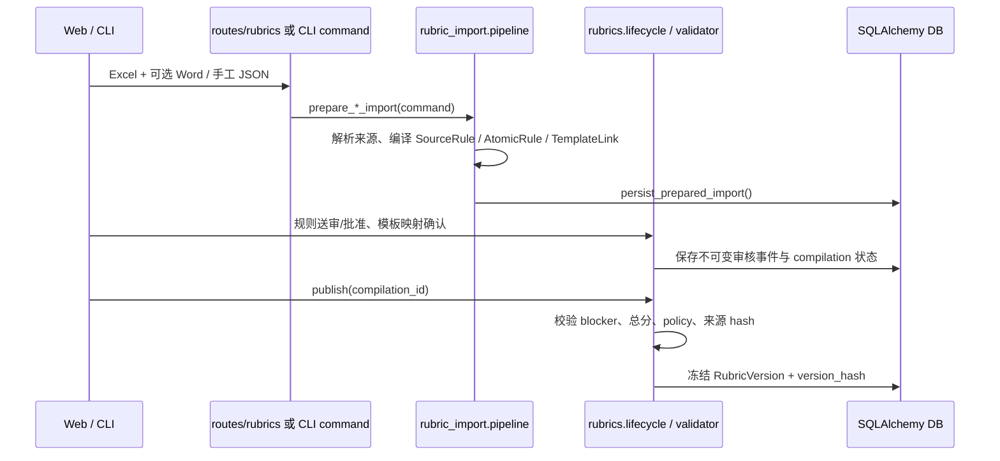
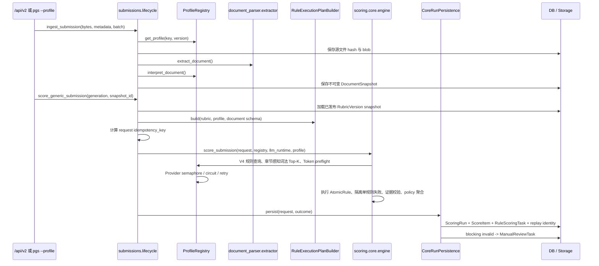

# 系统架构

> 当前事实快照：2026-09-07。运行时为 Python 3.10+（CI/锁文件使用 3.12），Alembic head 为 `0023_rule_scoring_review_tasks`。本文描述已实现代码，不代替 Accepted ADR、数据库迁移或发布门禁。

## 1. 系统边界

本项目是模板驱动的通用评分系统。它把用户授权的 Excel/Word 评分材料编译为可审核、可发布、不可变的评分版本；把 DOCX/PDF 转成结构化文档快照；再由确定性检查器和 LLM 检查器逐条执行 AtomicRule，最后进入人工复核、报告和表格导出。

当前同时保留两条入口：

- v1 论文兼容链路：`Paper` / `GradingBatch` / `score_paper()`，服务既可执行旧未版本化标准，也可把锁定正式 `RubricVersion` 的批次强制送入 Core。
- v2 通用链路：`Submission` / `EvaluationBatch` / `score_generic_submission()`，必须绑定唯一已发布的 `RubricVersion` 与明确的 Profile。

当前生产 Profile 是 `thesis / thesis-legacy-profile@1` 与 `technical_proposal / technical-proposal-profile@1`。`SCORING_ENGINE_MODE` 默认 `legacy`，只控制未版本化兼容入口；正式 `RubricVersion` 始终走 AtomicRule Core。没有真实 GATE-03 的 `gating_eligible=true` 产物和维护者批准，不得把默认模式改为 Core。

## 2. 分层与依赖规则

| 层 | 主要路径 | 职责 | 边界 |
|---|---|---|---|
| 入口层 | `frontend/web/`、`backend/app/api/routes/`、`backend/app/cli/` | 收集请求、鉴权、校验传输 schema、映射 HTTP/CLI 输出 | 不实现评分规则；Web 与 CLI 复用服务层 |
| 应用编排层 | `backend/app/services/` | 导入、摄取、评分编排、复核、批任务、报告、集成与部署诊断 | 负责事务和基础设施适配，不把业务扣分值写死 |
| 通用 Core | `services/scoring/core/` | 构建/执行版本化规则计划，校验证据，聚合分数，生成可重放结果 | 不依赖 FastAPI、SQLAlchemy 模型或具体论文结构；基础设施经 port/adapter 注入 |
| Profile 层 | `services/scoring/profiles/` | 解释特定文档、注册 checker、提供运行身份与展示扩展 | 不预置用户未授权的业务分值；Profile key/version 必须显式匹配 |
| Adapter 层 | `services/scoring/adapters/` | 从数据库加载冻结 Rubric、保存 Core run、兼容 v1、生成比较产物 | 不改变 Core 合同含义，不伪造正式版本身份 |
| 持久化层 | `backend/app/db/`、`alembic/` | SQLAlchemy 模型、会话、约束与逐版本迁移 | 生产以 PostgreSQL 16 迁移结果为准；测试 `create_all` 不能替代 Alembic 验证 |
| 外部适配层 | `services/llm/`、`services/llm_observability.py`、`services/storage/`、`services/spreadsheet/` | 模型、LLM Trace、对象存储、在线/离线导出 | 默认 Mock；外呼受配置、离线模式、BYOK 和安全检查约束；Langfuse 不可用不得中断评分 |

关键依赖方向是 `routes/CLI -> services -> Core contracts/ports`。Core 不反向导入 API、ORM 或具体存储实现；Profile 通过注册表和显式 identity 参与，不以可变中文名称调度。

## 3. 模块边界

| 模块 | 已实现职责 | 不应承担的职责 |
|---|---|---|
| `api/routes/auth.py`、`organizations.py`、`api/deps.py` | Cookie 会话、当前主体、组织角色和资源可见性 | 评分与文档解析 |
| `api/routes/rubrics.py`、`services/rubric_import/`、`services/rubrics/` | Excel/Word/手工 JSON 导入，来源图，规则编译，逐条审核，模板映射确认和发布校验 | 自动批准规则；从缺失材料臆造扣分或档位 |
| `services/document_parser/` | DOCX/PDF 提取、标题/章节、格式、修订痕迹、分块和解析质量 | 决定用户未授权的评分分值 |
| `services/papers/ingestion.py` | v1 上传、存储、解析、chunk 落库与可恢复重新解析 | v2 Profile 解释和 Core 计划构建 |
| `services/submissions/lifecycle.py` | v2 EvaluationBatch、Submission、不可变 DocumentSnapshot、Core 评分生命周期 | 旧未版本化评分兼容 |
| `services/scoring/engine.py` | v1 入口、legacy/Core/compare 路由、collect-compute-persist、人工改分和复核 | 允许正式 RubricVersion 回退到任意分值 legacy 路径 |
| `services/scoring/core/` | DTO、证据、policy、计划、checker registry、规则执行与聚合 | 数据库事务、HTTP 响应、文件系统细节 |
| `services/checkers/`、`services/coherence/`、`services/scoring/retrieval/` | 确定性判定、findings 转扣分、一致性分析、V4 章节感知词法证据选择与 Token Budget | 把“未召回”当作“全文不存在”的证明；当前不宣称向量召回或 reranker 已实现 |
| `services/batch_scoring/jobs.py` | 持久化任务、租约/心跳、逐论文检查点、取消、定向重试和观察指标 | 授予 GATE-03 或默认 Core 切换权限 |
| `services/calibration/`、`eval/`、`services/release_gates.py` | 锚点、QWK/MAE/漂移、候选和人工批准记录 | 把 Mock/test-only 演练声明为生产门禁通过 |
| `services/report/`、`services/spreadsheet/` | v1/v2 HTML、JSON、Excel、在线写表适配 | 修改历史评分结果 |
| `services/deployment/`、`backend/app/scripts/ops_backup.py` | inventory、OPS readiness、Postgres 验证、带 manifest 的备份/校验/恢复 | 以 OPS 绿色替代评分质量发布批准 |
| `services/ai_connections.py`、`services/llm/`、`services/cache/` | 私有 BYOK 加密/快照、provider 适配、重试、诊断、L0 缓存、按连接的进程内并发与熔断 | 把部署级旧 Key 复制成用户私有连接；在 Core 外改变已冻结策略；把进程内额度误当成跨实例全局额度 |
| `services/llm_observability.py` | 以 Langfuse v4/OpenTelemetry 建立 `scoring_run -> rule_scoring_task -> llm_generation -> retry_attempt` Trace，从应用源头脱敏和采样 | 保存权威分数/任务状态；默认上传完整 Prompt/论文；让 Exporter 失败传播到评分主链 |

## 4. 核心调用链

### 4.1 评分标准导入与发布

发布不会自动批准规则、确认模板链接或清除 blocker。正式批次必须锁定唯一且一致发布的 `RubricVersion`。

### 4.2 v2 Submission -> Core

同一 `submission + DocumentSnapshot + plan/runtime identity + rescore_generation` 生成稳定幂等键；重复请求返回既有 run，不能占用另一评分目标的身份。

当前 V4 选择器只使用可重放的词法排名、章节过滤/多样化和完整 EvidenceUnit，不截断引用。它是避免整篇正文直接进入 Provider 的安全基线，不是混合向量检索的最终实现。Provider 适配器在实际序列化 system/user 消息后再次检查输入、输出预留和 safety margin；预算不足转为规则级 `TOKEN_BUDGET_UNSATISFIABLE`。

语义规则异常由 Core 转成稳定 invalid outcome，其他无依赖规则继续。运行落库时，`RuleScoringTask` 保存每条 AtomicRule 的结果或安全 Provider 错误；blocking invalid 自动生成 `ManualReviewTask`。open/claimed blocking 任务存在时，总分和等级为空。人工只能在领取后、携带当前 `version`、并引用冻结 DocumentSnapshot 中真实 EvidenceUnit 的情况下定分。

本轮检查点在一次 Core 计算结束后批量持久化，因此支持审计和部分结果保留，但尚不能在进程中断点从单规则续跑。单论文规则执行仍为顺序模式；进程内 semaphore/circuit 只保护当前实例，跨 Vercel 实例的全局 RPM/TPM 与分布式熔断属于后续调度层。

### 4.3 v1 Paper 兼容链路

`routes/scoring.py` 或批次/CLI 调用 `services.scoring.engine.score_paper()`：

1. 根据批次是否锁定正式 `RubricVersion` 决定权威路径。锁定版本时无条件进入 `_score_paper_core()`。
2. 未版本化批次才读取 `SCORING_ENGINE_MODE`：`legacy` 返回 legacy；`compare` 返回 legacy 并保存非权威 Core 比较；`core` 仅用于明确隔离验证。
3. legacy 使用 `collect_scoring_inputs()` 预取数据，提交/释放事务后由 `compute_scoring()` 执行确定性、findings、hybrid 或 LLM 路由，最后 `persist_scoring()` 短事务落库。
4. 评分模式由 criterion 决定：结构化 findings、deterministic、hybrid、deductive、banded 或 `llm_direct`。代码只执行已授权规则，不生成业务扣分标准。

### 4.4 批评分、人工复核与导出

- v1 简单批次可调用 `score_batch()`；可恢复批任务由 `POST /api/batches/{id}/score-jobs` 创建，经 `/run` 执行。
- `BatchScoringJob` 保存 generation、观察策略 hash、runner lease/heartbeat；`BatchScoringItem` 保存逐论文状态、attempt、错误和 telemetry。取消只影响未启动项，重试只恢复失败/取消项。
- `ScoreItem` 保留 AI 结果与人工 final 值；`ReviewLog` 记录理由和操作者。v2 的 invalid/block item 必须经显式 resolution capability 后才能提交复核。
- 报告和导出只投影持久化结果：v1 走 `report/generator.py`、`spreadsheet/excel.py`；v2 走 `generic_export.py`、`generic_generator.py`、`spreadsheet/generic.py`。

## 5. 数据流与持久化

### 5.1 主要数据域

| 数据域 | 关键实体 | 生命周期/约束 |
|---|---|---|
| 身份与租户 | `User`、`Organization`、`OrganizationMember`、`AuthSession`、`AuditLog` | 资源查询按组织过滤；角色控制导入、评分、复核和成员管理 |
| 私有模型 | `AIConnection`、`AIUsageLedger` | Key 使用独立 `BYOK_MASTER_KEY` 加密；批次冻结连接快照与 key version，变化后要求重建任务 |
| 评分标准来源图 | `Rubric`、`RubricCriterion`、`RubricCompilation`、`SourceArtifact`、`SourceRule`、`TemplateItem`、`AtomicRule`、`RuleLevel`、`RuleTemplateLink`、`RubricVersion` | 草稿可重编译；发布版本、hash、policy 和来源身份不可变 |
| v2 文档 | `EvaluationBatch`、`Submission`、`DocumentSnapshot` | 源文件按 SHA-256 标识；快照含 parser/normalizer/profile/content hash，不向普通读取端点返回全文 |
| v1 文档 | `GradingBatch`、`Paper`、`PaperChunk` | 保存解析状态、对象引用、结构化 JSON 与证据块；正式批次锁定 rubric version |
| 执行与复核 | `ScoringRun`、`ScoreItem`、`RuleScoringTask`、`ManualReviewTask`、`ReviewLog` | Core run 保存完整身份；规则任务保存结果/错误检查点；人工任务按组织、版本和冻结证据解决；历史自动结果不重写 |
| 批任务与门禁 | `BatchScoringJob`、`BatchScoringItem`、`ReleaseGateProfile`、`ReleaseGateRun`、`ReleaseGateApproval` | 持久化恢复、观察和审批链；test-only 结果不可转为生产授权 |
| 校准与输出 | `CalibrationAnchor`、`SpreadsheetWriteLog` | 锚点按 code 注入；Google/Mock 写表及 v1/v2 Excel 导出均留审计日志，`target_type` 区分通道 |

### 5.2 文件与对象存储

- `STORAGE_PROVIDER=local` 时，`storage/uploads`、`parsed`、`reports`、`exports` 保存应用产物，L0 缓存位于同一存储根。
- `STORAGE_PROVIDER=supabase` 时，浏览器可通过签名 URL/TUS 直传私有桶；服务端只签名、确认大小/归属并触发解析。对象路径按组织、批次和资源隔离。
- 数据库保存对象引用和内容 hash，不应依赖可变本地绝对路径作为可重放身份。
- 备份必须同时覆盖数据库和完整 storage，并用 manifest SHA-256 验证；恢复只允许精确确认的隔离数据库和空 storage 目标。

## 6. 运行与部署拓扑

- 本地 Web：FastAPI 同进程托管 `/api` 与 `frontend/web` 静态文件，可使用临时 SQLite。
- 本地 CLI：`pgs` 直接调用服务层，默认独立使用 `~/.paper-grading/cli.db` 与 `~/.paper-grading/storage`，不需要 Web 服务。
- 内网 Compose：Caddy HTTPS -> FastAPI app -> PostgreSQL 16，Postgres、应用 storage、备份和 Caddy CA 使用独立 volume；app 启动先 `alembic upgrade head`。
- Vercel 生产：`public/` 由构建脚本生成指纹化静态资源；Python API 使用 Supabase/Postgres 连接。Vercel Git 直部署关闭，生产只能由 GitHub Actions 门禁后执行 prebuilt deploy。

FastAPI 中数据路由受 `enforce_auth` 保护；auth 和公开集成自检在登录前可达，`ops-readiness` 单独要求鉴权。开启 `AUTH_ENABLED` 后，弱密码、弱 `AUTH_SECRET` 或原文 LLM debug 会使应用 fail closed。

## 7. 架构不变量与变更检查

- 用户授权的模板/Excel 决定扣哪项、扣几分；不得在 Profile、checker 或 prompt 中暗置业务分值。
- 正式 `RubricVersion`、`DocumentSnapshot`、执行计划、模型/Prompt/Checker/Anchor 身份共同支撑审计与重放。
- 证据不足、规则未授权、身份不一致或自动 checker 失败时 fail closed，并进入人工复核；不得静默给分。
- LLM 网络调用不得持有长数据库写事务；并发依赖 collect -> compute -> persist 或等价短事务边界。
- 修改 prompt 或输入构造时同步 bump `services/cache/llm_cache.PROMPT_VERSION` 与 Core 镜像版本，并重新执行相关 QWK/回归验证。
- 新端点/字段同时更新 schema、模型、Alembic 迁移和测试。SQLite 测试不替代 PostgreSQL 迁移/约束验证。
- OPS readiness、batch observation、compare artifact 和 test-only rehearsal 都不是 GATE-03 发布授权。
- LLM 观测默认 `metadata_only`：只导出内容 hash/字符数、运行身份、Token、延迟和脱敏错误。Langfuse 是可替换的诊断投影，业务数据库仍是唯一权威来源。
- blocking `ManualReviewTask` 未解决时 `final_total_score` 与 `grade` 必须为空；前端或普通 ReviewLog 不得绕过这一不变量。
- 0023 中的规则/人工任务是审计状态；表内有数据时 Alembic downgrade 必须 fail closed。默认采用应用向后兼容、数据库保留的回滚方式。
- PostgreSQL 中若存在生产最小权限角色 `pgs_app`，0023 同步授予新表 DML、启用 RLS 并建立与现有生产基线一致的 policy；无该角色的通用/CI 数据库不创建部署专属角色。

### 7.1 前端 v2 计划审查事实（2026-09-07 记录，阶段 0–6B 已于 2026-09-08 实施）

以下为**审查当日**的代码合同，保留原文以便对照。落地结果见 §7.2；两节冲突时以 §7.2 为准。

- 正式论文批次同样走 Core。Core `ScoreItem.evidence` 保存 `evidence_unit_id / evidence_type / locator / payload_hash`；`LegacyPaperAdapter.adapt()` 明确不使用可变 `PaperChunk` 作为快照身份。该引用不能直接按 `chunk_id` 关联正文。Core 持久化当前设置 `confidence=None`，不能用低置信度阈值代替复核状态。
- 阻塞项持久化为 `ManualReviewTask`，接口在 `/api/v2/manual-review-tasks`；领取、释放和解决使用任务版本，解决还需冻结快照证据。普通改分/ReviewLog 不提供这套能力，批量采纳的界面方案必须保留该边界。
- 旧 Web 已采用逐文件签名直传/TUS、归档确认、独立解析和恢复。`/papers/bulk-upload` 是同步上传并解析入口，不能据此认定生产大文件上传只是更换多选控件。
- `SpreadsheetWriteLog.target_type` 当前已有 `mock_sheet / google_sheets / excel / excel_v2`。v1 Excel 每个 run 写一条记录；历史日志不能统一重标为 Sheets，也不能直接视为“一行等于一次批次导出”。
- 本地 FastAPI 从 `frontend/web` 托管页面和资源，Docker 复制该目录；Vercel 经 Python 构建脚本生成 `public/`。当前尚无 Vite 构建、SPA 深链接回退或新旧页面切换实现。
- 运维能力尚非统一的组织管理员边界：`enforce_auth` 只验证主体；`/system/ops-readiness` 的服务查询全局批任务，`/system/integrations` 与 `/system/llm-check` 保持公开。新运维页的角色和数据范围不能仅靠前端隐藏实现。

本轮核对范围还包括批次状态写入口、导出历史粒度及浏览器门禁：**审查当日**批次 Create/Patch 可接收 status，七态转移守卫和新前端测试尚未实现。

用户已确认八条审查意见，修订后的 `docs/前端v2改造计划.md` 将冻结正文/证据展示与评分计算分层，普通复核与阻塞任务共同组成队列，保留上传恢复及旧日志；状态、权限、三部署产物和浏览器验收前置。D-019 已接受为待实施设计，§13 的 R1–R8 映射到接口、迁移、阶段和验收场景；这些目标不能当作本节所述的已实现事实。

### 7.2 前端 v2 落地事实（2026-09-08）

阶段 0–6B 已实施并于 2026-09-08 部署到生产。迁移 head 为 `0029_runtime_access_for_v2_tables`；
评分语义、`SCORING_ENGINE_MODE=legacy` 与 GATE-03 发布权限**均未改动**。

- **前端产物**：`frontend/workbench/`（Vite + Vue 3 + JS）经 `scripts/build_web_static.py --with-workbench`
  组装进 `public/`。FastAPI、Vercel、Docker 托管同一份产物；Docker 镜像 COPY `public/`（此前没有，
  容器里 `/workbench/*` 全是 404）。自托管 IBM Plex Mono 的 SIL OFL 许可证随产物发布并可经 HTTP 取到。
- **入口（2026-09-08 起）**：`/` 直接是工作台，**旧 SPA 已下线**，`/legacy/` 返回 404，
  `WORKBENCH_DEFAULT_ENTRY` 开关取消。`/login` `/register` `/reset-password` 由工作台承接——
  邮件里已发出的邀请与重置链接指向后两条。**入口在两处生效**：FastAPI 的路由，以及
  `build_web_static.py` 写出的 `public/index.html`；Vercel 直接静态托管后者，只改前者在生产上无效。
- **状态机**：`0024` 落七态 CHECK 与 `state_version`；所有转移经 `services/batches/state`。
  归档/重开是显式端点，目标阶段由服务端从当前结果推导。**旧写入口（`PATCH /score-items`、
  `POST /scoring-runs/{id}/review`）与新端点共用归档守卫，改分同样 bump `review_revision`**——
  否则归档只是标签，批量采纳的乐观并发也会被静默绕过。
- **结果选择器**：`services/batches/results` 是 KPI、进度、复核队列、统计、分布与导出预检的唯一口径，
  按 `BatchScoringItem.status` 判定本轮是否已有结论，不用时间戳。
- **证据与正文**：`document_view` / `evidence_view` 只投影，不改快照身份；Core 与 legacy 分别标注来源，
  引文与当前文本失配时只跳块不高亮。两个端点连同复核队列均为 `Cache-Control: private, no-store`。
- **复核原因**：结构化 `review_reasons[]`（source/code/message/rule_code）+ 派生展示文本。
  **当前只有确定性来源**（含 0025 之前历史行的显示回退）；模型侧尚未接入——它要求 bump
  `PROMPT_VERSION` 并按 §15 重锚 QWK，而可门禁基线不存在，须走 PGS-8 两阶段批准。
- **导出**：`ExportEvent` 三态（生成中/已生成/失败），**没有「已下载」**；旧 `SpreadsheetWriteLog`
  保留原表原值，`0028` 幂等补录且不按路径猜合并。**四个 GET 数据出口**（批次 xlsx、HTML 报告、
  JSON、导出日志）与两个事件写端点均受 `require_organization_role` 门控——组织归属只回答
  「是不是本组织的数据」，不回答「这个人该不该把它导出去」。
- **运行角色授权**：生产运行角色 `pgs_app` 无 DDL，也不会自动获得新表权限。建表的迁移必须自己
  `GRANT` + `ENABLE ROW LEVEL SECURITY` + 建 `pgs_app_dml` 策略（照 0023）。`0026/0027` 漏了，
  由 `0029` 补齐。**漏掉不会让迁移失败，而是让迁移成功之后应用 permission denied**；本地与 CI
  不建这个角色，两边都测不出来。
- **多组织**：切换组织时中止在途请求并清空全部组织级 store（此前只清 session，旧组织的学生姓名会
  留在界面上）。运维页对无权角色显式说明，不留白页。
- **门禁**：CI 前端 job 跑组件测试、`typecheck`、OpenAPI 合同差异（`api:dump && api:check`，
  生成的 `.d.ts` 经 JSDoc 真正参与类型检查）、产物漂移与浏览器验收；deploy 依赖它。
  浏览器验收覆盖 V01–V07、V09–V13，其中 V01/V02/V10 跑在独立的 `AUTH_ENABLED=true` 多组织后端上。
  **V08 的 Supabase 直传与 TUS 未覆盖**：需真实对象存储，Mock 路由不冒充真实验证。

### 7.3 平台默认模型（2026-09-09，V3-0a）

- **来源改变**：受保护部署（`AUTH_ENABLED` 且设了口令）的模型解析顺序为
  **绑定的 BYOK runtime → `platform_llm_config` 单例 → 抛错**。环境变量退化为
  开发与 CI 专用（`AUTH_ENABLED=false` 仍走 env，否则本地与浏览器验收会立刻断）。
- **这道判断排在 `provider == "mock"` 分支之前**。排在之后就是修复前的行为：
  `LLM_PROVIDER=mock`（默认值）直接返回 `MockLLMScorer`，于是没绑连接的评分
  悄悄产出假分数，界面无任何提示。
- **`PLATFORM_MANAGED_LLM_ENABLED` 不再授予任何权限**。留着它等于把刚堵上的洞用
  一个 env 重新打开：谁设的、设了什么，一概没有记录。
- **加密域隔离**：平台密钥用 `platform-llm|<config_id>|<version>` 作 AAD，BYOK 用
  `ai-connection|<org>|<owner>|<version>`。任一方的密文搬到另一方都解不开——否则
  加密只剩「存了密文」这一个作用，绑不住它属于谁。
- **会话由调用方传入**：`get_llm_scorer(session=...)`。工厂自己开会话会脱离调用方
  事务，在测试里还会指向另一个数据库。评分引擎与起草端点都已接线。
- **端点**：`/system/platform-llm` 的读/写/试连/停用**限平台管理员**——配置它等于决定
  「所有没绑 BYOK 的用户用哪个模型、花谁的钱」。读接口只返回脱敏视图，密文字段不出现。
  `base_url` 走与 BYOK 同一条 SSRF 校验，不因为是平台配置就放行。
- **能力表**：`/system/capabilities` 增加 `llm.{platform_model_available,
  has_own_connection, can_use_llm}`。前端据此把用户引导去配置 BYOK；没有这个字段，
  前端只能等某次调用炸了才知道用不了——那时用户已经上传完材料了。**停用的连接与
  停用的平台配置都不算可用**：放行到一个必然失败的流程比直接挡住更糟。
- **前端守卫**：`router/llm-gate` 在 `can_use_llm` 为 false 时把导航引向账户与连接页。
  **账户页与运维页永远放行**——那正是解开这件事的两个地方，拦住它们等于把用户挡在
  一个自己无法解开的门外。能力表未加载时不拦，否则首屏会把正常用户闪到配置页。
- **表**：`platform_llm_config` 单例，`0030` 建表并给 `pgs_app` 授权 + RLS；
  有配置时拒绝降级（那一行含密钥材料与「谁配的」，删掉要人重新找回 API key）。

### 7.4 评分标准的写边界（2026-09-09，V3-0b）

- **写端点一律过角色门控**：`rubrics.py` 的 13 个写端点补上 `require_organization_role`。
  `_visible_rubric` 只查组织归属，不查角色；而发布一个评分标准决定了全组织的论文怎么被
  打分。它们此前难以触及只是因为旧 SPA 下线了 UI。
- **并发保护在编译层，不在 rubric 行**：`recompile` 要求显式 `supersedes_compilation_id`，
  基于非活跃草稿提交被整体拒绝。`PATCH /rubrics/{id}` 在创建即产生编译产物的前提下基本
  不可达（见 D-031）。

### 7.5 评分标准的创作入口（2026-09-09，V3-1）

旧 SPA 下线时把评分标准的全部创作能力一起带走了——后端 20 个端点齐全，新工作台
只调用了 2 个只读端点，生产上无法产生任何可用于评分的标准。V3-1 起逐步接回。

- **只有导入与克隆两条入口**（D-026）：不提供空白新建，每份标准都带模板溯源。
- **导入结果如实展示**：`warnings` 与 `template_summary` 原样呈现。它们是「你的
  Excel 里哪几条没被识别」的唯一出口；吞掉之后用户会以为全都导进去了，直到评分时
  才发现某个评分项没有判据可用。
- **默认仅自己可见**（V3-c）：扩大范围是发布时的显式动作，不在导入时顺手做掉。

### 7.6 发布与分享范围（2026-09-09，V3-3）

`POST /rubrics/{id}/publish` 同时接受 `compilation_id` 与 `visibility`，两者在**同一个
事务**里生效（D-029）。范围写入排在 `publish_rubric()` **之前**——有 ORM 守卫拦住
「已发布评分标准不可修改」，发布后再改会直接抛错。

不传范围就沿用当前值；发布后范围与版本一起冻结，扩大范围的路径是克隆为新版本。
「本组织」由创建者本人决定，「所有人」跨组织生效，维持 `platform_admin`。

### 7.7 评分标准页的发布区（2026-09-09，V3-3 前端）

- **编译产物必须由用户选**：默认选中当前活跃的那份，但仍要确认；不提供「用最新的」
  快捷方式——发布的是哪一份决定了之后所有论文按什么规则判分。
- **范围与编译产物同一次请求**：不选范围时**不发送该字段**，由服务端沿用当前值。
- 切换标准时执行草稿跟着重载：发布区列的是「这份标准」的编译产物，串了会发布错东西。
- 有阻断项时禁用发布，并指回第 2 步。

### 7.8 新建任务的入口与模型绑定（2026-09-09，V3-4）

- **入口**：工作台与评分任务页各有一个「新建评分任务」。页面与路由一直都在，此前
  全站没有任何链接指向它。
- **模型绑定分两道，不要混为一谈**：
  1. 路由守卫——**完全没有可用模型**时把用户引导去配置，根本走不到新建页；
  2. 新建页的连接必选——只在「平台没配默认模型」时出现，让用户挑自己的连接。
     平台配好后不强制，那正是「所有用户可正常使用」的含义。
- **建批次时冻结连接**：之后轮换密钥或改配置，旧批次会拒绝继续跑（`engine.py` 的
  快照比对），而不是悄悄换一个模型接着评。

## 8. 维护记录

| 日期 | 主题 | 架构核对结果 |
|---|---|---|
| 2026-09-01 | 初始化三文档 | 按当前 v1/v2 双链路、AtomicRule Core、Profile、0022 多租户/BYOK、可恢复批任务、Local/Supabase 存储和 CI/Vercel 发布链路建立事实基线。 |
| 2026-09-09 | V3-4 新建任务入口与模型绑定 | 新增 §7.8：两处入口、守卫与连接必选的分层、建批次冻结连接。无后端改动。 |
| 2026-09-09 | V3-3 发布区前端 | 新增 §7.7：编译产物必选、范围可选、切换标准重载草稿。无后端改动。 |
| 2026-09-09 | V3-3 发布分享范围 | 新增 §7.6：范围与编译产物同事务生效，且必须先于发布写入。无新迁移。 |
| 2026-09-09 | V3-1 评分标准导入接回 | 新增 §7.5：导入与克隆两条入口、导入结果如实展示、默认仅自己可见。前端新增 rubrics store；无后端改动。 |
| 2026-09-09 | V3-0b 写端点门控 | 新增 §7.4：13 个评分标准写端点补角色门控；并发保护经核实已由编译层承担，不加 rubric 级版本号（D-031）。无新迁移。 |
| 2026-09-09 | 平台默认模型改为管理员配置 | 新增 §7.3：模型解析顺序改为「BYOK → 平台配置表 → 抛错」，判断排到 mock 分支之前；`PLATFORM_MANAGED_LLM_ENABLED` 不再授权；加密用独立 AAD 域；会话由调用方传入。新增 `platform_llm_config` 表与迁移 0030，head 更新到 `0030_platform_llm_config`。评分语义与 GATE-03 边界不变。 |
| 2026-09-09 | 三文档同步规则入库 | 把「每次方案落地同步 ARCHITECTURE/DECISIONS/RUNBOOK」写入 CLAUDE.md 并说明各自回答什么；核对 §7.2 与生产实际一致（head `0029`、旧 SPA 已下线、导出出口全量门控、新表运行角色授权）。架构边界不变。 |
| 2026-09-08 | 前端 v2 阶段 0–6B 落地 | 新增 §7.2 落地事实：统一组装产物与三宿主托管、批次状态机与旧写入口共用守卫、结果选择器单一口径、证据投影与 no-store、导出三态、多组织切换清场、前端类型/合同/浏览器门禁。评分语义、`SCORING_ENGINE_MODE=legacy` 与 GATE-03 发布权限不变；迁移 head `0028_export_event_backfill`。|
| 2026-09-03 | P0 Provider 错误与 Langfuse 可观测性 | 核对 LLM/Core/批任务边界；新增稳定 ProviderError 投影和 fail-open Langfuse v4/OpenTelemetry Trace。评分、缓存、证据校验与 Core 计分边界不变。 |
| 2026-09-04 | 评分韧性、规则检查点与人工复核 | 核对 Profile/Core/LLM/持久化/API/迁移边界；新增 V4 预算化词法证据选择、规则失败隔离、0023 规则检查点与人工复核、进程内 Provider 保护。明确向量检索、进程中断续跑、DAG 并发和分布式配额仍未实现。 |
| 2026-09-07 | 前端 v2 计划审查 | 核对 Core 证据、阻塞复核、直传、日志通道、静态部署与运维权限；补正 Excel 也写日志的事实。实现边界、迁移 head 与默认 legacy 不变，计划建议尚未实施。 |
| 2026-09-07 | 前端 v2 八条审查意见落实 | 核对并同步修订计划的证据/复核/直传/日志/权限/部署/状态/验收边界；新增目标明确标为待实施，当前核心调用链、数据流、0023 head 和发布约束不变。 |
