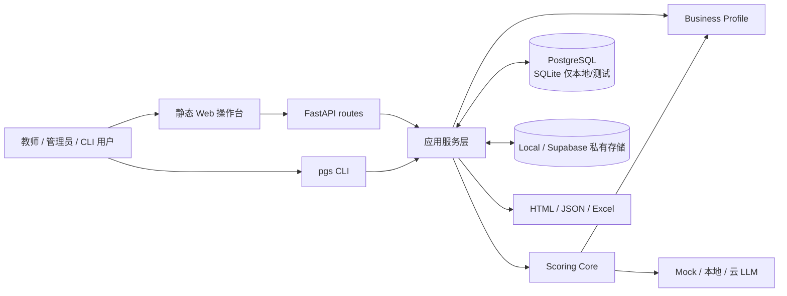
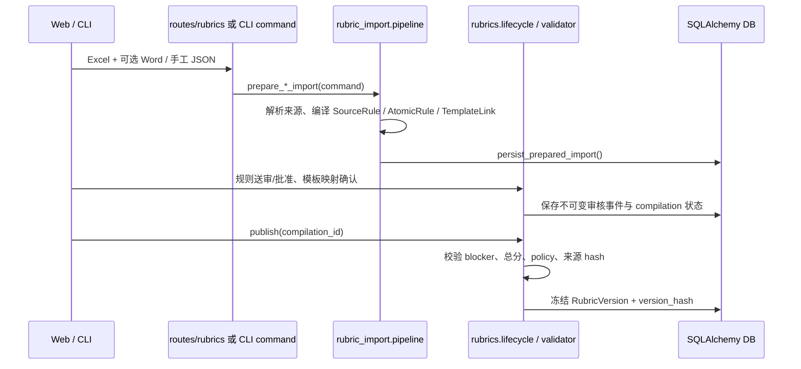
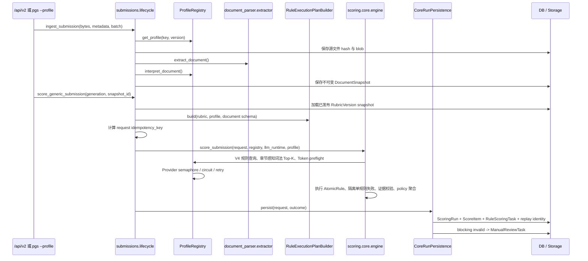

# 系统架构

> 当前事实快照：2026-09-04。运行时为 Python 3.10+（CI/锁文件使用 3.12），Alembic head 为 `0023_rule_scoring_review_tasks`。本文描述已实现代码，不代替 Accepted ADR、数据库迁移或发布门禁。

## 1. 系统边界

本项目是模板驱动的通用评分系统。它把用户授权的 Excel/Word 评分材料编译为可审核、可发布、不可变的评分版本；把 DOCX/PDF 转成结构化文档快照；再由确定性检查器和 LLM 检查器逐条执行 AtomicRule，最后进入人工复核、报告和表格导出。

当前同时保留两条入口：

- v1 论文兼容链路：`Paper` / `GradingBatch` / `score_paper()`，服务既可执行旧未版本化标准，也可把锁定正式 `RubricVersion` 的批次强制送入 Core。
- v2 通用链路：`Submission` / `EvaluationBatch` / `score_generic_submission()`，必须绑定唯一已发布的 `RubricVersion` 与明确的 Profile。

当前生产 Profile 是 `thesis / thesis-legacy-profile@1` 与 `technical_proposal / technical-proposal-profile@1`。`SCORING_ENGINE_MODE` 默认 `legacy`，只控制未版本化兼容入口；正式 `RubricVersion` 始终走 AtomicRule Core。没有真实 GATE-03 的 `gating_eligible=true` 产物和维护者批准，不得把默认模式改为 Core。

## 2. 分层与依赖规则

| 层 | 主要路径 | 职责 | 边界 |
|---|---|---|---|
| 入口层 | `frontend/web/`、`backend/app/api/routes/`、`backend/app/cli/` | 收集请求、鉴权、校验传输 schema、映射 HTTP/CLI 输出 | 不实现评分规则；Web 与 CLI 复用服务层 |
| 应用编排层 | `backend/app/services/` | 导入、摄取、评分编排、复核、批任务、报告、集成与部署诊断 | 负责事务和基础设施适配，不把业务扣分值写死 |
| 通用 Core | `services/scoring/core/` | 构建/执行版本化规则计划，校验证据，聚合分数，生成可重放结果 | 不依赖 FastAPI、SQLAlchemy 模型或具体论文结构；基础设施经 port/adapter 注入 |
| Profile 层 | `services/scoring/profiles/` | 解释特定文档、注册 checker、提供运行身份与展示扩展 | 不预置用户未授权的业务分值；Profile key/version 必须显式匹配 |
| Adapter 层 | `services/scoring/adapters/` | 从数据库加载冻结 Rubric、保存 Core run、兼容 v1、生成比较产物 | 不改变 Core 合同含义，不伪造正式版本身份 |
| 持久化层 | `backend/app/db/`、`alembic/` | SQLAlchemy 模型、会话、约束与逐版本迁移 | 生产以 PostgreSQL 16 迁移结果为准；测试 `create_all` 不能替代 Alembic 验证 |
| 外部适配层 | `services/llm/`、`services/llm_observability.py`、`services/storage/`、`services/spreadsheet/` | 模型、LLM Trace、对象存储、在线/离线导出 | 默认 Mock；外呼受配置、离线模式、BYOK 和安全检查约束；Langfuse 不可用不得中断评分 |

关键依赖方向是 `routes/CLI -> services -> Core contracts/ports`。Core 不反向导入 API、ORM 或具体存储实现；Profile 通过注册表和显式 identity 参与，不以可变中文名称调度。

## 3. 模块边界

| 模块 | 已实现职责 | 不应承担的职责 |
|---|---|---|
| `api/routes/auth.py`、`organizations.py`、`api/deps.py` | Cookie 会话、当前主体、组织角色和资源可见性 | 评分与文档解析 |
| `api/routes/rubrics.py`、`services/rubric_import/`、`services/rubrics/` | Excel/Word/手工 JSON 导入，来源图，规则编译，逐条审核，模板映射确认和发布校验 | 自动批准规则；从缺失材料臆造扣分或档位 |
| `services/document_parser/` | DOCX/PDF 提取、标题/章节、格式、修订痕迹、分块和解析质量 | 决定用户未授权的评分分值 |
| `services/papers/ingestion.py` | v1 上传、存储、解析、chunk 落库与可恢复重新解析 | v2 Profile 解释和 Core 计划构建 |
| `services/submissions/lifecycle.py` | v2 EvaluationBatch、Submission、不可变 DocumentSnapshot、Core 评分生命周期 | 旧未版本化评分兼容 |
| `services/scoring/engine.py` | v1 入口、legacy/Core/compare 路由、collect-compute-persist、人工改分和复核 | 允许正式 RubricVersion 回退到任意分值 legacy 路径 |
| `services/scoring/core/` | DTO、证据、policy、计划、checker registry、规则执行与聚合 | 数据库事务、HTTP 响应、文件系统细节 |
| `services/checkers/`、`services/coherence/`、`services/scoring/retrieval/` | 确定性判定、findings 转扣分、一致性分析、V4 章节感知词法证据选择与 Token Budget | 把“未召回”当作“全文不存在”的证明；当前不宣称向量召回或 reranker 已实现 |
| `services/batch_scoring/jobs.py` | 持久化任务、租约/心跳、逐论文检查点、取消、定向重试和观察指标 | 授予 GATE-03 或默认 Core 切换权限 |
| `services/calibration/`、`eval/`、`services/release_gates.py` | 锚点、QWK/MAE/漂移、候选和人工批准记录 | 把 Mock/test-only 演练声明为生产门禁通过 |
| `services/report/`、`services/spreadsheet/` | v1/v2 HTML、JSON、Excel、在线写表适配 | 修改历史评分结果 |
| `services/deployment/`、`backend/app/scripts/ops_backup.py` | inventory、OPS readiness、Postgres 验证、带 manifest 的备份/校验/恢复 | 以 OPS 绿色替代评分质量发布批准 |
| `services/ai_connections.py`、`services/llm/`、`services/cache/` | 私有 BYOK 加密/快照、provider 适配、重试、诊断、L0 缓存、按连接的进程内并发与熔断 | 把部署级旧 Key 复制成用户私有连接；在 Core 外改变已冻结策略；把进程内额度误当成跨实例全局额度 |
| `services/llm_observability.py` | 以 Langfuse v4/OpenTelemetry 建立 `scoring_run -> rule_scoring_task -> llm_generation -> retry_attempt` Trace，从应用源头脱敏和采样 | 保存权威分数/任务状态；默认上传完整 Prompt/论文；让 Exporter 失败传播到评分主链 |

## 4. 核心调用链

### 4.1 评分标准导入与发布

发布不会自动批准规则、确认模板链接或清除 blocker。正式批次必须锁定唯一且一致发布的 `RubricVersion`。

### 4.2 v2 Submission -> Core

同一 `submission + DocumentSnapshot + plan/runtime identity + rescore_generation` 生成稳定幂等键；重复请求返回既有 run，不能占用另一评分目标的身份。

当前 V4 选择器只使用可重放的词法排名、章节过滤/多样化和完整 EvidenceUnit，不截断引用。它是避免整篇正文直接进入 Provider 的安全基线，不是混合向量检索的最终实现。Provider 适配器在实际序列化 system/user 消息后再次检查输入、输出预留和 safety margin；预算不足转为规则级 `TOKEN_BUDGET_UNSATISFIABLE`。

语义规则异常由 Core 转成稳定 invalid outcome，其他无依赖规则继续。运行落库时，`RuleScoringTask` 保存每条 AtomicRule 的结果或安全 Provider 错误；blocking invalid 自动生成 `ManualReviewTask`。open/claimed blocking 任务存在时，总分和等级为空。人工只能在领取后、携带当前 `version`、并引用冻结 DocumentSnapshot 中真实 EvidenceUnit 的情况下定分。

本轮检查点在一次 Core 计算结束后批量持久化，因此支持审计和部分结果保留，但尚不能在进程中断点从单规则续跑。单论文规则执行仍为顺序模式；进程内 semaphore/circuit 只保护当前实例，跨 Vercel 实例的全局 RPM/TPM 与分布式熔断属于后续调度层。

### 4.3 v1 Paper 兼容链路

`routes/scoring.py` 或批次/CLI 调用 `services.scoring.engine.score_paper()`：

1. 根据批次是否锁定正式 `RubricVersion` 决定权威路径。锁定版本时无条件进入 `_score_paper_core()`。
2. 未版本化批次才读取 `SCORING_ENGINE_MODE`：`legacy` 返回 legacy；`compare` 返回 legacy 并保存非权威 Core 比较；`core` 仅用于明确隔离验证。
3. legacy 使用 `collect_scoring_inputs()` 预取数据，提交/释放事务后由 `compute_scoring()` 执行确定性、findings、hybrid 或 LLM 路由，最后 `persist_scoring()` 短事务落库。
4. 评分模式由 criterion 决定：结构化 findings、deterministic、hybrid、deductive、banded 或 `llm_direct`。代码只执行已授权规则，不生成业务扣分标准。

### 4.4 批评分、人工复核与导出

- v1 简单批次可调用 `score_batch()`；可恢复批任务由 `POST /api/batches/{id}/score-jobs` 创建，经 `/run` 执行。
- `BatchScoringJob` 保存 generation、观察策略 hash、runner lease/heartbeat；`BatchScoringItem` 保存逐论文状态、attempt、错误和 telemetry。取消只影响未启动项，重试只恢复失败/取消项。
- `ScoreItem` 保留 AI 结果与人工 final 值；`ReviewLog` 记录理由和操作者。v2 的 invalid/block item 必须经显式 resolution capability 后才能提交复核。
- 报告和导出只投影持久化结果：v1 走 `report/generator.py`、`spreadsheet/excel.py`；v2 走 `generic_export.py`、`generic_generator.py`、`spreadsheet/generic.py`。

## 5. 数据流与持久化

### 5.1 主要数据域

| 数据域 | 关键实体 | 生命周期/约束 |
|---|---|---|
| 身份与租户 | `User`、`Organization`、`OrganizationMember`、`AuthSession`、`AuditLog` | 资源查询按组织过滤；角色控制导入、评分、复核和成员管理 |
| 私有模型 | `AIConnection`、`AIUsageLedger` | Key 使用独立 `BYOK_MASTER_KEY` 加密；批次冻结连接快照与 key version，变化后要求重建任务 |
| 评分标准来源图 | `Rubric`、`RubricCriterion`、`RubricCompilation`、`SourceArtifact`、`SourceRule`、`TemplateItem`、`AtomicRule`、`RuleLevel`、`RuleTemplateLink`、`RubricVersion` | 草稿可重编译；发布版本、hash、policy 和来源身份不可变 |
| v2 文档 | `EvaluationBatch`、`Submission`、`DocumentSnapshot` | 源文件按 SHA-256 标识；快照含 parser/normalizer/profile/content hash，不向普通读取端点返回全文 |
| v1 文档 | `GradingBatch`、`Paper`、`PaperChunk` | 保存解析状态、对象引用、结构化 JSON 与证据块；正式批次锁定 rubric version |
| 执行与复核 | `ScoringRun`、`ScoreItem`、`RuleScoringTask`、`ManualReviewTask`、`ReviewLog` | Core run 保存完整身份；规则任务保存结果/错误检查点；人工任务按组织、版本和冻结证据解决；历史自动结果不重写 |
| 批任务与门禁 | `BatchScoringJob`、`BatchScoringItem`、`ReleaseGateProfile`、`ReleaseGateRun`、`ReleaseGateApproval` | 持久化恢复、观察和审批链；test-only 结果不可转为生产授权 |
| 校准与输出 | `CalibrationAnchor`、`SpreadsheetWriteLog` | 锚点按 code 注入；在线写表行为留审计日志 |

### 5.2 文件与对象存储

- `STORAGE_PROVIDER=local` 时，`storage/uploads`、`parsed`、`reports`、`exports` 保存应用产物，L0 缓存位于同一存储根。
- `STORAGE_PROVIDER=supabase` 时，浏览器可通过签名 URL/TUS 直传私有桶；服务端只签名、确认大小/归属并触发解析。对象路径按组织、批次和资源隔离。
- 数据库保存对象引用和内容 hash，不应依赖可变本地绝对路径作为可重放身份。
- 备份必须同时覆盖数据库和完整 storage，并用 manifest SHA-256 验证；恢复只允许精确确认的隔离数据库和空 storage 目标。

## 6. 运行与部署拓扑

- 本地 Web：FastAPI 同进程托管 `/api` 与 `frontend/web` 静态文件，可使用临时 SQLite。
- 本地 CLI：`pgs` 直接调用服务层，默认独立使用 `~/.paper-grading/cli.db` 与 `~/.paper-grading/storage`，不需要 Web 服务。
- 内网 Compose：Caddy HTTPS -> FastAPI app -> PostgreSQL 16，Postgres、应用 storage、备份和 Caddy CA 使用独立 volume；app 启动先 `alembic upgrade head`。
- Vercel 生产：`public/` 由构建脚本生成指纹化静态资源；Python API 使用 Supabase/Postgres 连接。Vercel Git 直部署关闭，生产只能由 GitHub Actions 门禁后执行 prebuilt deploy。

FastAPI 中数据路由受 `enforce_auth` 保护；auth 和公开集成自检在登录前可达，`ops-readiness` 单独要求鉴权。开启 `AUTH_ENABLED` 后，弱密码、弱 `AUTH_SECRET` 或原文 LLM debug 会使应用 fail closed。

## 7. 架构不变量与变更检查

- 用户授权的模板/Excel 决定扣哪项、扣几分；不得在 Profile、checker 或 prompt 中暗置业务分值。
- 正式 `RubricVersion`、`DocumentSnapshot`、执行计划、模型/Prompt/Checker/Anchor 身份共同支撑审计与重放。
- 证据不足、规则未授权、身份不一致或自动 checker 失败时 fail closed，并进入人工复核；不得静默给分。
- LLM 网络调用不得持有长数据库写事务；并发依赖 collect -> compute -> persist 或等价短事务边界。
- 修改 prompt 或输入构造时同步 bump `services/cache/llm_cache.PROMPT_VERSION` 与 Core 镜像版本，并重新执行相关 QWK/回归验证。
- 新端点/字段同时更新 schema、模型、Alembic 迁移和测试。SQLite 测试不替代 PostgreSQL 迁移/约束验证。
- OPS readiness、batch observation、compare artifact 和 test-only rehearsal 都不是 GATE-03 发布授权。
- LLM 观测默认 `metadata_only`：只导出内容 hash/字符数、运行身份、Token、延迟和脱敏错误。Langfuse 是可替换的诊断投影，业务数据库仍是唯一权威来源。
- blocking `ManualReviewTask` 未解决时 `final_total_score` 与 `grade` 必须为空；前端或普通 ReviewLog 不得绕过这一不变量。
- 0023 中的规则/人工任务是审计状态；表内有数据时 Alembic downgrade 必须 fail closed。默认采用应用向后兼容、数据库保留的回滚方式。
- PostgreSQL 中若存在生产最小权限角色 `pgs_app`，0023 同步授予新表 DML、启用 RLS 并建立与现有生产基线一致的 policy；无该角色的通用/CI 数据库不创建部署专属角色。

## 8. 维护记录

| 日期 | 主题 | 架构核对结果 |
|---|---|---|
| 2026-09-01 | 初始化三文档 | 按当前 v1/v2 双链路、AtomicRule Core、Profile、0022 多租户/BYOK、可恢复批任务、Local/Supabase 存储和 CI/Vercel 发布链路建立事实基线。 |
| 2026-09-03 | P0 Provider 错误与 Langfuse 可观测性 | 核对 LLM/Core/批任务边界；新增稳定 ProviderError 投影和 fail-open Langfuse v4/OpenTelemetry Trace。评分、缓存、证据校验与 Core 计分边界不变。 |
| 2026-09-04 | 评分韧性、规则检查点与人工复核 | 核对 Profile/Core/LLM/持久化/API/迁移边界；新增 V4 预算化词法证据选择、规则失败隔离、0023 规则检查点与人工复核、进程内 Provider 保护。明确向量检索、进程中断续跑、DAG 并发和分布式配额仍未实现。 |
