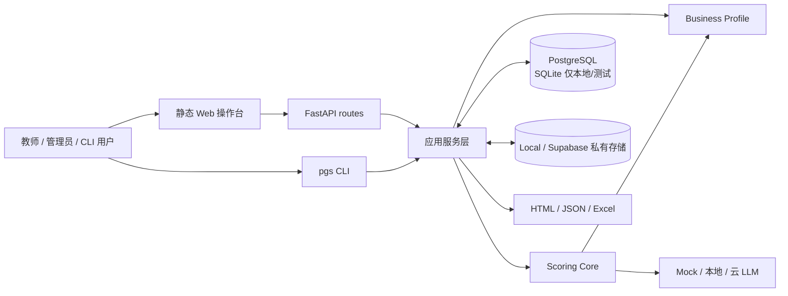
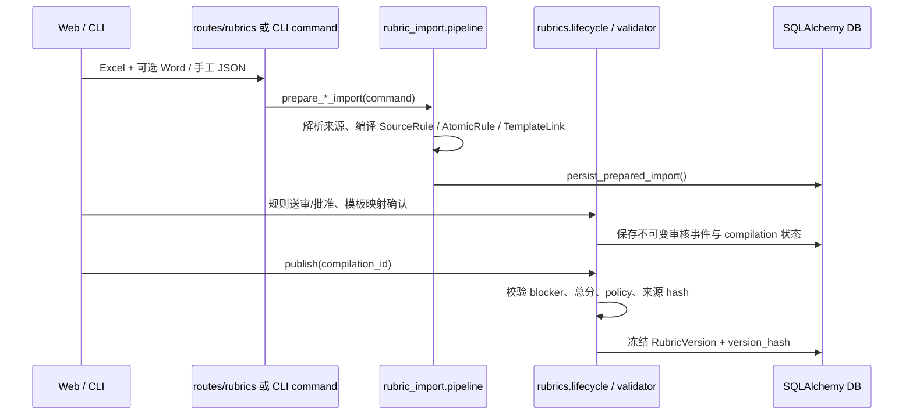
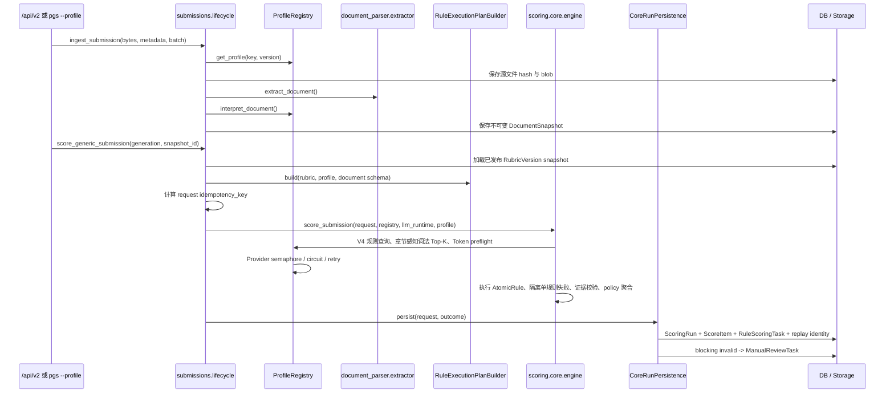

# 系统架构

> 当前事实快照：2026-09-28。运行时为 Python 3.10+（CI/锁文件使用 3.12），Alembic head 为 `0032_single_active_ai_connection`。本文描述已实现代码，不代替 Accepted ADR、数据库迁移或发布门禁。

## 1. 系统边界

本项目是模板驱动的通用评分系统。它把用户授权的 Excel/Word 评分材料编译为可审核、可发布、不可变的评分版本；把 DOCX/PDF 转成结构化文档快照；再由确定性检查器和 LLM 检查器逐条执行 AtomicRule，最后进入人工复核、报告和表格导出。

当前同时保留两条入口：

- v1 论文兼容链路：`Paper` / `GradingBatch` / `score_paper()`，服务既可执行旧未版本化标准，也可把锁定正式 `RubricVersion` 的批次强制送入 Core。
- v2 通用链路：`Submission` / `EvaluationBatch` / `score_generic_submission()`，必须绑定唯一已发布的 `RubricVersion` 与明确的 Profile。

当前生产 Profile 是 `thesis / thesis-legacy-profile@1` 与 `technical_proposal / technical-proposal-profile@1`。`SCORING_ENGINE_MODE` 默认 `legacy`，只控制未版本化兼容入口；正式 `RubricVersion` 始终走 AtomicRule Core。没有真实 GATE-03 的 `gating_eligible=true` 产物和维护者批准，不得把默认模式改为 Core。


```mermaid
flowchart LR
    U[教师 / 管理员 / CLI 用户]
    WEB[静态 Web 操作台]
    CLI[pgs CLI]
    API[FastAPI routes]
    APP[应用服务层]
    CORE[Scoring Core]
    PROFILE[Business Profile]
    LLM[Mock / 本地 / 云 LLM]
    DB[(PostgreSQL\nSQLite 仅本地/测试)]
    STORE[(Local / Supabase 私有存储)]
    OUT[HTML / JSON / Excel]

    U --> WEB --> API
    U --> CLI
    API --> APP
    CLI --> APP
    APP --> PROFILE
    APP --> CORE
    CORE --> PROFILE
    CORE --> LLM
    APP <--> DB
    APP <--> STORE
    APP --> OUT
```

## 2. 分层与依赖规则

| 层 | 主要路径 | 职责 | 边界 |
|---|---|---|---|
| 入口层 | `frontend/web/`、`backend/app/api/routes/`、`backend/app/cli/` | 收集请求、鉴权、校验传输 schema、映射 HTTP/CLI 输出 | 不实现评分规则；Web 与 CLI 复用服务层 |
| 应用编排层 | `backend/app/services/` | 导入、摄取、评分编排、复核、批任务、报告、集成与部署诊断 | 负责事务和基础设施适配，不把业务扣分值写死 |
| 通用 Core | `services/scoring/core/` | 构建/执行版本化规则计划，校验证据，聚合分数，生成可重放结果 | 不依赖 FastAPI、SQLAlchemy 模型或具体论文结构；基础设施经 port/adapter 注入 |
| Profile 层 | `services/scoring/profiles/` | 解释特定文档、注册 checker、提供运行身份与展示扩展 | 不预置用户未授权的业务分值；Profile key/version 必须显式匹配 |
| Adapter 层 | `services/scoring/adapters/` | 从数据库加载冻结 Rubric、保存 Core run、兼容 v1、生成比较产物 | 不改变 Core 合同含义，不伪造正式版本身份 |
| 持久化层 | `backend/app/db/`、`alembic/` | SQLAlchemy 模型、会话、约束与逐版本迁移 | 生产以 PostgreSQL 16 迁移结果为准；测试 `create_all` 不能替代 Alembic 验证 |
| 外部适配层 | `services/llm/`、`services/llm_observability.py`、`services/storage/`、`services/spreadsheet/` | 模型、LLM Trace、对象存储、在线/离线导出 | 默认 Mock；外呼受配置、离线模式、BYOK 和安全检查约束；Langfuse 不可用不得中断评分 |

关键依赖方向是 `routes/CLI -> services -> Core contracts/ports`。Core 不反向导入 API、ORM 或具体存储实现；Profile 通过注册表和显式 identity 参与，不以可变中文名称调度。

## 3. 模块边界

| 模块 | 已实现职责 | 不应承担的职责 |
|---|---|---|
| `api/routes/auth.py`、`organizations.py`、`api/deps.py` | Cookie 会话、当前主体、组织角色和资源可见性 | 评分与文档解析 |
| `api/routes/rubrics.py`、`services/rubric_import/`、`services/rubrics/` | Excel/Word/手工 JSON 导入，来源图，规则编译，逐条审核，模板映射确认和发布校验 | 自动批准规则；从缺失材料臆造扣分或档位 |
| `services/document_parser/` | DOCX/PDF 提取、标题/章节、格式、修订痕迹、分块和解析质量 | 决定用户未授权的评分分值 |
| `services/papers/ingestion.py` | v1 上传、存储、解析、chunk 落库与可恢复重新解析 | v2 Profile 解释和 Core 计划构建 |
| `services/submissions/lifecycle.py` | v2 EvaluationBatch、Submission、不可变 DocumentSnapshot、Core 评分生命周期 | 旧未版本化评分兼容 |
| `services/scoring/engine.py` | v1 入口、legacy/Core/compare 路由、collect-compute-persist、人工改分和复核 | 允许正式 RubricVersion 回退到任意分值 legacy 路径 |
| `services/scoring/core/` | DTO、证据、policy、计划、checker registry、规则执行与聚合 | 数据库事务、HTTP 响应、文件系统细节 |
| `services/checkers/`、`services/coherence/`、`services/scoring/retrieval/` | 确定性判定、findings 转扣分、一致性分析、V4 章节感知词法证据选择与 Token Budget | 把“未召回”当作“全文不存在”的证明；当前不宣称向量召回或 reranker 已实现 |
| `services/batch_scoring/jobs.py` | 持久化任务、租约/心跳、逐论文检查点、取消、定向重试和观察指标 | 授予 GATE-03 或默认 Core 切换权限 |
| `services/calibration/`、`eval/`、`services/release_gates.py` | 锚点、QWK/MAE/漂移、候选和人工批准记录 | 把 Mock/test-only 演练声明为生产门禁通过 |
| `services/report/`、`services/spreadsheet/` | v1/v2 HTML、JSON、Excel、在线写表适配 | 修改历史评分结果 |
| `services/deployment/`、`backend/app/scripts/ops_backup.py` | inventory、OPS readiness、Postgres 验证、带 manifest 的备份/校验/恢复 | 以 OPS 绿色替代评分质量发布批准 |
| `services/ai_connections.py`、`services/llm/`、`services/cache/` | 私有 BYOK 加密/快照、三种协议适配（Chat Completions / Responses / Claude Messages，共用 `llm/transport`）、重试、诊断、L0 缓存、按连接的进程内并发与熔断 | 把部署级旧 Key 复制成用户私有连接；在 Core 外改变已冻结策略；把进程内额度误当成跨实例全局额度 |
| `services/llm_observability.py` | 以 Langfuse v4/OpenTelemetry 建立 `scoring_run -> rule_scoring_task -> llm_generation -> retry_attempt` Trace，从应用源头脱敏和采样 | 保存权威分数/任务状态；默认上传完整 Prompt/论文；让 Exporter 失败传播到评分主链 |

## 4. 核心调用链

### 4.1 评分标准导入与发布


```mermaid
sequenceDiagram
    participant C as Web / CLI
    participant R as routes/rubrics 或 CLI command
    participant P as rubric_import.pipeline
    participant L as rubrics.lifecycle / validator
    participant D as SQLAlchemy DB

    C->>R: Excel + 可选 Word / 手工 JSON
    R->>P: prepare_*_import(command)
    P->>P: 解析来源、编译 SourceRule / AtomicRule / TemplateLink
    P->>D: persist_prepared_import()
    C->>L: 规则送审/批准、模板映射确认
    L->>D: 保存不可变审核事件与 compilation 状态
    C->>L: publish(compilation_id)
    L->>L: 校验 blocker、总分、policy、来源 hash
    L->>D: 冻结 RubricVersion + version_hash
```

发布不会自动批准规则、确认模板链接或清除 blocker。正式批次必须锁定唯一且一致发布的 `RubricVersion`。

### 4.2 v2 Submission -> Core


```mermaid
sequenceDiagram
    participant A as /api/v2 或 pgs --profile
    participant S as submissions.lifecycle
    participant P as ProfileRegistry
    participant X as document_parser.extractor
    participant B as RuleExecutionPlanBuilder
    participant C as scoring.core.engine
    participant R as CoreRunPersistence
    participant D as DB / Storage

    A->>S: ingest_submission(bytes, metadata, batch)
    S->>P: get_profile(key, version)
    S->>D: 保存源文件 hash 与 blob
    S->>X: extract_document()
    S->>P: interpret_document()
    S->>D: 保存不可变 DocumentSnapshot
    A->>S: score_generic_submission(generation, snapshot_id)
    S->>D: 加载已发布 RubricVersion snapshot
    S->>B: build(rubric, profile, document schema)
    S->>S: 计算 request idempotency_key
    S->>C: score_submission(request, registry, llm_runtime, profile)
    C->>P: V4 规则查询、章节感知词法 Top-K、Token preflight
    P->>P: Provider semaphore / circuit / retry
    C->>C: 执行 AtomicRule、隔离单规则失败、证据校验、policy 聚合
    S->>R: persist(request, outcome)
    R->>D: ScoringRun + ScoreItem + RuleScoringTask + replay identity
    R->>D: blocking invalid -> ManualReviewTask
```

同一 `submission + DocumentSnapshot + plan/runtime identity + rescore_generation` 生成稳定幂等键；重复请求返回既有 run，不能占用另一评分目标的身份。

当前 V4 选择器只使用可重放的词法排名、章节过滤/多样化和完整 EvidenceUnit，不截断引用。它是避免整篇正文直接进入 Provider 的安全基线，不是混合向量检索的最终实现。Provider 适配器在实际序列化 system/user 消息后再次检查输入、输出预留和 safety margin；预算不足转为规则级 `TOKEN_BUDGET_UNSATISFIABLE`。

语义规则异常由 Core 转成稳定 invalid outcome，其他无依赖规则继续。运行落库时，`RuleScoringTask` 保存每条 AtomicRule 的结果或安全 Provider 错误；blocking invalid 自动生成 `ManualReviewTask`。open/claimed blocking 任务存在时，总分和等级为空。人工只能在领取后、携带当前 `version`、并引用冻结 DocumentSnapshot 中真实 EvidenceUnit 的情况下定分。

本轮检查点在一次 Core 计算结束后批量持久化，因此支持审计和部分结果保留，但尚不能在进程中断点从单规则续跑。单论文规则执行仍为顺序模式；进程内 semaphore/circuit 只保护当前实例，跨 Vercel 实例的全局 RPM/TPM 与分布式熔断属于后续调度层。

### 4.3 v1 Paper 兼容链路

`routes/scoring.py` 或批次/CLI 调用 `services.scoring.engine.score_paper()`：

1. 根据批次是否锁定正式 `RubricVersion` 决定权威路径。锁定版本时无条件进入 `_score_paper_core()`。
2. 未版本化批次才读取 `SCORING_ENGINE_MODE`：`legacy` 返回 legacy；`compare` 返回 legacy 并保存非权威 Core 比较；`core` 仅用于明确隔离验证。
3. legacy 使用 `collect_scoring_inputs()` 预取数据，提交/释放事务后由 `compute_scoring()` 执行确定性、findings、hybrid 或 LLM 路由，最后 `persist_scoring()` 短事务落库。
4. 评分模式由 criterion 决定：结构化 findings、deterministic、hybrid、deductive、banded 或 `llm_direct`。代码只执行已授权规则，不生成业务扣分标准。

### 4.4 批评分、人工复核与导出

- v1 简单批次可调用 `score_batch()`；可恢复批任务由 `POST /api/batches/{id}/score-jobs` 创建，经 `/run` 执行。
- `BatchScoringJob` 保存 generation、观察策略 hash、runner lease/heartbeat；`BatchScoringItem` 保存逐论文状态、attempt、错误和 telemetry。取消只影响未启动项，重试只恢复失败/取消项。
- `ScoreItem` 保留 AI 结果与人工 final 值；`ReviewLog` 记录理由和操作者。v2 的 invalid/block item 必须经显式 resolution capability 后才能提交复核。
- 报告和导出只投影持久化结果：v1 走 `report/generator.py`、`spreadsheet/excel.py`；v2 走 `generic_export.py`、`generic_generator.py`、`spreadsheet/generic.py`。

## 5. 数据流与持久化

### 5.1 主要数据域

| 数据域 | 关键实体 | 生命周期/约束 |
|---|---|---|
| 身份与租户 | `User`、`Organization`、`OrganizationMember`、`AuthSession`、`AuditLog` | 资源查询按组织过滤；角色控制导入、评分、复核和成员管理 |
| 私有模型 | `AIConnection`、`AIUsageLedger` | Key 使用独立 `BYOK_MASTER_KEY` 加密；批次冻结连接快照与 key version，变化后要求重建任务 |
| 评分标准来源图 | `Rubric`、`RubricCriterion`、`RubricCompilation`、`SourceArtifact`、`SourceRule`、`TemplateItem`、`AtomicRule`、`RuleLevel`、`RuleTemplateLink`、`RubricVersion` | 草稿可重编译；发布版本、hash、policy 和来源身份不可变 |
| v2 文档 | `EvaluationBatch`、`Submission`、`DocumentSnapshot` | 源文件按 SHA-256 标识；快照含 parser/normalizer/profile/content hash，不向普通读取端点返回全文 |
| v1 文档 | `GradingBatch`、`Paper`、`PaperChunk` | 保存解析状态、对象引用、结构化 JSON 与证据块；正式批次锁定 rubric version |
| 执行与复核 | `ScoringRun`、`ScoreItem`、`RuleScoringTask`、`ManualReviewTask`、`ReviewLog` | Core run 保存完整身份；规则任务保存结果/错误检查点；人工任务按组织、版本和冻结证据解决；历史自动结果不重写 |
| 批任务与门禁 | `BatchScoringJob`、`BatchScoringItem`、`ReleaseGateProfile`、`ReleaseGateRun`、`ReleaseGateApproval` | 持久化恢复、观察和审批链；test-only 结果不可转为生产授权 |
| 校准与输出 | `CalibrationAnchor`、`SpreadsheetWriteLog` | 锚点按 code 注入；Google/Mock 写表及 v1/v2 Excel 导出均留审计日志，`target_type` 区分通道 |

### 5.2 文件与对象存储

- `STORAGE_PROVIDER=local` 时，`storage/uploads`、`parsed`、`reports`、`exports` 保存应用产物，L0 缓存位于同一存储根。
- `STORAGE_PROVIDER=supabase` 时，浏览器可通过签名 URL/TUS 直传私有桶；服务端只签名、确认大小/归属并触发解析。对象路径按组织、批次和资源隔离。
- 数据库保存对象引用和内容 hash，不应依赖可变本地绝对路径作为可重放身份。
- 备份必须同时覆盖数据库和完整 storage，并用 manifest SHA-256 验证；恢复只允许精确确认的隔离数据库和空 storage 目标。

## 6. 运行与部署拓扑

- 本地 Web：FastAPI 同进程托管 `/api` 与 `frontend/web` 静态文件，可使用临时 SQLite。
- 本地 CLI：`pgs` 直接调用服务层，默认独立使用 `~/.paper-grading/cli.db` 与 `~/.paper-grading/storage`，不需要 Web 服务。
- 内网 Compose：Caddy HTTPS -> FastAPI app -> PostgreSQL 16，Postgres、应用 storage、备份和 Caddy CA 使用独立 volume；app 启动先 `alembic upgrade head`。
- Vercel 生产：`public/` 由构建脚本生成指纹化静态资源；Python API 使用 Supabase/Postgres 连接。Vercel Git 直部署关闭，生产只能由 GitHub Actions 门禁后执行 prebuilt deploy。

FastAPI 中数据路由受 `enforce_auth` 保护；auth 和公开集成自检在登录前可达，`ops-readiness` 单独要求鉴权。开启 `AUTH_ENABLED` 后，弱密码、弱 `AUTH_SECRET` 或原文 LLM debug 会使应用 fail closed。

## 7. 架构不变量与变更检查

- 用户授权的模板/Excel 决定扣哪项、扣几分；不得在 Profile、checker 或 prompt 中暗置业务分值。
- 正式 `RubricVersion`、`DocumentSnapshot`、执行计划、模型/Prompt/Checker/Anchor 身份共同支撑审计与重放。
- 证据不足、规则未授权、身份不一致或自动 checker 失败时 fail closed，并进入人工复核；不得静默给分。
- LLM 网络调用不得持有长数据库写事务；并发依赖 collect -> compute -> persist 或等价短事务边界。
- 修改 prompt 或输入构造时同步 bump `services/cache/llm_cache.PROMPT_VERSION` 与 Core 镜像版本，并重新执行相关 QWK/回归验证。
- 新端点/字段同时更新 schema、模型、Alembic 迁移和测试。SQLite 测试不替代 PostgreSQL 迁移/约束验证。
- OPS readiness、batch observation、compare artifact 和 test-only rehearsal 都不是 GATE-03 发布授权。
- LLM 观测默认 `metadata_only`：只导出内容 hash/字符数、运行身份、Token、延迟和脱敏错误。Langfuse 是可替换的诊断投影，业务数据库仍是唯一权威来源。
- blocking `ManualReviewTask` 未解决时 `final_total_score` 与 `grade` 必须为空；前端或普通 ReviewLog 不得绕过这一不变量。
- 0023 中的规则/人工任务是审计状态；表内有数据时 Alembic downgrade 必须 fail closed。默认采用应用向后兼容、数据库保留的回滚方式。
- PostgreSQL 中若存在生产最小权限角色 `pgs_app`，0023 同步授予新表 DML、启用 RLS 并建立与现有生产基线一致的 policy；无该角色的通用/CI 数据库不创建部署专属角色。

### 7.1 前端 v2 计划审查事实（2026-09-07 记录，阶段 0–6B 已于 2026-09-08 实施）

以下为**审查当日**的代码合同，保留原文以便对照。落地结果见 §7.2；两节冲突时以 §7.2 为准。

- 正式论文批次同样走 Core。Core `ScoreItem.evidence` 保存 `evidence_unit_id / evidence_type / locator / payload_hash`；`LegacyPaperAdapter.adapt()` 明确不使用可变 `PaperChunk` 作为快照身份。该引用不能直接按 `chunk_id` 关联正文。Core 持久化当前设置 `confidence=None`，不能用低置信度阈值代替复核状态。
- 阻塞项持久化为 `ManualReviewTask`，接口在 `/api/v2/manual-review-tasks`；领取、释放和解决使用任务版本，解决还需冻结快照证据。普通改分/ReviewLog 不提供这套能力，批量采纳的界面方案必须保留该边界。
- 旧 Web 已采用逐文件签名直传/TUS、归档确认、独立解析和恢复。`/papers/bulk-upload` 是同步上传并解析入口，不能据此认定生产大文件上传只是更换多选控件。
- `SpreadsheetWriteLog.target_type` 当前已有 `mock_sheet / google_sheets / excel / excel_v2`。v1 Excel 每个 run 写一条记录；历史日志不能统一重标为 Sheets，也不能直接视为“一行等于一次批次导出”。
- 本地 FastAPI 从 `frontend/web` 托管页面和资源，Docker 复制该目录；Vercel 经 Python 构建脚本生成 `public/`。当前尚无 Vite 构建、SPA 深链接回退或新旧页面切换实现。
- 运维能力尚非统一的组织管理员边界：`enforce_auth` 只验证主体；`/system/ops-readiness` 的服务查询全局批任务，`/system/integrations` 与 `/system/llm-check` 保持公开。新运维页的角色和数据范围不能仅靠前端隐藏实现。

本轮核对范围还包括批次状态写入口、导出历史粒度及浏览器门禁：**审查当日**批次 Create/Patch 可接收 status，七态转移守卫和新前端测试尚未实现。

用户已确认八条审查意见，修订后的 `docs/前端v2改造计划.md` 将冻结正文/证据展示与评分计算分层，普通复核与阻塞任务共同组成队列，保留上传恢复及旧日志；状态、权限、三部署产物和浏览器验收前置。D-019 已接受为待实施设计，§13 的 R1–R8 映射到接口、迁移、阶段和验收场景；这些目标不能当作本节所述的已实现事实。

### 7.2 前端 v2 落地事实（2026-09-08）

阶段 0–6B 已实施并于 2026-09-08 部署到生产。迁移 head 为 `0029_runtime_access_for_v2_tables`；
评分语义、`SCORING_ENGINE_MODE=legacy` 与 GATE-03 发布权限**均未改动**。

- **前端产物**：`frontend/workbench/`（Vite + Vue 3 + JS）经 `scripts/build_web_static.py --with-workbench`
  组装进 `public/`。FastAPI、Vercel、Docker 托管同一份产物；Docker 镜像 COPY `public/`（此前没有，
  容器里 `/workbench/*` 全是 404）。自托管 IBM Plex Mono 的 SIL OFL 许可证随产物发布并可经 HTTP 取到。
- **入口（2026-09-08 起）**：`/` 直接是工作台，**旧 SPA 已下线**，`/legacy/` 返回 404，
  `WORKBENCH_DEFAULT_ENTRY` 开关取消。`/login` `/register` `/reset-password` 由工作台承接——
  邮件里已发出的邀请与重置链接指向后两条。**入口在两处生效**：FastAPI 的路由，以及
  `build_web_static.py` 写出的 `public/index.html`；Vercel 直接静态托管后者，只改前者在生产上无效。
- **状态机**：`0024` 落七态 CHECK 与 `state_version`；所有转移经 `services/batches/state`。
  归档/重开是显式端点，目标阶段由服务端从当前结果推导。**旧写入口（`PATCH /score-items`、
  `POST /scoring-runs/{id}/review`）与新端点共用归档守卫，改分同样 bump `review_revision`**——
  否则归档只是标签，批量采纳的乐观并发也会被静默绕过。
- **结果选择器**：`services/batches/results` 是 KPI、进度、复核队列、统计、分布与导出预检的唯一口径，
  按 `BatchScoringItem.status` 判定本轮是否已有结论，不用时间戳。
- **证据与正文**：`document_view` / `evidence_view` 只投影，不改快照身份；Core 与 legacy 分别标注来源，
  引文与当前文本失配时只跳块不高亮。两个端点连同复核队列均为 `Cache-Control: private, no-store`。
- **复核原因**：结构化 `review_reasons[]`（source/code/message/rule_code）+ 派生展示文本。
  **当前只有确定性来源**（含 0025 之前历史行的显示回退）；模型侧尚未接入——它要求 bump
  `PROMPT_VERSION` 并按 §15 重锚 QWK，而可门禁基线不存在，须走 PGS-8 两阶段批准。
- **导出**：`ExportEvent` 三态（生成中/已生成/失败），**没有「已下载」**；旧 `SpreadsheetWriteLog`
  保留原表原值，`0028` 幂等补录且不按路径猜合并。**四个 GET 数据出口**（批次 xlsx、HTML 报告、
  JSON、导出日志）与两个事件写端点均受 `require_organization_role` 门控——组织归属只回答
  「是不是本组织的数据」，不回答「这个人该不该把它导出去」。
- **运行角色授权**：生产运行角色 `pgs_app` 无 DDL，也不会自动获得新表权限。建表的迁移必须自己
  `GRANT` + `ENABLE ROW LEVEL SECURITY` + 建 `pgs_app_dml` 策略（照 0023）。`0026/0027` 漏了，
  由 `0029` 补齐。**漏掉不会让迁移失败，而是让迁移成功之后应用 permission denied**；本地与 CI
  不建这个角色，两边都测不出来。
- **多组织**：切换组织时中止在途请求并清空全部组织级 store（此前只清 session，旧组织的学生姓名会
  留在界面上）。运维页对无权角色显式说明，不留白页。
- **门禁**：CI 前端 job 跑组件测试、`typecheck`、OpenAPI 合同差异（`api:dump && api:check`，
  生成的 `.d.ts` 经 JSDoc 真正参与类型检查）、产物漂移与浏览器验收；deploy 依赖它。
  浏览器验收覆盖 V01–V07、V09–V13，其中 V01/V02/V10 跑在独立的 `AUTH_ENABLED=true` 多组织后端上。
  **V08 的 Supabase 直传与 TUS 未覆盖**：需真实对象存储，Mock 路由不冒充真实验证。

### 7.3 平台默认模型（2026-09-09，V3-0a）

- **来源改变**：受保护部署（`AUTH_ENABLED` 且设了口令）的模型解析顺序为
  **绑定的 BYOK runtime → `platform_llm_config` 单例 → 抛错**。环境变量退化为
  开发与 CI 专用（`AUTH_ENABLED=false` 仍走 env，否则本地与浏览器验收会立刻断）。
- **这道判断排在 `provider == "mock"` 分支之前**。排在之后就是修复前的行为：
  `LLM_PROVIDER=mock`（默认值）直接返回 `MockLLMScorer`，于是没绑连接的评分
  悄悄产出假分数，界面无任何提示。
- **`PLATFORM_MANAGED_LLM_ENABLED` 不再授予任何权限**。留着它等于把刚堵上的洞用
  一个 env 重新打开：谁设的、设了什么，一概没有记录。
- **加密域隔离**：平台密钥用 `platform-llm|<config_id>|<version>` 作 AAD，BYOK 用
  `ai-connection|<org>|<owner>|<version>`。任一方的密文搬到另一方都解不开——否则
  加密只剩「存了密文」这一个作用，绑不住它属于谁。
- **会话由调用方传入**：`get_llm_scorer(session=...)`。工厂自己开会话会脱离调用方
  事务，在测试里还会指向另一个数据库。评分引擎与起草端点都已接线。
- **端点**：`/system/platform-llm` 的读/写/试连/停用**限平台管理员**——配置它等于决定
  「所有没绑 BYOK 的用户用哪个模型、花谁的钱」。读接口只返回脱敏视图，密文字段不出现。
  `base_url` 走与 BYOK 同一条 SSRF 校验，不因为是平台配置就放行。
- **能力表**：`/system/capabilities` 增加 `llm.{platform_model_available,
  has_own_connection, can_use_llm}`。前端据此把用户引导去配置 BYOK；没有这个字段，
  前端只能等某次调用炸了才知道用不了——那时用户已经上传完材料了。**停用的连接与
  停用的平台配置都不算可用**：放行到一个必然失败的流程比直接挡住更糟。
- **前端呈现（2026-09-09 改）**：`ModelSetupDialog` 阻断式弹窗，不再做路由跳转。
  判定留在 `router/llm-gate.requiresModelSetup`，**判定与呈现分开**。
  - 原先是「跳到账户页 + 一条横幅」：横幅容易被忽略，而且用户已经被送到一个自己
    没主动去的页面，得自己猜发生了什么。
  - **判定、呈现、拦截三分**：`requiresModelSetup` 判定，`ModelSetupDialog` 呈现，
    `blockedByMissingModel` 拦截。三者分开的原因是它们的取舍相反——呈现必须可关闭
    （否则遮罩盖住配置表单），拦截必须关不掉（否则关掉弹窗就全站畅通）。
  - **可关闭**（2026-09-10 修正）。初版设计成阻断式，理由是「没有模型时整套能力都
    用不了」。实际站不住：遮罩 `inset: 0` 铺满视口，用户点进配置页之后弹窗还在，
    **表单点不到**。现在有 ✕，点操作链接也自动收起。
  - **拦截在路由守卫**：功能页一律拦下并送到配置页，配置页永远放行；平台管理员优先
    送去运维页——配平台默认模型能让所有人都能用。
  - **验收要验可点击，不是可见**：遮罩之下表单照样 `visible`，`toBeVisible()` 通过
    但用户点不到。改为直接 `fill()` 一次——Playwright 的可操作性检查会因遮挡失败。
  - 能力表未加载时不弹，否则首屏会给正常用户一次误报。
- **表**：`platform_llm_config` 单例，`0030` 建表并给 `pgs_app` 授权 + RLS；
  有配置时拒绝降级（那一行含密钥材料与「谁配的」，删掉要人重新找回 API key）。

### 7.4 评分标准的写边界（2026-09-09，V3-0b）

- **写端点一律过角色门控**：`rubrics.py` 的 13 个写端点补上 `require_organization_role`。
  `_visible_rubric` 只查组织归属，不查角色；而发布一个评分标准决定了全组织的论文怎么被
  打分。它们此前难以触及只是因为旧 SPA 下线了 UI。
- **并发保护在编译层，不在 rubric 行**：`recompile` 要求显式 `supersedes_compilation_id`，
  基于非活跃草稿提交被整体拒绝。`PATCH /rubrics/{id}` 在创建即产生编译产物的前提下基本
  不可达（见 D-031）。

### 7.5 评分标准的创作入口（2026-09-09，V3-1）

旧 SPA 下线时把评分标准的全部创作能力一起带走了——后端 20 个端点齐全，新工作台
只调用了 2 个只读端点，生产上无法产生任何可用于评分的标准。V3-1 起逐步接回。

- **只有导入与克隆两条入口**（D-026）：不提供空白新建，每份标准都带模板溯源。
- **导入结果如实展示**：`warnings` 与 `template_summary` 原样呈现。它们是「你的
  Excel 里哪几条没被识别」的唯一出口；吞掉之后用户会以为全都导进去了，直到评分时
  才发现某个评分项没有判据可用。
- **默认仅自己可见**（V3-c）：扩大范围是发布时的显式动作，不在导入时顺手做掉。

### 7.6 发布与分享范围（2026-09-09，V3-3）

`POST /rubrics/{id}/publish` 同时接受 `compilation_id` 与 `visibility`，两者在**同一个
事务**里生效（D-029）。范围写入排在 `publish_rubric()` **之前**——有 ORM 守卫拦住
「已发布评分标准不可修改」，发布后再改会直接抛错。

不传范围就沿用当前值；发布后范围与版本一起冻结，扩大范围的路径是克隆为新版本。
「本组织」由创建者本人决定，「所有人」跨组织生效，维持 `platform_admin`。

### 7.7 评分标准页的发布区（2026-09-09，V3-3 前端）

- **编译产物必须由用户选**：默认选中当前活跃的那份，但仍要确认；不提供「用最新的」
  快捷方式——发布的是哪一份决定了之后所有论文按什么规则判分。
- **范围与编译产物同一次请求**：不选范围时**不发送该字段**，由服务端沿用当前值。
- 切换标准时执行草稿跟着重载：发布区列的是「这份标准」的编译产物，串了会发布错东西。
- 有阻断项时禁用发布，并指回第 2 步。

### 7.8 新建任务的入口与模型绑定（2026-09-09，V3-4）

- **入口**：工作台与评分任务页各有一个「新建评分任务」。页面与路由一直都在，此前
  全站没有任何链接指向它。
- **模型绑定分两道，不要混为一谈**：
  1. 路由守卫——**完全没有可用模型**时把用户引导去配置，根本走不到新建页；
  2. 新建页的连接必选——只在「平台没配默认模型」时出现，让用户挑自己的连接。
     平台配好后不强制，那正是「所有用户可正常使用」的含义。
- **建批次时冻结连接**：之后轮换密钥或改配置，旧批次会拒绝继续跑（`engine.py` 的
  快照比对），而不是悄悄换一个模型接着评。

### 7.9 AI 起草缺失细则（2026-09-09，V3-2）

- **必须绑调用者自己的连接**：留空会走平台默认，而平台是 mock 时得到的是编出来的
  扣分规则，却以「AI 起草 · 待确认」呈现——确认之后它们进入正式发布的评分标准。
  无连接时按钮禁用并链到账户与连接页。
- **只给缺规则的评分项**：AI 补缺失部分，用户已写明的表述保留。
- 起草结果默认**待确认**，未确认不进入可执行版本（后端既有语义，前端如实呈现）。

### 7.10 表单必须走设计系统的类（2026-09-09 视觉走查）

V3 新增的表单区块用了裸 `<input>` / `<select>` / `<textarea>` 与 `<label for>`，
拿不到 `.input` / `.select` 的宽高内边距，也拿不到 `.field` / `.field-label` 的上下
留白——结果是标签与控件挤在一行、宽度随内容伸缩、按钮贴边，**与同一页里用对了类的
区块并排时格外突兀**。

规范：`.field` 包裹 + `.field-label` 作标签 + `.input` / `.select` 作控件；
并排字段用 `.form-grid`，按钮行用 `.form-actions`；页头带主操作用 `.page-head-row`。

**设计稿里没有原生 radio / checkbox**：可选项用卡片表达，选中靠边框与底色。评分标准
选择原先是「卡片外一圈边框 + 卡片内一个系统圆点」，两种选中语义叠在一起。控件保留
（键盘与读屏要靠它），只从视觉上移除，并给卡片补 `:focus-within` 焦点态——藏掉控件
之后，键盘用户需要卡片自己指示焦点。

**构建与 typecheck 都不会报这类问题**，`form-styles.test.js` 用源码契约兜住：
裸控件、裸 `<label for>`、以及引用了不存在的布局类（这次的 `.page-head-row` 就是
凭空写的，按钮因此脱离页头跑到内容区上方）。

### 7.11 sticky 区不能装会变高的内容（2026-09-09）

评分工作区右栏底部的总分是 `position: sticky; bottom: 0`。把评语框与两个确认按钮
加进去之后它变高，**盖住了上方展开的改分框**——「保存」按钮点不到，而页面看起来
一切正常。

改为：评语与确认动作跟着内容流走，sticky 区只留总分那一行（高度固定，盖不住东西）。

浏览器验收里用 `getBoundingClientRect()` 直接比对两块的边界，并用 Playwright 的
可操作性检查点一次「保存」——**它会拒绝点被遮挡的元素，比看截图可靠**。

### 7.12 视觉问题的三层检测

这一类问题构建、typecheck、单测都不报，靠人看又容易漏。分三层：

| 层 | 查什么 | 覆盖不到什么 |
|---|---|---|
| 源码契约 `form-styles.test.js` | 裸控件、裸 `<label for>`、引用不存在的布局类、原生 radio/checkbox 无样式 | 运行时才出现的控件 |
| 全页 DOM 契约（`workflow.spec.js`） | 八个页面真实 DOM 里的裸控件、横向溢出 | 遮挡、错位 |
| 定点断言 | 边界比对 + Playwright 可操作性检查 | 需要人先发现问题在哪 |

第二层补的正是第一层的盲区：`v-if` 展开的面板在模板里查得到，但条件渲染的组合、
运行时插入的控件查不到。

**窄屏要单独跑**：以上三层都在桌面宽度下执行，而表单最容易在窄屏崩。补窄屏用例后
立刻查出一个**既有**问题——上传区的原生文件选择框有约 333px 的固有宽度，比窄屏上
`.drop` 的可用空间还宽，把整页撑出横向滚动条。控件的固有尺寸不受 `max-width` 之外
的约束，**别让它自己决定页面宽度**。

### 7.13 批次列表带回绑定的标准（2026-09-10）

设计稿的评分任务表有「评分标准」列，实现里没有——`BatchRead` 只给 `rubric_id`，
前端拿不到可显示的内容。**批次绑定哪个标准版本决定了它怎么判分**，这是列表里仅次
于批次名的信息。

- 一次 `outerjoin` 带回名称与版本号，不让前端按 id 逐个查（一页 20 个批次就是 20 次往返）。
- `outerjoin` 而非 `inner`：标准找不到时批次仍要出现在列表里，那一列留空即可——
  宁可空着，也不能让整个评分任务页 500。
- 字段叫 `rubric_version_label` 而不是 `rubric_version`：`GradingBatch` 已有同名的
  **关系属性**，`from_attributes` 会把那个 ORM 对象当成本字段的值。

### 7.14 复核队列的行内动作与深链接（2026-09-10）

设计稿的「待确认给分」表最后一列是逐行的「查看原文 / 确认」。生产此前只有页顶的
批量采纳，**逐项确认在界面上做不到**：用户对单独一项要么整页采纳，要么自己去工作区
里翻。

调用链：

```
ReviewView 行内「确认」
  → review.acceptOne(entry)
  → review.accept([一条])                 ← 与 acceptVisible 同一条路径
  → POST /batches/{id}/review-queue/accept
```

- **逐项与批量共用 `accept(items, reason)`**：两者的服务端前置条件完全一致
  （`result_revision` + 每项 `review_revision` + 幂等键）。拆成两份实现，迟早有一份
  先忘记带 revision。
- **不可采纳的行不给「确认」按钮**：阻塞任务缺的是结论本身（provider 失败、规则被
  阻断），无 AI 分的项根本没有分可采纳。`acceptOne` 对这两类直接返回 `null`，
  **不发请求**。
- **「查看原文」是深链接**：`/batches/{batchId}/grade?paper=<paper_id>`。
  `GradeView` 把 `route.query.paper` 传给 `openBatch(id, paperId)`；`openBatch` 校验
  该 id 确实在本批次的材料列表里，否则回落到首项——选中一个列表里没有的 id 会让
  **一行都不高亮**，界面看起来正常，用户却不知道自己在看什么。

### 7.15 AI 起草的落库闭环（2026-09-10，V3-2）

`POST /rubrics/{id}/draft-deduction-rules` 的 docstring 写明 **non-persistent**：它只
返回待确认的建议，一条也不落库。上一版前端把结果存进 `lastDraft` 就再没用过，并且
起草成功后**重新加载了完整度**——库里什么都没变，于是阻断项一个没少。用户点了按钮、
等了一次真实模型调用、页面纹丝不动。

补齐后的链路：

```
生成全部缺失细则
  → POST /rubrics/{id}/draft-deduction-rules   ← 不落库，返回 rule_groups
  → AiRuleDraftPanel 逐行呈现，用户排除不要的
  → mergeConfirmedDrafts(criteria, items, excluded)   （lib/ai-draft.js，纯函数）
  → GET /rubrics/{id}                          ← 取完整 criteria（含规则正文）
  → POST /rubrics/{id}/recompile               ← 唯一的落库路径
  → 重新加载完整度与执行草稿
```

边界与理由：

- **落库只能走 `recompile`**。`PATCH /rubrics/{id}` 在已有编译产物时直接 409
  （`RUBRIC_RECOMPILE_REQUIRED`），而工作台里的标准在导入时就产生了编译产物，这条路
  始终走不通。
- **完整 criteria 必须从 `GET /rubrics/{id}` 取**，不能用执行草稿：后者按设计是一份
  安全读模型，明确不带规则正文（`draft_graph.py` 的模块 docstring）。
- **映射沿用旧模板中心的字段形状**（`frontend/web/assets/app.js:1947`）。那条链路验证过
  能编译通过；换一套字段名等于重新赌一次。组级的 `mutex_group` 与 `cap_points` 必须
  跟着每条规则走，丢了它们同一问题的三档会同时命中。
- **一条都没确认时不改 `scoring_mode`**。改成 `deductive` 却没有任何规则，评分时该项
  恒得满分——比不改更糟，而且看起来像配置生效了。

### 7.16 工作区中栏的三页签（2026-09-10，设计稿对照）

设计稿中栏顶部是「正文 / 篇章结构 / 格式发现 4」三个页签。生产只有正文。

`coherence_findings` 与 `format_findings` 存在 `ScoringRun` 上，进 HTML 报告、进 JSON
导出、被启用项消费时还会标 `deducted_by`——**唯独工作区不显示**。于是评分时按格式问题
扣了分，复核的人在界面上看不到扣在哪，只能去下载报告。

数据不需要新请求：`GET /scoring-runs?paper_id=` 返回的 `ScoringRunRead` 本来就带这两个
字段，store 在 `selectPaper` 里已经拿到了整个 run 对象，此前只取了 `id`。

- 页签上带条数，不点开就知道有没有东西。
- 「计入扣分」单独一列：`deducted_by` 为空时显示**「未计入」**而不是留白。留白会被读成
  「只是提示」，于是同一个问题在人工复核时又被扣一次。
- 无发现时给出**两句不同的话**（一致性检查通过 / 模板未规定格式或非 docx 无法判定），
  而不是一张空表——空表说明不了「查过没问题」还是「压根没查」。

### 7.17 `.btn` 的居中修在类本身，不在各个视图（2026-09-10）

`.btn` 原先只设 `height: 36px`，**没有设 `display`**。原生 `<button>` 由 UA 样式自己
居中内容；`RouterLink` 渲染出来的 `<a>` 是行内元素，`height` 对它根本不生效，盒子高度
由 line-height 决定，文字于是偏上 8px。

同一个根因返工了三次——弹窗按钮、复核行内动作、工作台与评分任务的「新建评分任务」。
前两次都是在单个视图里补 `display: inline-flex`。补丁修得掉那一处，修不掉下一处。

现在 `display / align-items / justify-content / text-decoration` 写在 `.btn` 上，两处
局部补丁已删除。文件选择框同理，走 `::file-selector-button`——**不藏输入框再用 label
冒充**，那样会丢掉原生的键盘可达性与「已选文件名」的无障碍播报。

`e2e/button-centering.spec.js` 按**几何量**：用 `Range` 取文字的可视矩形，和元素矩形
比中心偏差，容差 1px。它不看用什么写法达成，所以下一次换个实现方式也拦得住。

### 7.18 未配置模型的拦截：判定 / 拦截 / 留痕 / 呈现（2026-09-10，D-039）

四件事，四个位置，**没有任何一次性开关**：

```
router.beforeEach
  ├─ blockedByMissingModel(session, to)   判定：读实时 can_use_llm，配置页白名单
  ├─ noteBlockedAttempt(to)               留痕：记下「这一次导航被拦了」
  └─ redirect → account#ai-connections    拦截：带锚点，落在具体配置区
                / ops#platform-llm

ModelSetupDialog
  visible = requiresModelSetup && pendingBlock !== null    呈现
  close   → clearBlockedAttempt()          只清当前这一条
```

**为什么拦在路由守卫**：

- 请求拦截器太晚——页面已经渲染，用户可能填了半天表单才被拦；而 `can_use_llm` 是
  会话级状态，不是单个请求的属性。
- 页面级校验要在每个页面重复，漏一个就是一个洞。
- 守卫是唯一收敛点，且每次导航重新求值。

守卫的短板是只能拦不能解释，所以配一个 `pendingBlock`。它**不是**「弹过没有」的开关，
是「这一次点击被挡了」的事实：每次拦截写入新对象，关闭只清当前这条。用户没配置就
离开配置页、再点任何入口，守卫写入新的一条，弹窗重新出现。

**缓存与刷新时机**：`can_use_llm` 来自 `/system/capabilities`，在 `bootstrap()` 时拉取。
任何会改变可用性的写操作之后必须 `session.loadCapabilities()`：

| 位置 | 动作 | 方向 |
|---|---|---|
| `OpsView` | 保存 / 测试 / 停用平台模型 | 双向 |
| `AccountView` | 新建 AI 连接 | false → true |
| `AccountView` | 停用 / 删除连接 | true → false |

**反向同样要刷**：停用最后一个连接后 `can_use_llm` 已变 false，不刷新的话前端仍以为
可用，放人进功能页——然后每个动作在后端失败。

### 评分标准条款确认（2026-09-13，已部署）

授权的 `review-workspace` 投影单独提供当前编译版本的条款正文、分档与模板来源；
`execution-draft` 继续保持不含正文的恢复读模型。`rules/{rule_code}/confirm`
在评分标准父行锁内核对 compilation、rule ID 与内容摘要，复用既有提交审核/批准
状态机，在同一事务内记录确认人、时间与两次状态转换；已批准的相同内容重试不重复审计。
条款确认不发布模板，不改变分值、判分算法、评分 Prompt 指令或默认 legacy。AI 起草输入保留原始评分项上下文，起草版本升级为 `rubric-rule-draft@2`，缓存版本升级为 `2026-09-11-1`；旧缓存不再命中。数据库结构与
Alembic head `0030_platform_llm_config` 不变；用户已明确批准本次接口变更不新增空迁移。

`atomic_recompile` 从当前版本复制完整规则、档位、原始来源及模板映射，按规则 ID 和
内容摘要应用用户编辑；在持久化锁内再次核对摘要，生成新草稿后重新确认。规则编号和
来源原文保留，数据库行 ID 按新版本重建。总分修改仅同步 policy 的总分及 hash，
不自动调整等级阈值、舍入或评分算法；普通评分项编辑同样同步政策总分及 hash。AI 指纹建议走追加合并，不能替换导入规则。
审核投影补充既有发布校验器的结构阻断，避免页面在规则配置矛盾时允许提交审核。

### 2026-09-14 OpenRouter 规则起草错误处理

错误协议补充：生产出现上游 400 后错误处理 TypeError，本地用 OpenRouter 数字 error.code=400 重现字符串 join 崩溃。ProviderError 统一将标量 type/code 转为字符串，忽略嵌套非标量字段；数字 400/429/503 保留对应分类，避免再次伪装为通用 503。拒绝直接 stringify 嵌套厂商错误字段，避免把私有内容带入诊断。评分结果语义、API 权限与数据库结构不变；验收覆盖数字码及嵌套字段脱敏。

执行时限补充：76d6806 上线后的同一请求被 Vercel 明确记录为 “Task timed out after 60 seconds”（504）。`vercel.json` 的 Python 函数 maxDuration 改为 300 秒；依据 [Vercel 限制](https://vercel.com/docs/functions/limitations) 验证部署支持，不升级付费套餐。OpenRouter 起草 Schema 请求默认显式关闭额外 reasoning（若连接明确启用 thinking 则保留），依据 [OpenRouter reasoning 参数](https://openrouter.ai/docs/guides/best-practices/reasoning-tokens)；单次生成不再叠加传输层重试，仍最多一次结构修正，总共最多两次模型调用。默认 HTTP 超时仍 60 秒，现有显式连接超时不变；平台 300 秒是最终硬上限，超过仍可能 504。原因日志附输出预算与 HTTP 超时数值，不记录正文。接受更长函数运行上限的成本，拒绝无限等待、自动切换付费模型与截断结果放行。

生产补充证据：部署 ef500cf 后，同一 Chrome 连接再次返回 HTTP 200，应用安全日志明确为 output_truncated；连接公开配置 provider_options 为空。起草使用通用评分预算造成容量不匹配，现为 OpenRouter 起草提供 8192 token 的独立默认下限；连接显式 max_tokens 始终优先，不修改连接持久化配置和正式评分预算。拒绝无上限增大及对截断输出静默拼接，较高默认值可能增加输出时长/调用成本；继续保留分项请求与人工确认。起草版本 rubric-rule-draft@5，缓存版本 2026-09-14-3。上线后须验证不再出现截断且返回可核对建议；若仍达到连接显式上限则提示管理员调整，不自动越过该上限。

OpenRouter 起草专用请求显式携带严格 JSON Schema（包括必需的 mutex_group）；其他厂商及评分调用不变。依据 [OpenRouter 结构化输出文档](https://openrouter.ai/docs/guides/features/structured-outputs) 和 [免费路由说明](https://openrouter.ai/openrouter/free/apps)，声明所需输出能力，仍保留应用层业务校验，不将 JSON Schema 当作评分规则授权。

核对链路：工作台逐评分项调用 draft-deduction-rules → 私有连接运行时 → OpenAI-compatible JSON 解析 → 严格规则校验。前端保留已返回的建议，后续失败停止；再次生成排除已有建议。解析错误使用仅含固定原因码的 ChatJSONOutputError，起草层区分输出截断、无效 JSON 与 ProviderCallError，日志仅记录原因码/状态/异常类型，禁止记录模型正文。缺字段或无效输出最多重新生成一次，纠正请求只追加校验码；截断和连接错误不在此层重试。未确认规则不落库、不发布；有效 JSON 的评分解析语义、迁移 head 0030_platform_llm_config、默认 legacy 引擎均不变。提示词版本 rubric-rule-draft@5，缓存输入版本 2026-09-14-3。

### 2026-09-15 AI 规则组上限与单条上限分离

调用链为 ai_rule_drafter → frontend/lib/ai-draft.js → rubric_import/deduction_caps.py → pipeline / atomic_recompile → AtomicRule → executable_validator。起草结果仍使用组 cap_points；应用时写入结构化行的 group_cap_points，单条 cap_points=null。后端核对 AI 来源、生成指纹、评分项/组编号、同组互斥身份、once 模式、无档位和分值范围，再将可证明等价的旧格式转换；未知人工/Excel 单条上限保持原样交由发布校验，新格式不合法组信息拒绝保存。

组上限保留在评分项 JSON 投影与来源记录中；不新增数据库列。Core once 只扣一次 max_points，单条 cap_points 仅由 capped 分支消费；同一互斥组多条触发仍阻断，不自动选最高档。编辑器禁止在非 capped 模式输入单条上限，旧冲突提供显式清除入口；发布错误定位具体规则并说明中文原因。数据修复沿现有完整原子重新编译与审核链路创建新草稿，旧版本和历史确认不变。数据库 head 0030_platform_llm_config、默认 legacy、Core 算法及发布边界不变。

### 2026-09-15 发布流程按人工步骤呈现

RubricsView 的第 3 步按当前模板状态呈现：draft 显示条款/模板映射/规则校验检查清单，未完成可返回待确认条款或校验页面，ready 时在卡片内提交审核；review 显示执行版本、分享范围与发布；published 显示冻结结果与复制入口。前两步页头仅提供“前往校验与发布”，不在页头执行审核。检查与按钮复用现有 guards，保存、审核、发布仍分别调用原端点，不自动串联。复用 card、card-note、issue-row、chip、notice、field、head-actions 与 btn 组件样式；没有新增视觉体系。后端状态机、权限、数据库 head 0030_platform_llm_config、评分与默认 legacy 不变。

## 8. 维护记录

| 日期 | 主题 | 架构核对结果 |
|---|---|---|
| 2026-09-13 | 评分标准条款确认与原型还原 | 完成原子编辑、完整来源复制、AI 追加、锁内内容摘要复核及结构阻断展示；本地 1911 项后端与 139 项浏览器回归通过，后续总分补充修复的 10 项专项测试通过。主线 95d189f 经完整 CI 部署；数据库与默认 legacy 不变，线上资源一致、健康 200、未登录审核接口 401，待登录后业务验收。 |
| 2026-09-11 | 评分标准条款确认与原型还原 | 核对导入、规则审核、编译与发布边界；新增独立审核投影及带内容校验的确认入口，安全恢复读模型与评分语义不变。实施和验证进行中。 |
| 2026-09-10 | 未配置模型的拦截修复 | 新增 §7.18：判定/拦截/留痕/呈现四分；`pendingBlock` 取代组件级 `dismissed`；能力表刷新时机列表。无后端改动。 |
| 2026-09-10 | 按钮居中与文件选择框 | 新增 §7.17：`.btn` 的居中回到类本身，删两处局部补丁；文件框走 `::file-selector-button`。无后端改动。 |
| 2026-09-10 | 复核进度条 | 复核进度补进度条，总数为 0 时不画。无后端改动。 |
| 2026-09-10 | 工作区中栏三页签 | 新增 §7.16：篇章与格式发现接进工作区，数据复用已到手的 run 对象。无后端改动、无新请求。 |
| 2026-09-10 | AI 起草落库闭环 | 新增 §7.15：起草端点不落库，确认后经 `recompile` 写入；完整 criteria 取自 `GET /rubrics/{id}` 而非安全读模型的执行草稿。无后端改动、无新迁移。 |
| 2026-09-10 | 复核队列行内动作 | 新增 §7.14：逐项确认与批量采纳共用一条提交路径；「查看原文」带 `?paper=` 深链接，工作区校验材料归属后再选中。无后端改动。 |
| 2026-09-01 | 初始化三文档 | 按当前 v1/v2 双链路、AtomicRule Core、Profile、0022 多租户/BYOK、可恢复批任务、Local/Supabase 存储和 CI/Vercel 发布链路建立事实基线。 |
| 2026-09-10 | 评分任务补「评分标准」列 | 新增 §7.13：outerjoin 带回标准名与版本，字段避开 ORM 关系属性同名。对齐设计稿。 |
| 2026-09-10 | 弹窗可关闭与按钮居中 | 弹窗补 ✕ 与点链接自动收起（遮罩曾挡住配置表单）；`.btn` 用在 `<a>` 上补 display 修文字居中；验收改为验可点击而非可见。无后端改动。 |
| 2026-09-09 | 模型未配置改为弹窗引导 | 新增 `ModelSetupDialog`（阻断式、不可关闭、按角色给出路），移除路由跳转与账户页横幅；判定与呈现分开。无后端改动。 |
| 2026-09-09 | 工作区 sticky 遮挡 | 新增 §7.11：sticky 区只留固定高度内容，评语与确认移出；验收用边界比对 + 可点击性检查。无后端改动。 |
| 2026-09-09 | 表单视觉对齐设计稿 | 新增 §7.10：表单类规范与 `form-styles.test.js` 源码契约；补 `.page-head-row`、`textarea.input`、`.field input[type=file]` 样式。无后端改动。 |
| 2026-09-09 | V3-2 AI 起草 | 新增 §7.9：起草必须绑自己的连接、只补缺失项、结果默认待确认。无后端改动。 |
| 2026-09-09 | V3-4 新建任务入口与模型绑定 | 新增 §7.8：两处入口、守卫与连接必选的分层、建批次冻结连接。无后端改动。 |
| 2026-09-09 | V3-3 发布区前端 | 新增 §7.7：编译产物必选、范围可选、切换标准重载草稿。无后端改动。 |
| 2026-09-09 | V3-3 发布分享范围 | 新增 §7.6：范围与编译产物同事务生效，且必须先于发布写入。无新迁移。 |
| 2026-09-09 | V3-1 评分标准导入接回 | 新增 §7.5：导入与克隆两条入口、导入结果如实展示、默认仅自己可见。前端新增 rubrics store；无后端改动。 |
| 2026-09-09 | V3-0b 写端点门控 | 新增 §7.4：13 个评分标准写端点补角色门控；并发保护经核实已由编译层承担，不加 rubric 级版本号（D-031）。无新迁移。 |
| 2026-09-09 | 平台默认模型改为管理员配置 | 新增 §7.3：模型解析顺序改为「BYOK → 平台配置表 → 抛错」，判断排到 mock 分支之前；`PLATFORM_MANAGED_LLM_ENABLED` 不再授权；加密用独立 AAD 域；会话由调用方传入。新增 `platform_llm_config` 表与迁移 0030，head 更新到 `0030_platform_llm_config`。评分语义与 GATE-03 边界不变。 |
| 2026-09-09 | 三文档同步规则入库 | 把「每次方案落地同步 ARCHITECTURE/DECISIONS/RUNBOOK」写入 CLAUDE.md 并说明各自回答什么；核对 §7.2 与生产实际一致（head `0029`、旧 SPA 已下线、导出出口全量门控、新表运行角色授权）。架构边界不变。 |
| 2026-09-08 | 前端 v2 阶段 0–6B 落地 | 新增 §7.2 落地事实：统一组装产物与三宿主托管、批次状态机与旧写入口共用守卫、结果选择器单一口径、证据投影与 no-store、导出三态、多组织切换清场、前端类型/合同/浏览器门禁。评分语义、`SCORING_ENGINE_MODE=legacy` 与 GATE-03 发布权限不变；迁移 head `0028_export_event_backfill`。|
| 2026-09-03 | P0 Provider 错误与 Langfuse 可观测性 | 核对 LLM/Core/批任务边界；新增稳定 ProviderError 投影和 fail-open Langfuse v4/OpenTelemetry Trace。评分、缓存、证据校验与 Core 计分边界不变。 |
| 2026-09-04 | 评分韧性、规则检查点与人工复核 | 核对 Profile/Core/LLM/持久化/API/迁移边界；新增 V4 预算化词法证据选择、规则失败隔离、0023 规则检查点与人工复核、进程内 Provider 保护。明确向量检索、进程中断续跑、DAG 并发和分布式配额仍未实现。 |
| 2026-09-07 | 前端 v2 计划审查 | 核对 Core 证据、阻塞复核、直传、日志通道、静态部署与运维权限；补正 Excel 也写日志的事实。实现边界、迁移 head 与默认 legacy 不变，计划建议尚未实施。 |
| 2026-09-07 | 前端 v2 八条审查意见落实 | 核对并同步修订计划的证据/复核/直传/日志/权限/部署/状态/验收边界；新增目标明确标为待实施，当前核心调用链、数据流、0023 head 和发布约束不变。 |
| 2026-09-11 | 平台模型配置默认折叠 | 核对 OpsView：按接口 configured 判断，未配置展开，已配置默认收起（含停用配置）；保存成功收起，测试连接独立于表单。API、数据流、权限、迁移 head `0030_platform_llm_config` 与评分边界不变。 |
| 2026-09-14 | OpenRouter 规则起草错误处理 | 记录输出校验、错误分类、有限纠正和分项保留结果；未改变确认及发布边界。CI 验收等待确认成功提示后再查审核状态，不能以建议面板消失代替确认完成。 |
| 2026-09-14 | OpenRouter 起草输出预算 | 依据生产 output_truncated 增加独立默认预算，保留显式限制和原有评分预算；需再次经完整 CI 发布验证。 |
| 2026-09-14 | OpenRouter 起草执行时限 | 根据生产 60 秒硬超时调整 Vercel 上限至 300 秒，关闭未显式启用的额外推理并限制起草传输重试；无数据迁移。 |
| 2026-09-14 | OpenRouter 数字错误码兼容 | 修复错误投影自身的 TypeError，保留数字码分类，忽略非标量诊断字段。 |
| 2026-09-14 | OpenRouter 规则生成生产验收完成 | 最终 f350092 经 main CI 34819189045 全门禁部署；1934 项后端测试通过，生产健康/资源检查 8/8。生成链路 f453834 已实测 6/6 请求 200、40 条待确认建议；最终提交仅修复错误投影，保留页面建议，未确认或发布模板。详情见 docs/上线清单.md。 |
| 2026-09-15 | AI 规则组上限与单条上限冲突 | 落实组/单条上限分离、中文校验及存量修复验证；生产执行结果见上线清单。 |
| 2026-09-15 | AI 规则组上限修复部署验收 | e0dcb18 经完整 CI 34913724818 部署，线上检查 8/8；生产草稿由 draft.4 修复为 draft.5，15 个上限阻断消除，刷新后 21 条字段对照仅上限变化，审核状态仍为 17 已确认/4 待确认，未发布模板。 |
| 2026-09-15 | 发布流程按人工步骤呈现 | 检查、提交审核、确认发布按阶段集中在第 3 步；沿用现有设计组件，后端状态机和生产模板状态不变。 |
| 2026-09-15 | 发布流程引导生产验收 | 995da3a 经完整 CI 34919369965 部署，线上检查 8/8；Chrome 验证检查就绪提示及卡片内提交审核入口，未改变真实模板审核/发布状态。 |


### 2026-09-15 上传后解析衔接

上传队列在归档成功后调用现有 papers/{id}/parse，再执行批次预检。仅 parsed 显示解析完成；失败保留 paperId，重试/刷新恢复只解析已有材料。本地上传返回 parsed 时跳过重复解析。API、数据库 head 0030_platform_llm_config、评分语义与 Core 发布边界不变。

维护记录：2026-09-15 · 上传后解析衔接：已核对本节涉及的上传、解析及预检边界。

维护记录：2026-09-15 · 上传后解析衔接生产验收：c213a23 经 main CI 34920902739 全部门禁部署成功，生产页面/资源校验 9/9；Chrome 恢复原草稿的三份已上传材料并完成解析，刷新后仍为 3 份解析正常、0 阻断，开始评分可用，未启动评分。


### 2026-09-15 平台用量外键与评分异常状态

平台模型在 ScoringRun 中保留来源快照和 token 用量，连接外键为 NULL；AIUsageLedger 仍仅用于 BYOK。legacy engine 与 Core persistence 共用 usage_connection_id 投影。同步批评分在成功领取 scoring 后捕获异常，先 rollback，再经状态机保存 scored_with_errors 并重新抛出异常；已提交的逐份结果保留。无 API、表结构、prompt 或计分算法变更，迁移 head 0030_platform_llm_config 不变。硬超时/进程被终止不能由 Python 异常处理保证恢复，独立后台任务接入不在本次范围。

维护记录：2026-09-15 · 平台用量外键与评分异常状态：核对并更新上述调用链、决策与操作边界。

维护记录：2026-09-15 · 平台用量异常存量修复：生产日志确认原请求 HTTP 500 后，锁定唯一目标批次并校验 scoring、state_version=2、原更新时间及 0 条评分结果，经 finish_scoring 转为 scored_with_errors、版本 3；同事务写入 batch.failed_request_state_reconciled 审计。三份材料保留，未重新评分。

维护记录：2026-09-15 · 平台用量与异常状态生产验收：eaf947f 经完整 CI 34922785204 部署成功，生产服务/资源检查 9/9；Chrome 刷新确认目标批次退出 scoring，显示 scored_with_errors，材料 3 份、有效评分结果 0，未重新调用 AI。平台模型真实再次评分未执行；通过合成 Core 评分落库及全量回归验证修复。

### 2026-09-15 持久化后台评分与运行详情

生产评分入口从同步 `POST /batches/{id}/score` 切换为既有持久化批任务：请求创建 `BatchScoringJob/BatchScoringItem` 后，把每个 pending item 作为只含 job/item ID 的消息发布到 Vercel Queues 并立即返回。`backend.app.services.batch_scoring.vercel_queue` 是 Python push subscriber，平台把它编译为仅队列可调用的私有函数；每次函数只执行一份材料，默认全局并发 2。数据库仍是业务状态来源，Vercel Queue 只负责耐久投递、平台中断后的重投和并发触发。

消费者复用逐材料检查点、15 秒用户可见 heartbeat、失败隔离和定向重试；item 状态变化与 job 汇总计数同事务提交。消息使用 item ID + attempt count 幂等键，成功/失败/取消终态重复投递直接确认；Vercel 300 秒硬终止留下的 running item 在 330 秒租约后可重新领取，`_default_score_item` 会复用已落库的新 ScoringRun，避免重复有效结果。模型或材料异常落为 item 失败并确认消息，平台崩溃、超时或活跃租约冲突则由队列重投。手工 `/batch-scoring-jobs/{id}/run` 在 Vercel 上继续返回 409，避免整批模型调用进入一个 HTTP 生命周期；本地常驻 worker 入口保留用于开发和离线运行。

前端 `/tasks/running` 展示当前组织的活跃任务与 24 小时内异常终态，`/tasks/:batchId/run` 展示 job counts、heartbeat 与逐材料状态。任务列表中的“评分中”状态及进度条都链接到运行详情，普通整行入口仍进入评分工作区。API 只返回租约时长与健康状态，不返回内部 token；材料详情只展示文件名和错误摘要，不读取正文。API、静态页面和评分消费者均部署在同一个 Vercel 项目，连接既有 Postgres、私有存储和模型配置，不再依赖 Render 或其他常驻计算服务。迁移 head `0030_platform_llm_config` 与评分算法不变。

维护记录：2026-09-15 · 持久化后台评分：根据生产 300 秒 504 将评分入口改为持久化 job，新增独立 worker、租约恢复、实时计数与运行详情；核对数据库结构、评分算法、prompt 和 Core 默认边界均不变。

维护记录：2026-09-15 · Vercel-only 后台评分：按用户部署边界改为 Vercel Queues Python subscriber，逐材料投递与执行；删除 Render 服务声明，数据库结构、评分算法、prompt 和 Core 默认边界仍不变。

维护记录：2026-09-15 · 队列结果完整性：消费者在成功检查点前验证每个评分项均形成有效分数；全项无分或 invalid/blocked 的持久化运行不再复用，材料进入失败态。默认评分上下文预算收紧为 8k，避免 token 预算内的 JSON 请求触发兼容模型服务的 HTTP 413。

### 2026-09-17 评分模板与评分项导入方案（待实施）

方案见 [评分模板与评分项导入改进方案](docs/评分模板与评分项导入改进方案.md)。已核对 RubricsView、导入接口及 rubric_import 边界：当前仍为 Excel 必填、Word 可选批注输入，未实现 Word 正文单文件导入。目标前端固定上方 Word、下方 Excel 上传框，组合解析、来源匹配与冲突记录由后端承担，前端呈现统一评分项及确认问题。数据库迁移 head 仍为 `0030_platform_llm_config`，评分链、组织隔离、发布审核与默认 Core 边界不变；计划不代表已实现架构。

维护记录：2026-09-17 · 评分模板与评分项导入方案：核对当前页面、接口、解析和生命周期边界，记录待实施设计；实现及迁移不变。

### 2026-09-18 评分规则解析模块重构（待实施）

方案见 [评分规则解析模块重构方案](docs/评分规则解析模块重构方案.md)。目标将 `rubric_import` 第一部分拆为三层：格式适配器（Excel/Word → 带稳定 unit_id 的 `SourceUnit`，不用 LLM）→ 抽取器（单元 → 评分项候选并为每个单元登记 consumed/context/structural/ignored_by_rule 状态，确定性优先、LLM 结构识别仅作用户确认后的兜底）→ 兜底分类器（只处理 unclaimed 单元，只影响报告）。台账与覆盖率写入 `RubricCompilation.raw_parse_output`，LLM 建议写 `raw_model_output`，合入写 `human_changes`；路由改为只调用 `prepare_file_import` 一次。第二部分结束后增加用户触发的 LLM 规则审查。当前实现未变：路由仍先 `parse_rubric_files` 再 `prepare_file_import`，迁移 head 仍为 `0030_platform_llm_config`，评分链与默认 Core 边界不变。

维护记录：2026-09-18 · 评分规则解析模块重构方案：记录目标分层、单元台账数据流与持久化落点；实现及迁移不变。
维护记录：2026-09-18 · 规则解析方案澄清：明确双文件下 Excel 结构主干与 Word 候选冲突裁决、两级未认领门禁、LLM 建议指纹防并发与审查错误豁免规则，核对当前工作区 Phase 0–1 实现与 Phase 2–3 门禁端点。

### 2026-09-18 评分规则解析模块重构（已实施）

按 [方案](docs/评分规则解析模块重构方案.md) 阶段 0–8 落地，迁移 head 仍为 `0030_platform_llm_config`（第一期不新增表）。

- **调用链**：`POST /rubrics/import-files` 只调用一次 `pipeline.prepare_file_import`（不再先跑 `parse_rubric_files`）。`prepare_file_import` = 加载来源（`sources/xlsx_adapter`、`sources/docx_adapter` → `SourceLedger`）→ 抽取（`extraction/table_extractor`、`extraction/docx_extractor`，或用户确认的 `structure_override` → `extraction/structure_override`）→ `_assemble_file_graph`（原有评分项/原子规则组装，行为由 `tests/snapshots/rubric_parse` 快照守护）。
- **文档角色**：仅 Excel → Excel 为 rules；仅 Word → Word 为 rules（`rules_file` 已可选）；两者都有 → Excel 为结构主干，Word 为 template，其表格/段落评分项与 Excel 比对，一致的记 `word_evidence`，分值不一致或 Excel 缺失的记 `source_conflicts`。
- **持久化**：台账、覆盖率、触发条件、抽取摘要、冲突、结构覆盖写 `RubricCompilation.raw_parse_output`（`source_ledger`/`coverage`/`triggers`/`extraction`/`source_conflicts`/`structure_override`/`template_summary`）；LLM 结果写 `raw_model_output`（`unit_classifications`/`structure_suggestions`/`rule_review`，均带指纹）；人工处理、合入、撤销、豁免、发布时审查状态写 `human_changes`。重编译（`persist_prepared_import`）在新编译记录缺少这些键时从前一编译记录继承，门禁与建议不会因重编译失效。
- **门禁**：`executable_validator` 新增 `unresolved_source_units`（阻断单元＝未认领的批注或带分值/扣分动词的单元，加未裁决的双文件冲突），只作用于带台账的编译记录。2026-09-20 的原型整改将前端导航调整为：第 1 步处理来源冲突，第 2 步处理未认领规则，第 3 步保留完整发布阻断，避免尚不能进入规则页就被要求处理规则。
- **结构重新解析**：`pipeline.prepare_structure_reparse` 从台账重建原文（`sources/rebuild`，文件本身不落库）并按确认结构重新解析；草稿重编译新增 `structure_reparse` 模式，是唯一允许评分项集合变化（只增不删）的路径，仅用于导入后未人工编辑的草稿。
- **新增端点**：`GET /rubrics/{id}/parse-coverage`、`POST /rubrics/{id}/units/{unit_id}/resolve`、`POST /rubrics/{id}/units/resolve-batch`、`POST /rubrics/{id}/unit-classifications`、`POST /rubrics/import-files/structure-suggestions`、`POST /rubrics/{id}/structure-suggestions`、`POST /rubrics/{id}/suggestions/merge`、`POST /rubrics/{id}/suggestions/undo`、`POST|GET /rubrics/{id}/rule-review`、`POST /rubrics/{id}/rule-review/findings/{finding_id}/dismiss`。LLM 端点均为用户确认后调用、复用 `_rubric_ai_scorer` 连接选择，Mock 连接一律拒绝。
- **前端**：`RubricsView` 导入面板改为上方 Word、下方 Excel 两个上传框（至少一份），识别失败时可主动走 AI 结构预检。2026-09-20 后 `ParseCoveragePanel` 在第 1 步以 `conflictsOnly` 展示来源冲突，完整台账与 `StructureSuggestionPanel` 在第 2 步，`RuleAuditPanel` 在第 3 步；门禁与合入规则在 `lib/parse-coverage.js`。
- CLI 离线评分仍走旧的 `parser.parse_rubric_files` + `compile_criterion_rules`（CLI 计划下线，按用户决定不改）。评分链、默认 Core 边界不变。

维护记录：2026-09-18 · 评分规则解析模块重构实施：记录三层解析调用链、文档角色、持久化落点、门禁、结构重新解析路径、新增端点与前端组件。

### 2026-09-20 评分模板临时导入会话与重新上传（已实施）

第一步调用链为 `RubricsView/RubricImportWorkspace → /rubrics/import-sessions → rubric_import.pipeline.prepare_file_import(scorer=None) → import_sessions → rubric_import_sessions`。确定性解析只写临时会话，不创建 `Rubric`；会话保存组织/创建人、四态状态机、`state_version`、文件内容、prepared graph、可编辑草稿、冲突、换算提示和 24 小时过期时间。读取、编辑、原文预览、冲突裁决、替换和取消均复用评分标准可见性与教师/管理员写权限。

确认调用链为 `/import-sessions/{id}/confirm → import_sessions.prepared_for_confirmation → pipeline.persist_prepared_import`。短事务锁定会话并校验版本/幂等键，原子创建 Rubric、评分项、来源图和首个 compilation，随后把会话标为 confirmed；任一步失败整体回滚。整数换算使用十进制 `ROUND_HALF_UP`，原值和提示保留；同一评分项下多条原子规则按 code 折叠，同 code 名称或分值冲突直接拒绝。

重新上传分两层：临时会话先 `/reupload-preview` 计算指纹与评分项差异，确认后才替换草稿；正式 draft Rubric 先 `/{id}/reupload-preview` 计算评分项和规则继承差异，`/{id}/reupload-confirm` 在一个短事务中 supersede 唯一活动的未发布 compilation 并生成后继。未变化项保留人工上下文、原子规则和仍有效的确认；名称/分值变化项使用新来源且确认失效；移除项在临时草稿软删除；新增项标记待补规则。review/published Rubric 不允许覆盖，必须复制新版本。迁移 head 为 `0031_rubric_import_sessions`，`pgs_app` 表权限/RLS 和 PostgreSQL verifier 均覆盖新表。评分引擎、prompt、Profile 与默认 `legacy` 不变。

维护记录：2026-09-20 · 评分模板临时导入会话：记录确定性解析、确认事务、两级重新上传、规则继承/失效和迁移 0031；核对评分链及默认 Core 边界不变。

### 2026-09-20 评分标准原型对齐与分步工作流（已实施）

修复后的第一步由 `RubricImportWorkspace` 统一呈现初始选择、临时会话、正式草稿和只读标准；标题按当前操作对象派生，文件卡片、评分项表、基本信息及主操作保持稳定。`ParseCoveragePanel` 第一步只显示来源冲突，第二步显示未认领规则及规则导航，第三步显示完整校验与发布检查。总分与小数换算提示可定位对应输入；重新上传成功清除旧原文预览，迟到差异响应核对当前 Rubric 后再应用。

正式来源读取链为 `RubricsView.refreshDetail → api.get(/rubrics/{id}/source-workspace) → _visible_rubric → rubric_import.source_workspace.read_source_workspace`，响应使用 `RubricSourceWorkspaceRead` 与 `Cache-Control: private, no-store`。来源优先匹配活动 compilation 的文件图，必要时沿同 Rubric predecessor 寻找文件记录，再按文件哈希匹配已确认会话以补充舍入等信息；不读取文件二进制、不写数据库。旧台账缺失时复用来源行，仍无出处则返回 `unknown`，不能伪称人工新增。详细改动和分项验证见 [原型差异与执行计划](docs/评分标准原型差异与改造执行计划.md)。

临时评分项编辑、新增和删除的客户端复制边界为 `toRaw(Pinia criteria) → structuredClone → PATCH import-session`；原生克隆不再接收 Vue 代理，避免请求前发生 `DataCloneError`。确认操作的客户端收据键固定为 `confirm:<session_id>`；同一会话确认响应丢失后的再次点击复用此键，由现有后端幂等合同返回同一 Rubric，不因重试生成新确认身份。

本轮没有新增持久化数据结构，迁移 head 保持 `0031_rubric_import_sessions`；确认事务、重新上传指纹/继承规则、组织权限和 review/published 锁定仍由原有服务端承担。阶段性呈现调整不能放宽最终未处理来源、规则确认与最新校验的发布门禁。评分算法、prompt、Profile 和默认 `legacy` 均不变。

维护记录：2026-09-20 · 评分标准原型对齐与分步工作流：已实现统一工作区、来源只读调用链、问题定位及分步门禁，补齐响应式复制与确认重试边界；后端全量 2197、来源专项 18、前端 238、受影响 E2E 96 通过（另 3 项不适用跳过），实际页面及桌面/窄屏截图已核对；数据库和评分/发布边界不变，未执行生产发布。

### 2026-09-21 合并父级评分项名称解析修复

XLSX 适配器继续以 `unit_id` 保留合并单元格来源；确定性表格抽取器在第一次解析后检查 `name` 列的来源，而不是按名称文本去重。同一纵向合并 `unit_id` 覆盖多个独立评分行、各行具有稳定且不同的 `item_label`/code、说明或分值不同，且没有已有 `dimension` 列时，抽取器把原 `name` 列重映射为 `dimension`，再从原始行重新抽取；评分项名称取独立 `item_label`，仅从显示名称移除已结构化的末尾分值，原文和来源单元不变。最终台账按 `Txx.dimension` 认领父单元，评分项数量、code、分值、说明和来源行保持不变。

若缺少稳定子项名称或原表已有 `dimension` 列，抽取器不覆盖、不去重、不追加序号，而是在 `structure_issues` 记录 `MERGED_NAME_AMBIGUOUS`，由触发器生成 E9，进入现有“结构 LLM 建议 → 用户确认”路径。独立单元格中的同名项不会触发该逻辑；分类器 LLM、`ai_rule_drafter.py`、评分引擎、数据库模型和 Alembic head `0031_rubric_import_sessions` 均不变。

维护记录：2026-09-21 · 合并父级评分项名称解析修复：核对 XLSX 来源、两遍确定性抽取、E9 结构兜底和台账认领链路；数据库、规则起草和评分边界不变。

### 2026-09-21 合并父级评分项层级展示修正

此段记录当时的展示实现；新解析的名称来源已由 2026-09-24 条目更新。导入工作区显示维度、名称和具体要求；当维度与名称相同，只显示一次语义标题。数据库和迁移边界不变。

维护记录：2026-09-21 · 合并父级评分项层级展示修正：核对导入工作区的 dimension/name/description 投影，补齐层级展示；解析和评分边界不变。

### 2026-09-21 解析辅助与规则拆分步骤归位

评分标准工作流第一步统一承载文件结构识别：来源覆盖率、未认领内容分类、Word/Excel 冲突、AI 表头/列用途建议及结构差异合入均在 `RubricImportWorkspace` 的 analysis 区展示；存在阻断单元或未解决冲突时不能进入第二步。第二步不再挂载解析覆盖率或结构建议组件，只保留原文规则核对、AI 扣分细则拆分、分档/等级原子规则编辑与确认。后端解析、起草端点、数据模型和迁移不变。

维护记录：2026-09-21 · 解析辅助与规则拆分步骤归位：将 AI 表结构识别及未认领内容处理移至第一步，第二步收敛为原子评分规则拆分与确认。

### 2026-09-21 AI 扣分细则有界输出与分批生成

第二步的扣分细则起草继续按评分项调用 `draft-deduction-rules`，并在单个复杂评分项内部按待处理原文确定性拆分为最多 6 批。每批只处理 `focus_units` 指定的局部内容，最多返回 2 个规则组、每组最多 3 个互斥严重程度；组数、字符串长度、分值范围、来源枚举及来源数量同时由严格 JSON Schema 和服务端业务校验约束。各批独立校验，格式或业务字段错误只允许一次定向纠正；截断、认证、配额和传输错误不叠加业务重试。全部批次成功后才以稳定编号合并并再次执行全局校验，任一批失败都不接受残缺 JSON，也不覆盖原有条款。

规则起草使用独立缺省输出预算 6144 token；若连接显式配置输出上限，则显式值继续优先。OpenAI Responses 与 OpenAI-compatible 路径都传递严格 schema；OpenRouter 专属的 reasoning 参数不发送给其他兼容厂商。`max_output_tokens`/`max_tokens` 只限制模型侧输出，代码不按字符数模拟模型 token；最终安全边界由 schema、分批与业务校验共同保证。提示词版本为 `rubric-rule-draft@6`，缓存输入版本为 `2026-09-21-1`。数据库、迁移 head `0031_rubric_import_sessions`、人工确认/发布边界和评分算法均不变。

维护记录：2026-09-21 · AI 扣分细则有界输出与分批生成：记录严格 JSON Schema、6144 专用缺省预算、最多 6 批生成、双层业务校验及失败封闭边界；数据库和评分链路不变。

### 2026-09-22 最终规则集合统一确认

第二步的人工确认边界调整为“先定稿、后确认”。AI 起草结果仍是 non-persistent 建议；用户排除并应用建议时只经 `recompile` 形成后继 compilation，不再由 `RubricsView.applyDraft` 自动逐条审批新规则。当前评分项存在未处理 AI 建议时，`RuleReviewPanel` 继续展示原文规则但暂停确认操作；建议应用或丢弃后，面板读取后继 compilation，将原文解析规则与 AI 规则组成最终集合，由用户一次批量确认。后端仍为每条 AtomicRule 写独立审核事件，内容或评分上下文变化仍由 `review_carry.signature` 使旧确认失效，未放宽发布门禁。

规则来源投影把 `ai_interpreted_user_text`、`ai_inferred` 和 `llm` 都归为 AI 来源；界面分别显示“AI 解读原文”和“AI 推断”，不再把模型解释过的原文误计为用户录入。结构化行中的 `confirmed=true` 仅表示允许该建议进入后继 compilation，正式审核仍唯一取决于 `AtomicRule.status=approved`。数据库、迁移 head `0031_rubric_import_sessions`、评分算法和已发布版本均不变。

维护记录：2026-09-22 · 最终规则集合统一确认：将 AI 应用与 AtomicRule 审批分离，原文和 AI 规则在后继草稿统一确认一次，并修正 AI 解读原文的来源分类。

### 2026-09-22 本地 PostgreSQL 评分执行器随 Web 启动

`scripts/start-web-pg.sh` 在完成 PostgreSQL 健康检查、密钥加载和迁移后，同时启动 Uvicorn 与 `backend.app.scripts.run_batch_worker`。本地 worker 轮询数据库并领取 `queued` 或租约已过期的评分任务，复用生产消费者使用的持久化 job/item、评分、检查点、心跳、取消、失败隔离和重试逻辑；因此本地创建任务后不再依赖人工调用 `/run`。脚本统一管理两个子进程，任一退出都会终止另一方，避免形成“API 可访问但无人消费任务”的半启动状态。

生产边界不变：Vercel 继续通过 Queue subscriber 按材料推送执行，本地 worker 只是同一业务执行语义的数据库轮询适配器，不模拟 Vercel 消息投递、平台重试、OIDC 或函数时限。数据库结构、Alembic head `0031_rubric_import_sessions`、评分算法、prompt、前端接口及 Core 默认边界均不变。

维护记录：2026-09-22 · 本地评分 Worker 随 Web 启动：补齐 PostgreSQL 本地启动链路与 API/worker 联动退出，生产 Vercel Queue 部署及评分语义不变。

### 2026-09-22 本地评分预算与规则错误诊断修复

`scripts/start-web-pg.sh` 现在把 `.env.intranet` 作为宿主机 API 与 Worker 的显式运行配置源，在设置 `PGS_DISABLE_ENV_FILE=1` 之前以 export 语义加载全部字段；本机密钥文件随后只覆盖鉴权和加密密钥。脚本要求 `SCORING_CONTEXT_WINDOW_TOKENS`、`SCORING_CONTEXT_SAFETY_MARGIN_TOKENS` 与 `SCORING_EVIDENCE_TOP_K` 存在且为合法整数，并在启动摘要中输出非敏感预算。Docker Compose 与宿主机进程因此使用同一份评分配置，不再出现 Compose 看见 32768、宿主机 Core 静默使用默认 8192 的分裂状态。

Core 仍以 V4 完整 EvidenceUnit 和服务端 token preflight 为安全边界，不截断权威证据。批评分在发现不完整 `ScoringRun` 时读取该 run 的 `RuleScoringTask`：优先把 `TOKEN_BUDGET_UNSATISFIABLE` 或稳定 Provider code 投影为材料级 LLM 失败，否则投影为安全的 `RULE_EXECUTION_FAILED`/`SCORING_RESULT_INCOMPLETE`。未知规则异常继续隔离为 invalid，但持久化消息与 Worker 日志只包含规则编号、稳定错误码和异常类型，不包含异常原文、论文正文、模型请求或密钥。数据库结构、Alembic head `0031_rubric_import_sessions`、评分规则、证据完整性门槛和 Vercel Queue 部署边界不变。

维护记录：2026-09-22 · 本地评分预算与规则错误诊断修复：统一本地 Compose/宿主机评分配置，增加预算启动校验、材料级真实错误投影和无正文的规则异常类型日志。

### 2026-09-22 评分心跳时区与复核项持久化修复

批任务 API 的 `heartbeat_state` 现在把数据库返回的无时区时间明确解释为 UTC，再与 UTC 当前时间比较。PostgreSQL 继续保存既有 naive UTC 时间，不新增字段；马来西亚等非 UTC 宿主机不再把刚写入的心跳误判为超过 120 秒租约，Worker 的领取、心跳与恢复机制本身不变。

Core 持久化按评分值区分两类 `review_required`：已有 `auto_score` 的复核项仍映射为 `calculated`，`review_only` 且没有自动分数的项映射为 `blocked`，同时保留 aggregation 中的原始 `review_required`、空分数和 `need_manual_review=true`。该投影满足既有 `ck_score_items_aggregation_state`，不伪造分数、不放宽完整结果门槛，也不修改数据库约束或 Alembic head `0031_rubric_import_sessions`。

批任务错误边界只承认同时声明稳定 `code` 与 `failure_kind` 的应用异常；SQLAlchemy 等第三方库的内部短码不再成为材料错误码。未知异常持久化为稳定 `scoring_failure` 和异常类型摘要，不保存 SQL、绑定参数、模型 payload 或文档文本。

本地 `.env.intranet` 为缺省选项为空的平台 OpenAI-compatible 连接提供 `max_tokens=2400` 与 JSON object 响应约束；启动脚本验证 context 大于输出预算与安全余量之和，并显示非敏感预算摘要。当前 32768/2400/1024 组合保留约 29344 token 的理论输入空间。该设置不覆盖数据库中显式保存的连接选项，生产平台配置边界不变。

维护记录：2026-09-22 · 评分心跳时区与复核项持久化修复：修正 naive UTC 心跳在非 UTC 主机上的展示误报，并使无自动分的 review-only 结果符合既有数据库状态约束。

### 2026-09-23 发布前评分细则完整性门禁

`review_workspace` 与 `lifecycle.publish_rubric` 共用只读 `validate_publishable_rubric`。每个评分项必须有 AtomicRule，且至少一条为 deduct/score 或 band/score；只有 review/report/block 提示不能提供该项分数，返回带 criterion_code 的 `criterion_numeric_scoring_missing`。此项检查及细则正文非空检查也适用于 pre-M4 发布兼容入口。现代版本继续检查扣分数值、重复策略、封顶与满分；分档至少两档，编号唯一非空、分值不同且在范围内、判定说明非空。两种计分方式按模式校验，原有禁止同项混合分档与扣分的约束不变。

工作台第 3 步展示具体缺口，阻止审核/发布按钮并提供返回第 2 步入口；review 状态需退回草稿后补全。第 2 步的缺失细则生成候选也读取结构校验结果，避免已确认的 review-only 提示被覆盖率误认为完整。AI 仍只生成建议，应用后统一确认；发布请求在状态冻结前再次校验，失败时整笔事务回滚并返回可操作提示。评分算法、已发布版本、prompt、数据库字段、Alembic head `0031_rubric_import_sessions` 和生产 Core 门禁不变。

维护记录：2026-09-23 · 发布前评分细则完整性门禁：拦截只有复核提示的评分项，完善正文与等级校验，将 AI 补全引导前置到发布准备阶段。
### 2026-09-24 评价内容作为评分项标题

`table_extractor` 对纵向合并的“评价内容”完成来源识别后，将该列同时保存为 `dimension` 和各计分行的 `name`。独立的“打分项”仍提供 T01～T06 稳定 code；分值、具体要求及来源行不变。导入工作区在两字段相同时只显示一次语义标题；旧草稿若两字段不同，仍显示父标题和原标识。数据库、评分调用链与 Alembic head `0031_rubric_import_sessions` 不变。已保存的旧解析结果不会被自动改写，需要重新解析来源文件。

维护记录：2026-09-24 · 评价内容作为评分项标题：核对 XLSX 抽取、导入工作区和持久化边界；除名称投影外边界不变。
### 2026-09-24 评分表模板下载入口恢复

导入工作区的评分表区通过 `apiUrl` 生成与 API 客户端一致的地址，链接到现有 `GET /api/rubrics/import-template.xlsx`。浏览器携带同源登录 Cookie 下载后端生成的 XLSX；文件内容、解析服务、数据库和 Alembic head `0031_rubric_import_sessions` 不变。

维护记录：2026-09-24 · 评分表模板下载入口恢复：核对前端入口、API 地址配置及现有模板响应；后端和数据边界不变。
### 2026-09-24 同名评价内容逐项编号

`table_extractor` 对合并父级“评价内容”完成确定性重映射后，按原表行序统计同名评价内容。重复标题的各计分行从 1 起追加序号；唯一标题保持原文。`dimension` 继续保留未编号的评价内容，code、分值、说明及来源单元不变。导入工作区对这种编号名称只显示一次主标题；旧草稿的数字标识仍按历史层级显示。数据库及 Alembic head `0031_rubric_import_sessions` 不变。

维护记录：2026-09-24 · 同名评价内容逐项编号：核对抽取顺序、名称投影及旧草稿兼容展示；评分和数据边界不变。

### 2026-09-28 BYOK 单选启用

个人连接在 `(owner_id, organization_id)` 内最多一个 `active`；`0032_single_active_ai_connection` 的部分唯一索引在 SQLite/PostgreSQL 上共同保证该不变量。创建首个未删除连接时自动启用，后续新增连接保存为 `disabled`；`POST /api/ai-connections/{id}/activate` 在事务内先停用同范围旧连接，再启用目标连接，并记录审计。PostgreSQL 通过用户行锁串行化创建/切换；唯一索引兜底，冲突返回 409。测试连接与轮换 Key 不改变启用状态。停用/删除不自动选用其他连接。

账户页显示“已启用/未启用”和“启用”按钮；v1/v2 创建任务未显式传连接时解析当前启用的个人连接并冻结快照，优先于平台模型。评分标准 AI 起草/解析也优先使用当前启用的个人连接。运行中的既有任务不重绑；旧连接被停用后，后续运行时解析拒绝继续，已发出的外部请求可能完成。模型评分、prompt、缓存版本和 Core 发布门禁不变。

迁移对历史多个 active 按“最近验证成功、最早创建、ID”保留一个，不启用历史 disabled/deleted 连接，不改任务快照。下迁只删除唯一索引，保留状态，不能恢复迁移前的多启用状态。

维护记录：2026-09-28 · BYOK 单选启用：核对连接生命周期、租户隔离、v1/v2 绑定与 AI 起草；迁移 head 更新为 `0032_single_active_ai_connection`，评分内核与 Secret 存储边界不变。

### 2026-09-28 结构识别 JSON 错误诊断与恢复

结构建议链路为 `structure-suggestions → structure_state → recognize_structure → complete_json`。Responses 的 `complete_json` 新增安全的输出错误分类，区分响应截断、非法 JSON 与错误信封；不改变评分用的 `score_*` 解析和计分路径。结构识别对非法 JSON 最多修复一次，输出错误映射为 422，传输/鉴权错误保留 503 并按受控分类提示；日志只记录类别与次数，不记录原文、密钥或厂商原始错误正文。

结构识别使用独立默认输出预算 8192 Token，尊重连接显式输出上限。修复指令与预算变化更新 `rubric-structure@2` 和 `PROMPT_VERSION=2026-09-28-1`。真实本机复现证实上游 HTTP 200 可携带无法解析的 JSON，旧实现把该错误伪装成服务不可用；随后同配置的一次调用成功，故不把故障归因于固定协议/IP 限制，也不把推测的 Token 截断写成确定事实。

维护记录：2026-09-28 · 结构识别 JSON 错误诊断与恢复：核对适配器、结构识别修复循环及 HTTP 错误映射；数据库 head `0032_single_active_ai_connection`、评分内核与模板确认边界不变。

### 2026-09-28 评分标准识别校对双标签（历史布局，已由 09-29 分步改造取代）

第 1 步由 `RubricImportWorkspace` 组织表格/原文两个标签；`TableRecognitionPanel` 读取现有 extraction 和单元预览，`SourceReviewPanel` 组织章节列表、上下文、批量归类和局部快捷键。`RubricsView` 统一请求及错误处理，仍调用既有导入、重编译、结构建议、归类、resolve-batch 和发布接口。详情来源的现有 `locator` JSON 字典附带台账 `review` 投影，不新增数据库列、端点或持久化格式，无数据迁移；head 保持 `0032_single_active_ai_connection`。

结构差异匹配优先采用同工作表唯一来源行，名称作为兼容回退；字段修改仍显式确认。合入保留评分项 code 和数据库 ID，歧义行及真正缺失项仍受阻断。来源原文、评分政策、租户权限、人工审计与 Core 发布门禁不变。完整 UI/API 对应与原型差异见 `docs/评分标准识别校对接口映射.md`。

维护记录：2026-09-28 · 评分标准识别校对双标签：核对前端状态、来源台账、结构重解析、字段确认及现有 API 边界；数据库结构和评分内核不变。

维护记录：2026-09-29 · 表格视图分段切换样式：核对 TableRecognitionPanel 展示边界：识别结果/原表对照改为浅灰底槽、白色选中块的分段切换；切换状态、接口、数据和数据库结构不变。

维护记录：2026-09-29 · DOCX AI 归类诊断：核对 `unit-classifications → parse_state → llm_classifier → complete_json` 与 `resolve-batch` 调用链。实际分类器未使用结构识别的独立输出预算；异常转 failed 列表，前端未显示失败。人工归入只更新来源台账，下一步起草未消费 `<code>.manual` 文本。详见 `docs/AI归类功能检测-2026-09-29.md`。本次仅诊断与文档更新，业务代码、数据库 head 和发布边界不变。

### 2026-09-29 评分项与评分规则分步改造

取代 09-28 双标签：评分项页保留双文件上传与评分/表格核对；规则页左侧以待归类来源和真实评分项导航，右侧展示规则材料及细则。`source-workspace → locator.review → 规则来源` 复用现有台账投影。`resolve-batch(assign) → <code>.manual → draft-deduction-rules → input_analysis → AI 建议 → recompile → confirm` 补齐手工归类到起草的数据流；归类本身不新增评分项、不改变分值或自动批准规则。restore 只撤销人工归属，自动抽取引用保留。

分类器独立默认 8192 输出预算，失败原因只记录安全枚举到既有 rejected 列表；选中范围/失败重试在 UI 可见，部分重试保留其它有效建议。指纹包括评分项说明及来源 context；规则来源变更清除未应用建议。来源冲突仍在第一步，疑似规则处理在第二步，发布仍由既有后端 unresolved_source_units 及执行规则校验兜底。无新表、列、端点，复用现有 JSON 与动作枚举；head 保持 0032，评分内核、默认 legacy 与生产门禁不变。

维护记录：2026-09-29 · 评分项与评分规则分步改造：核对 Safari 设计、UI/API 映射、人工来源流、失败反馈和发布边界；完整映射见 `docs/评分标准识别校对接口映射.md`。

维护记录：2026-09-29 · 评分规则 AI 归类复测：核对新版 unit-classifications → llm_classifier → Responses 调用链；本机两次记录均 44 输入/0 成功/44 provider_error。分类器未保留适配器安全细分错误；同步分批等待无进度。业务实现、数据库 head 0032、连接配置及评分边界不变。详见 `docs/AI归类复测-2026-09-29.md`。

### 2026-09-29 AI 归类小批次与超时修复

归类默认每批 3 个单元；工作台通过既有 unit-classifications 接口逐批请求，每批提交后的累计建议立即投影到页面。后端遇到失败停止后续批次，已完成结果保留、未发送内容保持未归类。Responses/Chat 的 complete_json 新增内部 attempts_limit 参数，分类器传 1，其它调用保持原重试策略；归类另传 default_timeout_seconds=120，仅在连接未显式指定超时时使用，不改变其它调用。JSON 格式修复仍最多一次。ProviderCallError 通过统一投影只保存安全错误枚举，不保存上游正文。前端切换标准/组织后丢弃迟到结果并停止下一批，批量采纳限定于当前筛选或显式选择。prompt 版本为 rubric-unit-classify@3，缓存版本 2026-09-29-2。

维护记录：2026-09-29 · AI 归类小批次与超时修复：核对调用、持久化、错误投影和页面范围。复用已有端点及 JSON 字段，无数据库结构变化；head 0032、人工确认和评分内核不变。

### 2026-09-29 AI 归类有限并发

取代上一节浏览器串行调度：classifyInBatches 使用最多 3 个异步执行循环，每批仍为 3 条、同一轮单元去重分配，不另建线程池或后台队列。并发请求由既有同步 API 处理，供应商调用仍受进程内连接并发限制（默认 4）约束。批次失败停止补发，等待所有在途请求结束，已完成结果保留。响应按服务端 created_at 防止乱序回退，结束后重新读取 parse-coverage。

持久化链：模型调用 → compilation 无值变化 UPDATE 取得写锁 → 刷新 Session 旧快照 → 检查当前编译与输入指纹 → 合并最新建议 → 外层路由提交。PostgreSQL 锁单行、SQLite 使用写锁，模型等待期间不持有该合并写锁。已有 JSON/端点复用，无结构迁移，head 0032 不变。它防止不同批次覆盖，但不提供跨标签页同一输入的调用幂等或任务领取；关闭页面也不会后台续跑。

维护记录：2026-09-29 · AI 归类有限并发：核对并发调度、失败收敛、乱序显示和结果合并；评分内核、人工确认、输出预算与归类专用超时不变。

### 2026-09-29 识别校对原型细节对齐

依据 Claude Design「评分标准-识别与校对」原型补齐四处细节，分步结构不变（原文归类仍在第 2 步），只改前端，不改接口与数据库。

- 第 1 步分值核对：`RubricImportWorkspace` 的核对状态仍只存在于页面会话。每行的「核对 / 已核对」按钮可以来回切换，取消后通过 `score-check` 事件重新计入待核对数。
- 原表对照「识别为」：`TableRecognitionPanel` 只读 `parse-coverage.extraction`（`header_row / records / total_row / dropped_rows`）和 `source-workspace.previews.excel[].locator.review.claimed_by`，按 `<编号>.<字段>` 取出评分项编号；工作表以 `extraction.sheet_title` 为准。
- 直接采纳 AI 建议：`SourceReviewPanel` 把 `unit_classifications.results` 投影成可执行动作（`assign` 或 `not_rule`），单条采纳仍走既有 `POST /rubrics/{id}/units/resolve-batch`，和人工归入走同一条持久化与审计链。
- 第 2 步阻断项：`RubricsView.stepTwoBlockers` 用「保存规则，下一步」的禁用条件（疑似规则、缺细则、未应用 AI 草稿、待确认规则、对不上评分项的完整性问题）生成胶囊。原文筛选状态从面板内部移到 `RubricsView`，通过 `v-model:filter` 传入，这样底栏可以直接打开「疑似规则」；离开原文视图时重置为「待处理」。

维护记录：2026-09-29 · 识别校对原型细节对齐：核对了前端组件边界和数据来源；接口、数据库、Alembic head `0032_single_active_ai_connection`、评分内核、发布门禁均不变。

### 2026-09-30 规则来源默认折叠

第 2 步评分项的「归入的原文要求」默认只显示第一条，其余用「展开其余 N 个单元 / 收起」切换。计数仍显示全部单元数。折叠状态只保存在 `RubricsView` 的页面状态里，切换评分项后重新折叠；AI 起草读取的是后端台账里全部 `.manual` 归属，和页面上展开了多少条无关。

维护记录：2026-09-30 · 规则来源默认折叠：只改前端展示；接口、数据库、head `0032_single_active_ai_connection` 不变。

### 2026-09-30 工作台基准字号与评分标准页间距

`frontend/workbench/src/styles/tokens.css` 的 `body` 设了基准字号 13.5px，取自原型正文字号。组件里没写字号的文字从此继承 13.5px，不再落到浏览器默认的 16px。基准只设在 `body` 上，`html` 仍是 16px，所以 rem 尺寸不变。

评分标准页（`RubricsView.vue` scoped 样式）按原型收紧了步骤条、左侧评分项导航（列宽 252px）、评分项标题（18px）、规则来源两栏和卡片内边距。其它页面只受基准字号影响，间距没有改。

维护记录：2026-09-30 · 工作台基准字号与评分标准页间距：只改前端样式；接口、数据库、head `0032_single_active_ai_connection` 不变。

### 2026-09-30 AI 起草超时与熔断修复

`ai_rule_drafter.draft_deduction_rules` 的调用链改为：切批 → `_run_draft_batches` 在请求内用线程池并发，最多同时 3 批，合并时按批次原顺序 → 每批 `complete_json(attempts_limit=1, default_timeout_seconds=120)`，Responses 与 OpenAI-compatible 两种适配器一致 → 单批业务校验 → 合并后的全局校验。

- 任一批失败后不再发出新批次，等已发出的批次结束，再抛出序号最小的失败。
- 各批共用同一个 scorer 和 `httpx.Client`（连接池有线程锁），经 `provider_request_slot` 受连接并发上限（默认 4）和熔断器约束。
- 每批复制一份 `contextvars`，让观测链路挂在当前请求下。

维护记录：2026-09-30 · AI 起草超时与熔断修复：接口、数据库、prompt 与缓存版本均不变（`rubric-rule-draft@7`），head `0032_single_active_ai_connection` 不变。

### 2026-09-30 AI 连接协议自动识别

新增 `backend/app/services/ai_connection_protocol.py`，负责判断私有 AI 连接用 Chat Completions（`openai_compatible`）还是 Responses（`openai_responses`）。

判断顺序：
1. 手动选择（`manual`）；
2. 地址后缀：粘贴了 `/chat/completions` 或 `/responses` 的完整地址时，按后缀定协议，并去掉后缀（`url_suffix`）；
3. 已知平台表（`known_host`）：OpenAI 官方首选 Responses，表中其它平台用 Chat；
4. 探测请求（`probe`）：先 Chat，后 Responses。

只有 404/405（`ProtocolEndpointMissing`，是 `ValueError` 的子类）才改试另一种协议。探测复用 `ai_connections.verify_connection_runtime` 的最小请求，出站前照旧做 DNS 校验。

各接口的行为：
- **`POST /ai-connections`**：`provider_type` 可省略，默认 `auto`。后缀或已知平台能定时不联网；未知平台需要探测，探测成功会顺带写入 `last_verified_at`。识别结果写进原有的 `provider_type` 列，审计记录写入 `protocol_detection`。
- **`POST /ai-connections/test-draft`**：始终联网验证，返回 `detection` 和规范化后的 `base_url`。
- **`POST /ai-connections/{id}/test`**：按已保存的协议测试，不重新识别，`detection=stored`。

调用模型时不切换协议，适配器由已保存的 `provider_type` 决定。

前端「账户与连接」：原来的「厂商协议」下拉改为只读的「接口协议」，显示识别结果和依据；手动选择放在「高级设置」里；连接列表显示每个连接的协议。

维护记录：2026-09-30 · AI 连接协议自动识别：没有新增表或列，head 保持 `0032_single_active_ai_connection`；OpenAPI 与前端类型已重新生成。

### 2026-09-30 AI 起草来源引用归一化

`ai_rule_drafter._draft_deduction_rules_once` 拿到模型输出后、业务校验前，会先调用 `_normalize_source_refs`：
- 把批内位置指针（`/batch|input_analysis/focus_units|unresolved_segments|raw_segments/<i>[/...]`）改写为该单元自己的来源，例如 `docx:p[101]`、`/criterion/description`；
- 缺少文档前缀的编号（如 `p[117]`），只有本批内恰好一个来源与之匹配时才补全；
- 其它值原样交给 `validate_ai_rule_draft`，由它拒绝。

每批请求的 `payload.batch.allowed_source_refs` 会列出本批允许的来源：本批原文单元的编号，加上 `/criterion/name|description|evidence_hints`。JSON Schema 仍然枚举同一组值。

合并后的规则只引用真实原文编号或评分项字段，不再残留只在单批内部有意义的位置指针。

维护记录：2026-09-30 · AI 起草来源引用归一化：起草 prompt 升为 `rubric-rule-draft@8`，全局缓存版本升为 `2026-09-30-1`；接口和数据库不变，head `0032_single_active_ai_connection` 不变。

### 2026-10-01 AI 起草厂商错误的提示细化

`ai_rule_drafter` 处理 `ProviderCallError` 时，提示里会写出受控的错误码、HTTP 状态码和本批等待的秒数，例如「AI 服务限流，请求被拒绝（rate_limited，HTTP 429，等待 0 秒后失败）」。日志 `rubric_ai_draft_failed` 也增加 `waited_seconds`。超时和熔断仍沿用各自的专门提示。

维护记录：2026-10-01 · AI 起草厂商错误的提示细化：只改提示文本和日志字段；接口、数据库和 prompt 版本都不变。

### 2026-10-04 评分请求采样参数与熔断状态修复

采样参数的调用链：`llm/factory.get_llm_scorer` 把连接选项 `top_p` 传给两种适配器，缺省为 1 → `core_adapter.core_runtime_provider_contract`（Core）和 `base._provider_contract`（v1 信封）冻结 `scorer.top_p` → 发请求：
- Responses：`openai_adapter._sampling_controls` 在 `top_p=1` 时不发送；
- Chat：照发冻结值。

`llm/rate_limit.ConnectionCircuitBreaker` 的状态机：
- `closed`：连续瞬时失败达到阈值后转 `open`；
- `open`：冷却结束后转 `half_open`，同一时刻只放行一个探测；
- 探测成功，或收到非瞬时、非鉴权错误（例如 400）→ `closed`，计数清零；
- 探测收到瞬时错误，或没有 HTTP 响应的未知异常（`unknown`）→ 重新 `open`，再等一个冷却期；
- 鉴权错误 → 永久 `open`，直到显式重置。

熔断和并发信号量的键是 `rate_limit.provider_circuit_key(snapshot)`，由 `连接ID|key-v<版本>|<模型>` 组成；没有连接快照时用 `base_url|模型`。换模型或轮换密钥后，自动使用新的熔断状态。

以前探测收到非瞬时错误会停在 `half_open`，并发请求因此一直被拒。状态只存在当前进程内存里，worker 重启后清空。

错误投影：
- `openai_adapter._raise_if_incomplete` 覆盖 Responses 的三条 JSON 路径（v1 信封、Core 信封、`complete_json`）；
- `scoring/core/failures.project_rule_execution_failure` 把 `reason=output_truncated` 投影为 `PROVIDER_OUTPUT_TRUNCATED`，`CircuitOpenError` 标为请求被熔断推迟，不再写成“规则输入无法安全准备”；
- `batch_scoring/jobs._incomplete_scoring_error` 先排除 `PROVIDER_CIRCUIT_OPEN`，再按出现次数选根因码。
- `scoring/engine._scorer_for_batch` 发现快照不一致时，抛出 `ai_connections.AIConnectionBindingError`（`ValueError` 的子类，带 `code` 和 `failure_kind`）；`jobs._classify_failure` 和 `_safe_failure_message` 会直接给出错误码和中文原因。

维护记录：2026-10-04 · 评分请求采样参数与熔断状态修复：没有新增表或列，head 保持 `0032_single_active_ai_connection`。prompt 与 `PROMPT_VERSION` 不变；未设置 `top_p` 的连接，信封与缓存身份不变。

### 2026-10-05 评分用量计量、预估上限与规则级决策账本

调用链（论文 Core 路径，`scoring/engine._score_paper_core`）：
1. 取 scorer 用量快照（`llm/usage.scorer_usage_snapshot`）。适配器的 `_post_with_retry` 每次请求都记入 `UsageMeter`：成功请求累加厂商回报的 token，失败请求只计次数。
2. `scoring/decision_ledger.build_decision_ledger` 按“组织 + AI 连接”构造 `DatabaseDecisionLedger`。账本未启用或 scorer 是 Mock 时为 `None`；处于 `bypass_ledger_reads()` 上下文时只写不读。
3. `ThesisProfile.build_llm_runtime(scorer, input_token_cap=SCORING_MAX_INPUT_TOKENS_PER_PAPER)`：运行时记录每次调用的用量增量（`last_call_usage`）；本篇用量达到上限后抛出 `TokenBudgetExceededError`（`TOKEN_BUDGET_EXCEEDED`），不再发出请求。
4. `score_submission_observed(..., decision_ledger=...)` → `score_submission` / `execute_legacy_compatibility_plan` → `execute_rule_plan`。语义规则在 `_semantic_decision` 中：
   - 先算 `core/decision_identity.rule_decision_identity(envelope)`，按身份查账本；命中且通过校验就直接采用，不调用模型；
   - 否则调用模型，判定通过校验后立即写入账本。
5. 用量增量和账本的 `reused_rule_codes` 交给 `CoreRunPersistence.persist(usage=..., reused_rule_codes=...)`：写入 `scoring_runs.*_tokens`、`rule_scoring_tasks.decision_reused`，并调用 `ai_connections.record_usage_ledger(usage=...)`。

账本的边界：
- Core 只依赖 `core/ports.DecisionLedger`（`get` / `put`），数据库访问全部在 `scoring/decision_ledger.py`；
- 读写各用独立会话、立即提交，与外层评分事务无关；
- 失败只记日志，降级为“不复用”。

批次任务：
- `batch_scoring/jobs._default_score_item` 在 `job.rescore=true` 时用 `bypass_ledger_reads()` 包住评分调用；
- `_telemetry_for_run` 新增 `decision_ledger_reused`、`decision_ledger_judged`、`prompt_tokens`、`completion_tokens`。

预估与上限：
- `scoring/usage_estimate`：
  - `estimate_paper` 只处理 Core 路径，用 `rule_executor.prompt_envelope_for_rule` 组装信封，按 `envelope_input_estimate` 估算（与 `preflight_v4_provider_payload` 相同的算法），并用 `known_identities` 扣除可以复用的规则；
  - `estimate_batch` 与任务执行保持一致：非 rescore 时跳过已有完整结果的论文。
- 路由 `api/routes/batch_jobs.py`：
  - 新增 `GET /batches/{batch_id}/score-estimate`；
  - `POST /batches/{id}/score-jobs`（没有进行中的任务时）和 `POST /batch-scoring-jobs/{id}/retry`，在配置了上限时先调用 `assert_within_token_caps`，超出则返回 409。
- 前端：`NewTaskView` 在预检之后不阻塞地加载估算；`TaskRunView` 的“用量”列使用 `lib/score-jobs.itemUsageText`。

持久化：迁移 `0033_rule_decision_ledger` 新增表 `rule_decision_ledger`（`scope_key` + `decision_identity_hash` 唯一，按 `expires_at` 建索引，含 `pgs_app` 授权与 RLS），以及 `rule_scoring_tasks.decision_reused`。Postgres 校验器的必需表和运行角色检查已加入新表。

维护记录：2026-10-05 · 评分用量计量、预估上限与规则级决策账本：head 升为 `0033_rule_decision_ledger`；新增端点后 OpenAPI 与前端类型已重新生成，`public/` 已重新组装。

### 2026-10-05 判断用视图、互斥组合并、证据压缩与论文概况卡

身份与发送内容分离：`PromptEnvelopeV3/V4` 仍是身份和审计对象；发给模型的内容由 `llm/core_view.py` 从信封派生。

- 快照：`adapters/rubric_snapshot` 对 M4 编译器产出 `atomic-rule-snapshot@3`（带 `name`、`rule_text`、示例和 `context_needs`；`context_needs` 由 `core/rule_context.derive_context_needs` 推导）。`core/contracts.M4_ATOMIC_RULE_SCHEMAS` 统一 @2 / @3 的 M4 语义。
- 选证：`retrieval/selection.build_v4_envelope(..., selection_rules=...)`：
  - `_structural_query` 决定覆盖模式；给定一组规则时，它与具体成员无关；
  - `_ranking_query` 在结构化查询之上加入规则原文。
  - `ThesisProfile.build_provider_envelope(base_envelope, selection_rules, criterion_rules)` 按 `SCORING_EVIDENCE_SCOPE` 选择共用范围。
- 概况卡：`ThesisProfile.build_prompt_extensions` 调用 `retrieval/digest.build_paper_digest`，结果写入 `profile_prompt_extensions.paper_digest`。
- 视图：`core_view.build_core_request` / `build_core_group_request` 生成 `CoreProviderRequest`（system、user 视图、schema、别名表、压缩决定）。证据经 `retrieval/compression.compress_evidence` 压缩（只保留原文连续片段，丢弃个人信息和图表标题）。
- 适配器：`OpenAIResponsesScorer` / `OpenAICompatibleChatScorer` 提供 `score_core_envelope` 和 `score_core_group`，都会先 `preflight_core_request`；回包经 `decode_core_response` / `decode_core_group_response` 把别名映射回原 ID，再交给 `normalize_core_provider_response`。
- 执行器：`execute_rule_plan` 用 `eligible_rule_groups` 找出可合并的互斥组；运行时声明 `supports_group_calls` 时调用 `llm_runtime.score_group`，否则逐条判断。判定先在副本上试算，被接受后才合并 occurrence 登记。组判定通过 `DecisionLedger` 按组身份复用；`ExecutionJournal`（引擎侧实现为 `RuleCallJournal`）记录复用和 `group_call_id`，持久化时写入 `rule_scoring_tasks.decision_reused` / `group_call_id`。
- 预估：`usage_estimate.estimate_paper` 用 `plan_rule_order`、`eligible_rule_groups`、`group_decision_identity` 复现执行时的分组，并用 `request_input_estimate` 按视图计数。

维护记录：2026-10-05 · 判断用视图、互斥组合并、证据压缩与论文概况卡：迁移 0033 增加 `rule_scoring_tasks.group_call_id`，head 不变；`core-semantic-provider@3`、`section-bm25-diverse@2`、`provider-view@1`、`evidence-compressor@1`、`paper-digest@1`，`llm_cache.PROMPT_VERSION=2026-10-05-1`。

### 2026-10-07 token 压缩发布

生产库 head 升为 `0033_rule_decision_ledger`。模块边界、调用链与数据流和 2026-10-05 两条记录一致，本次发布没有结构变化。

维护记录：2026-10-07 · token 压缩发布与 QWK 豁免：无结构变化，生产库 head 升为 `0033_rule_decision_ledger`；只更新了浏览器验收用例。

### 2026-10-07 AI 归类：失败分类与续跑范围

`classifyInBatches` 仍是最多 3 路、每批 3 条，变化在于停止条件和返回值：
- 每批回包的缺失单元按错误码分类：错误码都在 `CONTENT_FAILURES` 内，就记入 `failed` 并继续；出现其它错误码，或请求本身抛错，就停止派发新批次；连续 `CONTENT_FAILURE_STREAK_LIMIT`（2）批内容级失败也停止。
- 进度与返回值从 `{completed,total,running}` 扩为 `{completed,failed,total,running,stopped}`，其中 `stopped` 取 `null | 'repeated' | 'provider' | 'request'`。

`SourceReviewPanel` 的送出范围从 `classifyScope`（勾选项，或当前筛选下的待处理项）改为 `classifyTargets`：未勾选时排除 `suggestionFor` 能返回有效建议的单元，勾选时不变。批量采纳仍使用 `classifyScope`。后端端点、结果合并与指纹不变。

维护记录：2026-10-07 · AI 归类续跑：只改前端调度与送出范围；后端、提示词版本与迁移不变。

### 2026-10-08 自部署的后台评分执行

两种部署的执行者不同，任务状态都在数据库：
- **Vercel**：`dispatch_batch_scoring_job` 把每篇论文投递到 Vercel Queues，`score_batch_item` 逐篇执行。
- **自部署（Compose / 本地脚本）**：不投递消息，由 `run_batch_worker` → `run_worker_loop` 每 3 秒执行 `next_runnable_batch_scoring_job_id`。它会领取排队中的任务，或心跳过期的任务（租约 120 秒，每 15 秒写一次心跳）。

Compose 拓扑：`caddy` → `app`（迁移 + uvicorn）；`worker`（同一镜像，`run_batch_worker`）；`db`。`app` 与 `worker` 共享 `app_storage`，环境配置通过 YAML 锚点共享。部署冒烟 `deployment-smoke@2` 会创建后台任务并等待它到终态。

缺少模型的错误链：`get_llm_scorer` 在受保护部署既没有绑定连接、也没有平台模型时，抛出 `llm/errors.PlatformModelMissingError`（`code=PLATFORM_MODEL_MISSING`，`failure_kind=checker`）。
- 批任务的 `_classify_failure` 读取这两个属性，`_safe_failure_message` 原样给出中文提示；
- `POST /api/papers/{id}/score` 与 `/api/scoring-runs/{id}/retry` 把它映射为 503。

维护记录：2026-10-08 · Compose 后台评分 worker：Compose 拓扑新增 worker；缺少模型改为专门的错误类型（同步评分 500 → 503）；无数据模型变化。

### 2026-10-08 连接级并发上限与模型调用诊断

- **配置**：`ai_connections.provider_options.max_concurrency`（`SCHEDULING_OPTION_KEYS`，从 `ConnectionRuntime.snapshot()` 中排除）。`llm/factory.get_llm_scorer` 设置 `scorer.max_concurrency`；`scorer_concurrency(scorer, default)` 计算有效并发。
- **起草**：`ai_rule_drafter.draft_deduction_rules` → `_run_draft_batches(..., max_concurrency)`；每批 `complete_json(..., attempts_limit=1, rate_limit_retries=2)`。
- **归类**：`RubricsView.classifyUnits` 读取当前连接的 `provider_options.max_concurrency` → `classifyInBatches({ concurrency })`；后端 `llm_classifier` 传 `rate_limit_retries=2`。
- **批量评分**：
  - `create_batch_scoring_job` 用 `_batch_connection_limit` 压低 `max_workers`；
  - `_claim_queue_item` → `_ensure_connection_capacity`：锁连接行（加锁顺序 任务 → 连接），统计运行中且租约未过期的条目，满了抛 `ConnectionAtCapacityError(retry_after_seconds)`；
  - `vercel_queue.score_batch_item` 捕获后 `send(..., delay=...)`，幂等键唯一，然后正常确认。
- **适配器**：两个适配器的 `_post_with_retry(..., rate_limit_retries)`：`attempts = base_attempts + rate_limit_retries`，429 可以用完全部次数，超时和 5xx 只用 `base_attempts`。每次尝试都调用 `call_log.log_call_succeeded` / `log_call_failed`；Langfuse generation 的 metadata 增加 `routed_model`、`upstream_provider`。

维护记录：2026-10-08 · 连接并发上限与 429 重试：调用链增加连接并发与队列延迟投递；无数据模型或接口变化。

### 2026-10-09 起草时间预算与额度耗尽

- 路由 `draft_rubric_deduction_rules` 按请求计算 `deadline = monotonic() + RUBRIC_AI_DRAFT_TIME_BUDGET_SECONDS`，传给 `draft_deduction_rules(deadline=...)`。
- `draft_deduction_rules` 把它传给 `_run_draft_batches(has_time=...)`（每批开始前检查，含第一批）、`_draft_batch_with_repair(deadline=...)`、`_draft_deduction_rules_once(deadline=...)`，再传给适配器 `complete_json(deadline=...)` → `_post_with_retry`：用 `retry.deadline_timeout` 压低每次调用超时，用 `retry.retry_fits_before_deadline` 决定是否还能重试。
- `llm/errors.project_provider_error`：HTTP 429 加上 `_quota_exhausted(error_type, provider_code)` → `ProviderErrorCode.QUOTA_EXHAUSTED`（不可重试）。适配器的 429 额外重试要求 `projected.retryable`。

维护记录：2026-10-09 · 起草时间预算与额度耗尽：调用链增加截止时间；错误分类新增一类；无数据模型变化。

### 2026-10-09 Claude 协议适配器（`anthropic_messages`）

方案：`docs/模型协议适配器改造方案.md`。连接协议从两种变为三种：`openai_compatible`（Chat Completions）、`openai_responses`（Responses）、`anthropic_messages`（Claude，Bedrock 与 `api.anthropic.com` 共用）。

模块边界（`services/llm/`）：

| 模块 | 职责 |
|---|---|
| `transport.post_with_retry` | 三个适配器共用的一次 HTTP 调用：截止时间压低单次超时、429 另有 `rate_limit_retries`、额度耗尽不重试、熔断槽位（`rate_limit.provider_request_slot`）、`UsageMeter`、`call_log`、Langfuse generation。各适配器的 `_post_with_retry` 只提供 URL、请求头、`usage_of` 与 `operation`（`chat` / `responses` / `messages`） |
| `anthropic_messages_adapter.AnthropicMessagesScorer` | 请求 `{base_url}/messages`，头 `x-api-key` + `anthropic-version: 2023-06-01`；实现 `score_criterion`、`build_prompt_envelope`/`score_envelope`、`score_core_envelope`/`score_core_group`、`complete_json`（签名与另两者相同） |
| `legacy_prompts` | 旧评分路径（v1/v2）的提示词与输出 schema，从 Chat / Responses 适配器原样移出，供三者共用；`test_legacy_prompts_frozen` 锁定文本哈希 |
| `errors.ProviderJSONOutputError` | 「答了但不能用」的公共基类（`reason`）：`ChatJSONOutputError`、`ResponsesJSONOutputError`、`MessagesJSONOutputError` 都继承它；起草、结构识别按基类捕获 |

Claude 适配器的调用链：
- `factory.get_llm_scorer(runtime)`：`provider_type == "anthropic_messages"` → `AnthropicMessagesScorer(timeout_seconds, max_tokens, temperature, top_p, thinking_type, effort, structured_output)`，照旧设置 `_ai_connection_snapshot`、`max_concurrency`。
- 请求体：`model`、`max_tokens`（默认 `ANTHROPIC_MAX_TOKENS=4096`）、`system`、`messages=[user]`；`temperature`/`top_p`（至多其一）、`thinking`、`output_config.effort` **只在连接显式设置时发送**。
- 结构化输出：`resolve_structured_output(base_url, options)`：连接设置优先；否则只有 `api.anthropic.com` 开启。开启时 `output_config.format = {type: json_schema, schema: sanitize_schema(schema)}`，`sanitize_schema` 只删除 Claude 不支持的约束（`minimum`/`maximum`/`minLength`/`maxLength`/`maxItems`/`uniqueItems`/`pattern`、大于 1 的 `minItems` 等），属性名与结构不动。两种模式下的本地校验都不变（`decode_core_*`、起草层校验）。
- 响应：只拼接 `type=text` 块；`stop_reason` 为 `refusal` → `refused`，为 `max_tokens` → `output_truncated`，为 `pause_turn`/`tool_use` → `incomplete_output`。规则任务里 `scoring/core/failures.project_rule_execution_failure` 把 `refused` 投影为 `PROVIDER_OUTPUT_REFUSED`（阻断项，转人工复核），批量任务给出对应提示。用量：`prompt_tokens = input_tokens + cache_creation_input_tokens + cache_read_input_tokens`。
- 复现身份：适配器提供 `provider_controls()`；`core_adapter.core_runtime_provider_contract` 与 `base._provider_contract` 遇到实现了它的适配器时直接采用。没发的采样记 `"1"`，没发的 thinking 记 `null`；effort 写进 `model_version`（`messages-2023-06-01;effort=low`）。

连接与协议识别：
- `ai_connection_protocol`：后缀加入 `/messages`；新增路径规则 `url_path`（路径含 `/anthropic` 段，排在已知主机表之前）；已知主机加入 `api.anthropic.com`；未知主机探测顺序 Chat → Responses → Messages。`normalize_base_url` 把 Claude 地址统一为以 `/v1` 结尾。
- `ai_connections.validate_provider_options_for(provider_type, options)`：协议确定之后校验（创建、PATCH、平台模型 `set_config`、识别探测）。Claude 拒绝 `response_format_json`/`service_tier`/`max_output_tokens`，以及 temperature 与 top_p 同时设置；另两种协议拒绝 `effort`/`structured_output`。这两个新键会影响输出，因此进入复现快照。
- `verify_connection_runtime`：Claude 探测请求带上与评分相同的参数形状（采样、thinking、effort，以及判定为开启时的小 schema）；400 时给出检查设置的提示，不回显厂商正文。

错误映射（`errors.project_provider_error`）：402 与 Claude 消费上限（429 `enforced_spend_limit_reached`；自设上限的 400 原文前缀）→ `quota_exhausted`；529 → `capacity_unavailable`；`error.details.error_code` 作为厂商错误码；请求 ID 增加 `x-amzn-requestid`；限流头增加 `anthropic-ratelimit-*`；Bedrock 错误体没有类型时用 `x-amzn-errortype` 作诊断。`debug_logging` 对 `*_api_key` 头（`x-api-key`）脱敏。

持久化：迁移 `0034_anthropic_messages_provider` 只改 `ck_ai_connections_provider_type`（SQLite 用 batch 重建表），不建新表；有 Claude 连接（含软删除）或平台模型为 Claude 时拒绝降级。`postgres_verifier` 同时检查该约束的内容。

前端：账户页、运维页的协议下拉加入 Claude；仅在协议为 Claude 时显示「思考强度」「结构化输出」（`lib/claude-options.js`）。归类把 `refused`、`empty_content` 视为内容级失败。

维护记录：2026-10-09 · Claude 协议适配器：新增 `transport`、`legacy_prompts`、`anthropic_messages_adapter` 三个模块，Chat/Responses 改为共用传输层（行为不变）；head 升为 `0034_anthropic_messages_provider`；OpenAPI 与前端类型已重新生成，`public/` 已重新组装。

### 2026-10-09 旧路径信封冻结实例的调用参数

旧兼容路径（未版本化评分标准）的调用链：`scoring/engine._score_with_runtime_fallback` → `LLMScorer.build_prompt_envelope` → `base._provider_contract(scorer)` 冻结 provider 合同 → 适配器 `score_envelope` **只按信封里的参数**发请求（身份校验只比对 name / model / model_version）。

参数来源：`_provider_contract` 从**本次适配器实例**读取，与 Core 的 `core_adapter.core_runtime_provider_contract` 一致。全局设置只作为实例上没有该属性时的回退。实例的值来自 `llm/factory.get_llm_scorer`：AI 连接（BYOK / 平台模型）传 `provider_options`，没传的项由适配器构造函数回落到全局设置。
- Chat：`temperature`、`max_tokens`、`thinking_type`、`response_format_json` → 信封的 `sampling` / `thinking` / `response_format`。工厂给 AI 连接传 `thinking_type=options.get("thinking_type", "")`，所以没设置的连接不发 `thinking`。
- Responses：`temperature`、`max_output_tokens` → `sampling`；`response_format` 固定 `json_schema`，`thinking` 固定 `{enabled: false, type: null}`，不变。
- Claude（`anthropic_messages`）：适配器实现了 `provider_controls()`，`_provider_contract` 在函数开头直接采用它的返回值，不进上面两个分支，本次不涉及。

缓存边界：带 `_ai_connection_snapshot` 的实例（全部 AI 连接）在旧路径不读写 L0（`llm_cache`）。用环境变量配置的实例，属性值就是全局设置，所以信封与缓存键逐字段不变。Core 的规则决策账本 `rule_decision_ledger` 按组织与连接隔离，身份由 `core_runtime_provider_contract` 计算，不受这次改动影响。

维护记录：2026-10-09 · 旧路径信封冻结实例参数：`_provider_contract` 的参数来源改为实例；无数据模型、接口或迁移变化，`PROMPT_VERSION` 不变。

### 2026-10-09 同时请求数与队列并发

- `llm/factory.scorer_concurrency(scorer, default)`：评分器带 `max_concurrency` 时返回它，否则返回默认值。起草（`AI_RULE_DRAFT_MAX_CONCURRENCY=3`）用它决定并行批数。
- 前端 `classifyInBatches({ concurrency })`：通道数取连接声明（最多 `MAX_CLASSIFY_LANES=8`），默认 3。
- `batch_scoring/jobs._batch_model_source`：私有连接返回 (声明值, 锁连接行, 同连接批次)；没绑连接的批次返回平台配置 (声明值, 锁平台配置行, `ai_connection_id IS NULL` 的批次)。`_ensure_connection_capacity` 与 `create_batch_scoring_job` 共用它。
- `batch_scoring/vercel_queue.queue_concurrency()` 在模块导入时读取 `BATCH_SCORING_QUEUE_CONCURRENCY`，作为 `@subscribe(max_concurrency=...)`。

维护记录：2026-10-09 · 提高吞吐：并发来源从“只调低”改为“声明即生效”，平台模型加入名额检查；无数据模型变化。
