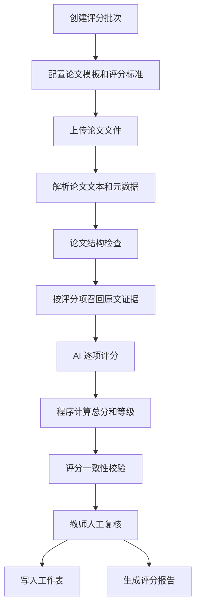

# 毕业生论文智能评分系统需求分析文档

文档版本：v1.0  
编写日期：2026-05-18  
适用对象：产品经理、教务管理人员、学院管理员、论文评阅教师、研发团队

## 1. 项目背景

毕业论文评阅通常存在以下问题：

- 评分标准虽然明确，但不同评阅人对标准的理解和执行尺度存在差异。
- 论文数量较多时，教师需要花费大量时间完成格式检查、基础质量判断和评语撰写。
- 评分过程中的依据不容易沉淀，后续复核、申诉、质量抽检成本较高。
- 评分结果通常需要人工整理到 Excel 或在线工作表，容易产生遗漏和录入错误。

本系统拟基于大模型能力，对学生提交的毕业论文进行辅助评分，并将评分结果、扣分依据、原文证据和修改建议写入工作表。系统定位为“教师辅助评阅系统”，不替代教师最终裁定。

## 2. 建设目标

### 2.1 总体目标

构建一个可上传论文、配置评分标准、自动分析论文内容、生成有依据评分结果、支持人工复核、并将结果写入表格的毕业论文智能评分系统。

### 2.2 具体目标

- 支持论文文件上传和批量评分。
- 支持论文模板和评分标准配置。
- 支持对论文结构、内容质量、引用规范、格式合规性进行辅助分析。
- 按评分项逐项输出分数、扣分原因、原文依据、章节或页码位置。
- 自动计算总分和等级。
- 支持教师人工确认、修改、驳回 AI 评分。
- 将总分和评分明细写入 Excel 或在线工作表。
- 保留评分标准版本、模型版本、评分过程、人工修改记录，满足审计和复核需求。

## 3. 业务范围

### 3.1 本期范围

第一期建议实现 MVP 能力：

- 用户登录和基础角色区分。
- 论文上传，支持 `.docx` 和文本型 `.pdf`。
- 评分标准维护，支持按评分项配置分值和扣分规则。
- 单篇论文自动评分。
- 批量论文评分任务。
- 评分结果页面展示。
- 教师人工复核和修改。
- 生成评分报告。
- 写入 Excel 或 Google Sheets。

### 3.2 后续范围

- 扫描版 PDF OCR 识别。
- 学校教务系统对接。
- 查重系统对接。
- 多模型评分对比。
- 跨学院评分标准管理。
- 学院级、专业级评分质量统计。
- 论文质量趋势分析。
- 教师评分尺度校准。

### 3.3 不在本期范围

- 不作为最终学位授予判断系统。
- 不直接替代论文查重系统。
- 不自动判定学术不端。
- 不直接向学生发布最终成绩，需经教师或管理员确认。

## 4. 用户角色

| 角色 | 说明 | 核心权限 |
|---|---|---|
| 系统管理员 | 维护系统配置、用户、模型和存储 | 用户管理、系统配置、日志查看 |
| 教务管理员 | 管理论文批次、学院、专业、工作表 | 批次管理、导出成绩、查看汇总 |
| 学院管理员 | 管理本学院论文和评分标准 | 上传论文、配置标准、分配评阅人 |
| 评阅教师 | 查看 AI 评分并进行人工复核 | 确认评分、修改分数、填写复核意见 |
| 学生 | 可选角色，本期可不开放 | 上传论文、查看反馈 |

## 5. 核心业务流程

### 5.1 总体流程



### 5.2 单篇评分流程

1. 教师或管理员上传论文。
2. 系统解析论文文件，提取正文、标题、章节、页码和学生信息。
3. 系统检查论文模板完整性，例如摘要、关键词、目录、正文、参考文献是否存在。
4. 系统根据评分标准，针对每个评分项召回相关论文片段。
5. 大模型基于评分项、扣分规则和原文片段输出结构化评分。
6. 系统校验模型输出是否符合 schema。
7. 系统按配置权重计算总分。
8. 系统判断是否需要人工复核。
9. 教师查看评分依据并确认或修改。
10. 系统写入工作表并生成报告。

### 5.3 批量评分流程

1. 创建评分批次。
2. 上传论文压缩包或多文件。
3. 系统识别文件列表和学生信息。
4. 为每篇论文创建评分任务。
5. 异步执行文档解析、证据召回、模型评分。
6. 批次页面展示每篇论文状态。
7. 失败任务支持重试。
8. 全部完成后导出或写入工作表。

## 6. 功能需求

### 6.1 评分批次管理

用于管理一次毕业论文评分工作。

功能包括：

- 新建评分批次。
- 设置批次名称、学院、专业、年级、论文类型。
- 绑定评分标准版本。
- 设置总分、等级规则和是否启用人工复核。
- 查看批次内论文数量、完成数量、失败数量。
- 支持暂停、恢复、归档批次。

关键字段：

| 字段 | 说明 |
|---|---|
| 批次编号 | 系统生成 |
| 批次名称 | 如“2026届计算机学院本科毕业论文评分” |
| 学院 | 所属学院 |
| 专业 | 所属专业 |
| 论文类型 | 本科、硕士、博士、课程论文 |
| 评分标准版本 | 当前批次使用的标准版本 |
| 状态 | 草稿、评分中、待复核、已完成、已归档 |

### 6.2 评分标准管理

评分标准是系统评分的核心配置，必须结构化管理。

功能包括：

- 新建评分标准。
- 配置评分项、满分、权重、扣分规则。
- 配置每个评分项需要检查的论文范围。
- 配置评分等级，例如优秀、良好、中等、及格、不及格。
- 发布评分标准版本。
- 禁止修改已发布且已被批次使用的版本，可复制为新版本。

评分项示例：

| 评分项 | 满分 | 检查重点 |
|---|---:|---|
| 选题意义 | 10 | 研究背景、实际价值、理论价值 |
| 文献综述 | 15 | 文献覆盖、归纳能力、研究空白 |
| 研究方法 | 20 | 方法合理性、实验设计、数据来源 |
| 论文创新性 | 15 | 创新点、对比现有研究、贡献 |
| 论证与分析 | 20 | 逻辑严密性、数据分析、结论支撑 |
| 写作规范 | 10 | 结构完整、格式、图表、语言 |
| 参考文献 | 10 | 数量、格式、引用规范、时效性 |

### 6.3 论文上传与解析

功能包括：

- 支持单篇论文上传。
- 支持批量上传。
- 支持 `.docx`、`.pdf`。
- 自动提取论文标题、作者、学号、专业、导师等信息。
- 自动识别章节结构。
- 保存论文原文件和解析后的文本。
- 对解析失败的文件标记失败原因。

解析结果应包括：

- 完整正文文本。
- 章节树。
- 页码映射。
- 段落编号。
- 表格和图片占位信息。
- 参考文献列表。

### 6.4 论文模板合规检查

系统需要检查论文是否符合模板要求。

检查项包括：

- 是否存在中文摘要。
- 是否存在英文摘要。
- 是否存在关键词。
- 是否存在目录。
- 是否存在正文主体。
- 是否存在结论。
- 是否存在参考文献。
- 章节编号是否基本连续。
- 参考文献数量是否达到最低要求。
- 正文字数是否达到要求。

输出结果包括：

- 检查项名称。
- 是否通过。
- 问题说明。
- 原文位置。
- 对评分项的影响。

### 6.5 证据召回

评分必须有依据，因此系统需要在评分前为每个评分项准备原文证据。

证据召回规则：

- 优先按章节关键词召回。
- 再按语义检索召回相关段落。
- 每个评分项至少提供 3 到 8 条候选证据。
- 证据必须包含章节、页码、段落编号。
- 模型最终引用的证据必须来自系统召回内容或论文原文。

示例：

| 评分项 | 优先召回章节 |
|---|---|
| 选题意义 | 绪论、研究背景、研究意义 |
| 文献综述 | 国内外研究现状、相关工作 |
| 研究方法 | 研究方法、实验设计、数据来源 |
| 论证与分析 | 实验结果、结果分析、讨论 |
| 参考文献 | 参考文献章节、正文引用标记 |

### 6.6 AI 自动评分

系统应按评分项逐项调用模型评分。

每个评分项的输入：

- 论文基本信息。
- 评分标准版本。
- 当前评分项。
- 当前评分项满分和扣分规则。
- 召回的论文证据。
- 结构检查结果。

每个评分项的输出：

- 得分。
- 满分。
- 扣分原因。
- 原文依据。
- 修改建议。
- 置信度。
- 是否建议人工复核。

重要约束：

- 总分由程序计算，不允许模型直接决定最终总分。
- 模型不得引用论文中不存在的内容。
- 模型输出必须符合 JSON Schema。
- 没有足够证据时，模型必须标记为“证据不足”，而不是强行评分。

### 6.7 评分结果展示

评分结果页面应包含：

- 论文基本信息。
- 总分和等级。
- 各评分项得分。
- 每项扣分原因。
- 每项原文依据。
- 每项修改建议。
- AI 置信度。
- 是否需要人工复核。
- 教师复核状态。

建议页面结构：

- 顶部：论文信息和总分。
- 左侧：评分项列表。
- 中间：当前评分项的评分说明。
- 右侧：原文证据和定位。

### 6.8 人工复核

教师可对 AI 评分进行复核。

功能包括：

- 确认 AI 评分。
- 修改单项分数。
- 修改总评语。
- 标记 AI 评分不准确。
- 填写人工复核意见。
- 退回重新评分。

系统必须记录：

- 修改前分数。
- 修改后分数。
- 修改人。
- 修改时间。
- 修改原因。

### 6.9 工作表写入

系统应支持将评分结果写入 Excel 或在线工作表。

建议至少生成两张表：

#### 总分表

| 字段 | 说明 |
|---|---|
| 批次名称 | 当前评分批次 |
| 学号 | 学生编号 |
| 姓名 | 学生姓名 |
| 学院 | 学院 |
| 专业 | 专业 |
| 论文题目 | 论文标题 |
| 评分标准版本 | 使用的评分标准 |
| AI 总分 | AI 初评分 |
| 最终总分 | 教师确认后的分数 |
| 等级 | 优秀、良好、中等、及格、不及格 |
| 主要扣分点 | 摘要说明 |
| 是否人工修改 | 是或否 |
| 是否需要复核 | 是或否 |
| 评分时间 | 系统评分完成时间 |
| 复核教师 | 人工确认人 |
| 报告链接 | 评分报告地址 |

#### 评分明细表

| 字段 | 说明 |
|---|---|
| 学号 | 学生编号 |
| 姓名 | 学生姓名 |
| 论文题目 | 论文标题 |
| 评分项 | 如“研究方法” |
| 满分 | 当前项满分 |
| AI 得分 | 模型初评分 |
| 最终得分 | 人工确认后的分数 |
| 扣分原因 | 具体原因 |
| 原文依据 | 引用短句或摘要 |
| 依据位置 | 页码、章节、段落 |
| 修改建议 | 给学生或教师的建议 |
| 置信度 | 模型自评置信度 |

### 6.10 评分报告

系统应支持生成单篇论文评分报告。

报告内容包括：

- 论文基本信息。
- 使用的评分标准版本。
- 总分和等级。
- 各项得分。
- 主要优点。
- 主要问题。
- 逐项扣分依据。
- 修改建议。
- 教师复核意见。

报告格式：

- MVP：HTML 或 Markdown。
- 正式版本：PDF、Word。

## 7. 非功能需求

### 7.1 准确性

- 每个评分项必须有至少一条依据。
- 总分必须由程序根据单项得分计算。
- 评分结果必须可追溯到评分标准版本和论文原文。

### 7.2 一致性

- 同一批次应使用同一评分标准版本。
- 同一论文重复评分应保留历史记录。
- 模型升级后，新旧评分结果应可区分。

### 7.3 可审计性

系统需保存：

- 原始论文文件。
- 解析后的正文。
- 评分标准版本。
- 模型名称和版本。
- 模型输入摘要。
- 模型输出结果。
- 人工修改记录。

### 7.4 性能

建议目标：

- 单篇论文解析时间小于 30 秒。
- 单篇论文评分时间小于 3 分钟。
- 批量 100 篇论文可异步处理。
- 页面查询响应小于 2 秒。

### 7.5 安全性

- 论文文件属于敏感教学数据，应限制访问权限。
- 下载报告需鉴权。
- 管理员只能查看授权范围内数据。
- API Key、模型密钥、表格密钥不得写入代码仓库。
- 重要操作需要审计日志。

### 7.6 可扩展性

- 评分模型应可替换。
- 评分标准应支持多学院、多专业、多版本。
- 文件存储应可从本地切换到对象存储。
- 表格写入应可支持 Excel、Google Sheets、企业微信文档或飞书表格。

## 8. 数据对象

### 8.1 论文对象

| 字段 | 说明 |
|---|---|
| paper_id | 论文 ID |
| batch_id | 批次 ID |
| student_id | 学号 |
| student_name | 姓名 |
| title | 论文题目 |
| file_url | 原文件地址 |
| parsed_text_url | 解析文本地址 |
| status | 上传、解析中、待评分、评分中、待复核、完成、失败 |

### 8.2 评分标准对象

| 字段 | 说明 |
|---|---|
| rubric_id | 评分标准 ID |
| version | 版本号 |
| name | 标准名称 |
| total_score | 总分 |
| status | 草稿、已发布、已归档 |

### 8.3 评分项对象

| 字段 | 说明 |
|---|---|
| criterion_id | 评分项 ID |
| rubric_id | 所属标准 |
| name | 评分项名称 |
| max_score | 满分 |
| weight | 权重 |
| description | 评分说明 |
| deduction_rules | 扣分规则 |
| evidence_requirements | 证据要求 |

### 8.4 评分结果对象

| 字段 | 说明 |
|---|---|
| score_id | 评分结果 ID |
| paper_id | 论文 ID |
| rubric_id | 评分标准 ID |
| ai_total_score | AI 总分 |
| final_total_score | 最终总分 |
| grade | 等级 |
| need_manual_review | 是否需要人工复核 |
| status | AI 已评分、已复核、已写表 |

## 9. 评分规则建议

### 9.1 总分计算

若评分项满分之和等于 100：

```text
总分 = 各评分项得分之和
```

若评分项使用权重：

```text
总分 = Σ(评分项得分 / 评分项满分 * 权重分)
```

### 9.2 等级规则

| 分数范围 | 等级 |
|---|---|
| 90 到 100 | 优秀 |
| 80 到 89 | 良好 |
| 70 到 79 | 中等 |
| 60 到 69 | 及格 |
| 0 到 59 | 不及格 |

### 9.3 强制人工复核规则

满足任一条件时，系统应标记为需要人工复核：

- 总分低于 60。
- 总分处于等级边界上下 2 分内，例如 58 到 62、68 到 72。
- 任一评分项置信度低于 0.65。
- 任一评分项证据不足。
- 模型输出存在结构校验失败并经过重试。
- 论文解析质量较差。
- 教师手动标记复核。

## 10. 验收标准

### 10.1 功能验收

- 能上传 `.docx` 和文本型 `.pdf` 论文。
- 能维护至少一套评分标准。
- 能对论文逐项评分并生成结构化结果。
- 每个评分项均包含分数、扣分原因、原文依据和建议。
- 能人工修改评分并保存修改记录。
- 能导出或写入工作表。
- 能查看单篇论文评分报告。

### 10.2 质量验收

- 随机抽取 20 篇论文，AI 评分结果均有可追溯依据。
- 工作表写入字段完整，不能错行或漏行。
- 人工修改记录完整保留。
- 同一批次评分标准版本一致。
- 模型异常、文件解析失败、表格写入失败均有明确错误提示。

## 11. 风险与应对

| 风险 | 影响 | 应对 |
|---|---|---|
| 模型评分不稳定 | 分数波动 | 固定评分标准版本、结构化输出、低温度、二次复核 |
| 模型引用不存在内容 | 评分依据失真 | 限制证据来源，保存原文位置，做引用校验 |
| PDF 解析质量差 | 评分依据缺失 | 优先要求 `.docx`，PDF 引入 OCR 和人工确认 |
| 教师不信任 AI 结果 | 系统使用率低 | 强调辅助评分，展示依据，支持人工修改 |
| 批量任务失败 | 影响评分进度 | 异步任务、失败重试、任务状态可视化 |
| 表格写入错误 | 成绩数据风险 | 写入前预览，写入后校验，保存写入日志 |

## 12. 参考资料

- OpenAI Structured Outputs：https://developers.openai.com/api/docs/guides/structured-outputs
- OpenAI File Search：https://developers.openai.com/api/docs/guides/tools-file-search
- Google Sheets API Append：https://developers.google.com/workspace/sheets/api/reference/rest/v4/spreadsheets.values/append
- pgvector：https://github.com/pgvector/pgvector
- Celery：https://docs.celeryq.dev/en/main/getting-started/introduction.html
