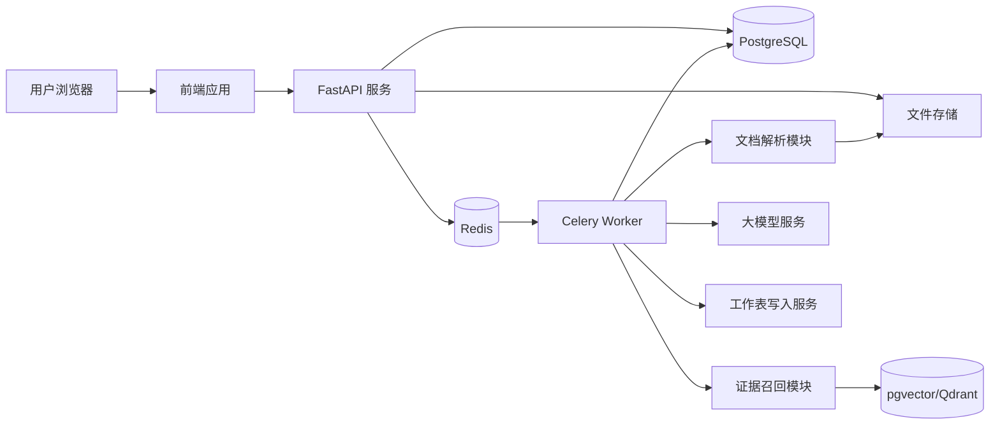
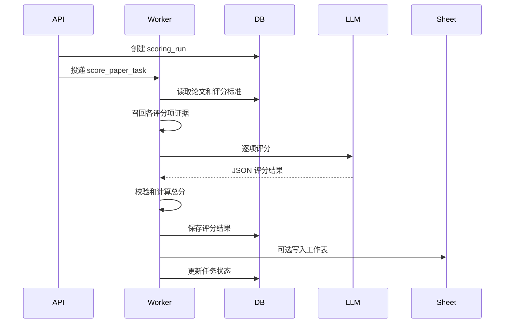

# 毕业生论文智能评分系统技术开发文档

文档版本：v1.0  
编写日期：2026-05-18  
适用对象：后端工程师、前端工程师、算法工程师、测试工程师、运维工程师

## 1. 技术目标

本系统的技术目标是构建一套可审计、可扩展、可人工复核的 AI 论文评分平台。系统不只输出分数，还必须输出评分依据、原文位置、扣分原因和修改建议，并将结果稳定写入工作表。

关键设计原则：

- 评分标准结构化。
- 论文内容结构化。
- 模型输出结构化。
- 评分依据可追溯。
- 总分由程序计算。
- 人工修改可审计。
- 模型、表格、存储均可替换。

## 2. 推荐技术栈

| 层级 | 推荐技术 | 说明 |
|---|---|---|
| 前端 | React + TypeScript + Ant Design | 适合后台管理和表格型业务 |
| MVP 前端 | Streamlit | 内部验证速度快 |
| 后端 | Python + FastAPI | 文档解析、AI 调用、异步任务生态成熟 |
| ORM | SQLAlchemy 2.x | 数据库模型和迁移方便 |
| 数据库 | PostgreSQL | 存储业务数据、评分结果、审计记录 |
| 向量检索 | PostgreSQL + pgvector | MVP 阶段减少组件数量 |
| 大规模向量库 | Qdrant | 后续多学院、多文档检索扩容 |
| 异步任务 | Celery + Redis | 批量评分和长耗时任务 |
| 文件存储 | 本地文件、MinIO、S3、OSS | 通过 Storage Adapter 抽象 |
| 模型调用 | OpenAI Responses API / Azure OpenAI / 国产模型 | 通过 LLM Adapter 抽象 |
| 表格写入 | Google Sheets API / openpyxl | 在线表格或本地 Excel |
| 部署 | Docker Compose；后续 Kubernetes | 便于本地和服务器部署 |
| 监控 | Prometheus + Grafana；MVP 可用日志 | 监控任务耗时和失败率 |

## 3. 总体架构



### 3.1 核心服务

| 服务 | 职责 |
|---|---|
| API 服务 | 用户请求、鉴权、任务创建、结果查询 |
| Worker 服务 | 文档解析、AI 评分、报告生成、表格写入 |
| 数据库 | 存储业务数据、评分结果、日志 |
| 文件存储 | 存储论文原文、解析文本、报告 |
| 向量检索 | 存储论文切片 embedding，用于证据召回 |
| 模型服务 | 输出结构化评分结果 |

## 4. 推荐项目结构

```text
paper-grading-system/
  backend/
    app/
      api/
        routes/
          auth.py
          batches.py
          papers.py
          rubrics.py
          scoring.py
          reviews.py
          exports.py
      core/
        config.py
        security.py
        logging.py
      db/
        models.py
        session.py
        migrations/
      schemas/
        batch.py
        paper.py
        rubric.py
        scoring.py
        review.py
      services/
        document_parser/
        chunking/
        retrieval/
        llm/
        scoring/
        spreadsheet/
        report/
        storage/
      workers/
        celery_app.py
        tasks.py
      tests/
    pyproject.toml
  frontend/
    src/
      pages/
      components/
      api/
      stores/
      types/
  docker-compose.yml
  README.md
```

## 5. 模块设计

### 5.1 文档解析模块

职责：

- 接收论文文件。
- 判断文件类型。
- 提取文本、页码、章节和段落。
- 提取学生信息和论文题目。
- 输出统一的 `ParsedPaper` 数据结构。

建议实现：

| 文件类型 | 工具 |
|---|---|
| `.docx` | `python-docx` |
| 文本型 `.pdf` | `PyMuPDF` 或 `pdfplumber` |
| 扫描型 PDF | OCR，后续引入 |

统一输出结构：

```json
{
  "title": "论文题目",
  "student_id": "20260001",
  "student_name": "张三",
  "sections": [
    {
      "section_id": "sec_001",
      "title": "第一章 绪论",
      "level": 1,
      "page_start": 1,
      "page_end": 5,
      "paragraphs": [
        {
          "paragraph_id": "p_001",
          "page": 1,
          "text": "论文原文段落"
        }
      ]
    }
  ],
  "references": []
}
```

### 5.2 分块与向量化模块

职责：

- 将论文按章节和段落切分。
- 生成用于检索的 chunk。
- 计算 embedding。
- 写入 pgvector 或 Qdrant。

分块建议：

- 每个 chunk 控制在 500 到 1000 中文字符。
- 保留章节标题、页码、段落编号。
- 相邻 chunk 保留少量 overlap。
- 参考文献单独切分。

Chunk 字段：

| 字段 | 说明 |
|---|---|
| chunk_id | 切片 ID |
| paper_id | 论文 ID |
| section_title | 章节标题 |
| page | 页码 |
| paragraph_ids | 包含的段落 ID |
| text | 切片文本 |
| embedding | 向量 |

### 5.3 评分标准模块

职责：

- 管理评分标准和版本。
- 提供评分项给 AI 评分服务。
- 校验评分项总分是否正确。

评分标准建议使用 JSON 保存结构化细节：

```json
{
  "rubric_id": "rubric_2026_cs_undergraduate",
  "version": "v1.0",
  "total_score": 100,
  "criteria": [
    {
      "criterion_id": "C01",
      "name": "选题意义",
      "max_score": 10,
      "description": "考察选题的理论意义、现实意义和问题价值。",
      "evidence_hints": ["绪论", "研究背景", "研究意义"],
      "deduction_rules": [
        "研究意义表述笼统，扣 1 到 3 分",
        "缺少问题背景，扣 1 到 2 分",
        "选题价值不足，扣 3 到 5 分"
      ]
    }
  ]
}
```

### 5.4 证据召回模块

职责：

- 根据评分项召回相关论文片段。
- 提供给模型作为评分依据。
- 降低模型凭空判断的风险。

召回策略：

1. 章节关键词匹配。
2. 全文关键词检索。
3. 向量相似度检索。
4. 混合排序。
5. 去重和长度控制。

输入：

```json
{
  "paper_id": "paper_001",
  "criterion": {
    "name": "研究方法",
    "evidence_hints": ["研究方法", "实验设计", "数据来源"]
  },
  "top_k": 8
}
```

输出：

```json
{
  "evidence_candidates": [
    {
      "chunk_id": "chunk_001",
      "section_title": "第三章 研究方法",
      "page": 12,
      "text": "本文采用问卷调查与回归分析方法..."
    }
  ]
}
```

### 5.5 AI 评分模块

职责：

- 构造模型输入。
- 调用大模型。
- 使用 JSON Schema 约束输出。
- 校验模型输出。
- 失败时进行有限次数重试。

模型建议：

- 正式版可使用支持结构化输出的强模型。
- 成本敏感场景可用较小模型做初评，低置信度项再用强模型复核。
- temperature 建议设置为 0 到 0.3，降低随机性。

模型输入原则：

- 明确评分角色。
- 明确只能基于给定证据评分。
- 明确不能编造原文。
- 明确分数范围。
- 明确输出 schema。

评分提示词模板：

```text
你是毕业论文评阅助手。请基于评分标准和论文证据，对当前评分项进行辅助评分。

限制：
1. 只能基于提供的论文证据评分。
2. 不得引用证据中不存在的内容。
3. 如果证据不足，请标记 evidence_sufficient=false，并说明缺失信息。
4. 得分必须在 0 到 max_score 之间。
5. 扣分原因必须与评分标准相关。

论文信息：
{paper_info}

评分项：
{criterion}

论文证据：
{evidence_candidates}

请输出符合 JSON Schema 的结果。
```

结构化输出 schema：

```json
{
  "type": "object",
  "additionalProperties": false,
  "required": [
    "criterion_id",
    "criterion_name",
    "max_score",
    "score",
    "evidence_sufficient",
    "reason",
    "deductions",
    "evidence",
    "suggestion",
    "confidence",
    "need_manual_review"
  ],
  "properties": {
    "criterion_id": { "type": "string" },
    "criterion_name": { "type": "string" },
    "max_score": { "type": "number" },
    "score": { "type": "number" },
    "evidence_sufficient": { "type": "boolean" },
    "reason": { "type": "string" },
    "deductions": {
      "type": "array",
      "items": { "type": "string" }
    },
    "evidence": {
      "type": "array",
      "items": {
        "type": "object",
        "additionalProperties": false,
        "required": ["quote", "location", "chunk_id"],
        "properties": {
          "quote": { "type": "string" },
          "location": { "type": "string" },
          "chunk_id": { "type": "string" }
        }
      }
    },
    "suggestion": { "type": "string" },
    "confidence": { "type": "number", "minimum": 0, "maximum": 1 },
    "need_manual_review": { "type": "boolean" }
  }
}
```

### 5.6 总分计算模块

职责：

- 汇总各项评分。
- 校验分数边界。
- 计算总分和等级。
- 判断是否需要人工复核。

伪代码：

```python
def calculate_total_score(item_scores, grade_rules):
    total = 0
    for item in item_scores:
        if item.score < 0 or item.score > item.max_score:
            raise ValueError("score out of range")
        total += item.score

    grade = match_grade(total, grade_rules)
    need_review = any([
        total < 60,
        is_near_grade_boundary(total),
        any(item.confidence < 0.65 for item in item_scores),
        any(not item.evidence_sufficient for item in item_scores),
        any(item.need_manual_review for item in item_scores),
    ])

    return total, grade, need_review
```

### 5.7 工作表写入模块

职责：

- 将评分结果写入 Excel 或 Google Sheets。
- 记录写入状态。
- 写入失败可重试。

适配器设计：

```python
class SpreadsheetWriter:
    def append_summary_rows(self, rows: list[dict]) -> None:
        raise NotImplementedError

    def append_detail_rows(self, rows: list[dict]) -> None:
        raise NotImplementedError
```

实现：

- `ExcelWriter`：使用 `openpyxl` 生成或追加 `.xlsx`。
- `GoogleSheetsWriter`：使用 Google Sheets API 追加行。

写入策略：

- 先写入系统数据库。
- 再异步写入工作表。
- 写表成功后记录 sheet row id 或响应信息。
- 写表失败不影响系统内评分结果，但状态标记为“写表失败”。

### 5.8 人工复核模块

职责：

- 展示 AI 评分。
- 支持人工修改。
- 保存修改历史。

复核规则：

- 教师可以修改单项最终得分。
- 总分随单项最终得分自动重算。
- 修改必须填写原因。
- 系统保留 AI 初评分和最终分。

### 5.9 报告生成模块

职责：

- 生成单篇论文评分报告。
- 报告包含总分、等级、评分明细、证据和建议。

MVP 输出：

- Markdown。
- HTML。

正式输出：

- PDF。
- Word。

## 6. 数据库设计

以下为核心表设计，实际开发可根据 ORM 规范调整。

### 6.1 users

```sql
CREATE TABLE users (
  id UUID PRIMARY KEY,
  username VARCHAR(100) NOT NULL UNIQUE,
  display_name VARCHAR(100) NOT NULL,
  role VARCHAR(50) NOT NULL,
  department VARCHAR(100),
  password_hash TEXT,
  created_at TIMESTAMP NOT NULL DEFAULT now(),
  updated_at TIMESTAMP NOT NULL DEFAULT now()
);
```

### 6.2 grading_batches

```sql
CREATE TABLE grading_batches (
  id UUID PRIMARY KEY,
  name VARCHAR(200) NOT NULL,
  department VARCHAR(100),
  major VARCHAR(100),
  academic_year VARCHAR(20),
  rubric_id UUID NOT NULL,
  status VARCHAR(50) NOT NULL,
  created_by UUID REFERENCES users(id),
  created_at TIMESTAMP NOT NULL DEFAULT now(),
  updated_at TIMESTAMP NOT NULL DEFAULT now()
);
```

### 6.3 rubrics

```sql
CREATE TABLE rubrics (
  id UUID PRIMARY KEY,
  name VARCHAR(200) NOT NULL,
  version VARCHAR(50) NOT NULL,
  total_score NUMERIC(5,2) NOT NULL,
  status VARCHAR(50) NOT NULL,
  description TEXT,
  created_by UUID REFERENCES users(id),
  created_at TIMESTAMP NOT NULL DEFAULT now(),
  published_at TIMESTAMP,
  UNIQUE(name, version)
);
```

### 6.4 rubric_criteria

```sql
CREATE TABLE rubric_criteria (
  id UUID PRIMARY KEY,
  rubric_id UUID NOT NULL REFERENCES rubrics(id),
  code VARCHAR(50) NOT NULL,
  name VARCHAR(100) NOT NULL,
  max_score NUMERIC(5,2) NOT NULL,
  weight NUMERIC(5,2),
  description TEXT,
  evidence_hints JSONB,
  deduction_rules JSONB,
  display_order INTEGER NOT NULL,
  created_at TIMESTAMP NOT NULL DEFAULT now(),
  UNIQUE(rubric_id, code)
);
```

### 6.5 papers

```sql
CREATE TABLE papers (
  id UUID PRIMARY KEY,
  batch_id UUID NOT NULL REFERENCES grading_batches(id),
  student_id VARCHAR(100),
  student_name VARCHAR(100),
  title TEXT,
  department VARCHAR(100),
  major VARCHAR(100),
  advisor VARCHAR(100),
  file_name TEXT NOT NULL,
  file_path TEXT NOT NULL,
  parsed_text_path TEXT,
  parse_quality NUMERIC(4,3),
  status VARCHAR(50) NOT NULL,
  error_message TEXT,
  created_at TIMESTAMP NOT NULL DEFAULT now(),
  updated_at TIMESTAMP NOT NULL DEFAULT now()
);
```

### 6.6 paper_chunks

```sql
CREATE TABLE paper_chunks (
  id UUID PRIMARY KEY,
  paper_id UUID NOT NULL REFERENCES papers(id),
  section_title TEXT,
  page_start INTEGER,
  page_end INTEGER,
  paragraph_ids JSONB,
  text TEXT NOT NULL,
  embedding vector,
  created_at TIMESTAMP NOT NULL DEFAULT now()
);
```

说明：如果使用 pgvector，需要先启用 `CREATE EXTENSION vector;`，并根据 embedding 维度设置 `vector(1536)` 等具体类型。

### 6.7 scoring_runs

```sql
CREATE TABLE scoring_runs (
  id UUID PRIMARY KEY,
  paper_id UUID NOT NULL REFERENCES papers(id),
  rubric_id UUID NOT NULL REFERENCES rubrics(id),
  model_provider VARCHAR(100) NOT NULL,
  model_name VARCHAR(100) NOT NULL,
  model_version VARCHAR(100),
  status VARCHAR(50) NOT NULL,
  ai_total_score NUMERIC(6,2),
  final_total_score NUMERIC(6,2),
  grade VARCHAR(50),
  need_manual_review BOOLEAN NOT NULL DEFAULT false,
  started_at TIMESTAMP,
  finished_at TIMESTAMP,
  created_at TIMESTAMP NOT NULL DEFAULT now()
);
```

### 6.8 score_items

```sql
CREATE TABLE score_items (
  id UUID PRIMARY KEY,
  scoring_run_id UUID NOT NULL REFERENCES scoring_runs(id),
  criterion_id UUID NOT NULL REFERENCES rubric_criteria(id),
  max_score NUMERIC(5,2) NOT NULL,
  ai_score NUMERIC(5,2) NOT NULL,
  final_score NUMERIC(5,2),
  evidence_sufficient BOOLEAN NOT NULL,
  reason TEXT NOT NULL,
  deductions JSONB,
  evidence JSONB,
  suggestion TEXT,
  confidence NUMERIC(4,3),
  need_manual_review BOOLEAN NOT NULL DEFAULT false,
  raw_model_output JSONB,
  created_at TIMESTAMP NOT NULL DEFAULT now()
);
```

### 6.9 review_logs

```sql
CREATE TABLE review_logs (
  id UUID PRIMARY KEY,
  scoring_run_id UUID NOT NULL REFERENCES scoring_runs(id),
  score_item_id UUID REFERENCES score_items(id),
  reviewer_id UUID NOT NULL REFERENCES users(id),
  before_score NUMERIC(5,2),
  after_score NUMERIC(5,2),
  reason TEXT NOT NULL,
  created_at TIMESTAMP NOT NULL DEFAULT now()
);
```

### 6.10 spreadsheet_write_logs

```sql
CREATE TABLE spreadsheet_write_logs (
  id UUID PRIMARY KEY,
  scoring_run_id UUID NOT NULL REFERENCES scoring_runs(id),
  target_type VARCHAR(50) NOT NULL,
  target_id TEXT,
  status VARCHAR(50) NOT NULL,
  response JSONB,
  error_message TEXT,
  created_at TIMESTAMP NOT NULL DEFAULT now()
);
```

## 7. API 设计

### 7.1 批次接口

| 方法 | 路径 | 说明 |
|---|---|---|
| POST | `/api/batches` | 创建评分批次 |
| GET | `/api/batches` | 查询批次列表 |
| GET | `/api/batches/{batch_id}` | 查询批次详情 |
| PATCH | `/api/batches/{batch_id}` | 更新批次 |
| POST | `/api/batches/{batch_id}/start` | 启动批量评分 |

### 7.2 评分标准接口

| 方法 | 路径 | 说明 |
|---|---|---|
| POST | `/api/rubrics` | 创建评分标准 |
| GET | `/api/rubrics` | 查询评分标准列表 |
| GET | `/api/rubrics/{rubric_id}` | 查询评分标准详情 |
| POST | `/api/rubrics/{rubric_id}/publish` | 发布评分标准 |
| POST | `/api/rubrics/{rubric_id}/clone` | 复制新版本 |

### 7.3 论文接口

| 方法 | 路径 | 说明 |
|---|---|---|
| POST | `/api/papers/upload` | 上传单篇论文 |
| POST | `/api/papers/bulk-upload` | 批量上传论文 |
| GET | `/api/papers/{paper_id}` | 查询论文详情 |
| GET | `/api/papers/{paper_id}/parsed` | 查询解析结果 |
| POST | `/api/papers/{paper_id}/parse` | 重新解析 |

### 7.4 评分接口

| 方法 | 路径 | 说明 |
|---|---|---|
| POST | `/api/papers/{paper_id}/score` | 创建评分任务 |
| GET | `/api/scoring-runs/{run_id}` | 查询评分结果 |
| GET | `/api/scoring-runs/{run_id}/items` | 查询评分明细 |
| POST | `/api/scoring-runs/{run_id}/retry` | 重试评分 |

### 7.5 复核接口

| 方法 | 路径 | 说明 |
|---|---|---|
| POST | `/api/scoring-runs/{run_id}/review` | 提交复核 |
| PATCH | `/api/score-items/{item_id}` | 修改单项分数 |
| GET | `/api/scoring-runs/{run_id}/review-logs` | 查看复核日志 |

### 7.6 导出接口

| 方法 | 路径 | 说明 |
|---|---|---|
| POST | `/api/scoring-runs/{run_id}/write-sheet` | 写入工作表 |
| GET | `/api/batches/{batch_id}/export.xlsx` | 导出批次 Excel |
| GET | `/api/scoring-runs/{run_id}/report` | 下载评分报告 |

## 8. 异步任务设计

### 8.1 任务类型

| 任务 | 说明 |
|---|---|
| `parse_paper_task` | 解析论文 |
| `embed_paper_task` | 论文分块和向量化 |
| `score_paper_task` | 单篇论文评分 |
| `score_criterion_task` | 单个评分项评分 |
| `write_sheet_task` | 写入工作表 |
| `generate_report_task` | 生成报告 |

### 8.2 单篇评分任务编排



### 8.3 重试策略

| 场景 | 重试策略 |
|---|---|
| 模型调用超时 | 最多重试 3 次，指数退避 |
| JSON schema 校验失败 | 使用修复提示词重试 1 到 2 次 |
| 表格写入失败 | 最多重试 3 次 |
| 文件解析失败 | 不自动重试，提示人工检查 |

## 9. 关键业务算法

### 9.1 论文结构检测

检测思路：

- 使用章节标题正则识别。
- 使用关键词识别摘要、关键词、目录、参考文献。
- 对 `.docx` 优先读取标题样式。
- 对 PDF 使用文本标题模式识别。

输出：

```json
{
  "checks": [
    {
      "code": "HAS_ABSTRACT_CN",
      "name": "中文摘要",
      "passed": true,
      "message": "检测到中文摘要",
      "location": "第1页"
    }
  ],
  "parse_quality": 0.92
}
```

### 9.2 证据校验

模型输出 evidence 后，系统应校验：

- `chunk_id` 是否存在于候选证据。
- `quote` 是否能在对应 chunk 文本中找到，或与 chunk 有高相似度。
- 证据数量是否满足要求。

校验失败时：

- 标记该评分项需要人工复核。
- 可触发一次重新评分。

### 9.3 分数边界校验

校验规则：

- 单项得分不能小于 0。
- 单项得分不能大于满分。
- 小数位统一保留 1 位或 2 位。
- 总分不能大于评分标准总分。

## 10. 前端页面设计

### 10.1 页面列表

| 页面 | 功能 |
|---|---|
| 登录页 | 用户登录 |
| 批次列表页 | 查看评分批次 |
| 批次详情页 | 查看批次论文和状态 |
| 评分标准页 | 创建和维护评分标准 |
| 论文上传页 | 上传单篇或批量论文 |
| 评分结果页 | 查看 AI 评分和依据 |
| 人工复核页 | 修改分数和提交意见 |
| 导出配置页 | 配置 Excel 或在线表格 |
| 系统日志页 | 查看任务和错误日志 |

### 10.2 评分结果页布局

建议布局：

- 顶部：论文题目、学生信息、总分、等级、状态。
- 左侧：评分项导航和得分。
- 中间：当前评分项的原因、扣分点、建议。
- 右侧：原文证据列表。
- 底部：人工复核操作区。

### 10.3 关键交互

- 点击评分项时切换评分明细。
- 点击证据时定位到原文段落。
- 修改分数时实时重算总分。
- 提交复核时必须填写原因。
- 写入工作表前展示预览。

## 11. 配置项

建议使用环境变量或配置中心：

| 配置项 | 说明 |
|---|---|
| `DATABASE_URL` | PostgreSQL 连接 |
| `REDIS_URL` | Redis 连接 |
| `STORAGE_BACKEND` | local、minio、s3 |
| `OPENAI_API_KEY` | 模型 API Key |
| `LLM_PROVIDER` | openai、azure、custom |
| `LLM_MODEL` | 评分模型名称 |
| `EMBEDDING_MODEL` | 向量模型名称 |
| `GOOGLE_SHEETS_CREDENTIALS` | Google Sheets 凭证路径 |
| `MAX_UPLOAD_SIZE_MB` | 上传文件大小限制 |
| `SCORING_TEMPERATURE` | 模型温度 |

## 12. 安全设计

### 12.1 鉴权

- MVP 可使用账号密码登录。
- 正式环境建议接入学校统一身份认证。
- API 使用 JWT。

### 12.2 权限控制

建议 RBAC：

- 系统管理员：全部权限。
- 教务管理员：全校或授权学院数据。
- 学院管理员：本学院数据。
- 教师：被分配论文和复核任务。
- 学生：仅自己的论文和反馈。

### 12.3 数据安全

- 文件下载必须鉴权。
- API Key 不落库明文。
- 敏感日志脱敏。
- 评分 prompt 中避免发送无关个人信息。
- 支持按批次归档和删除。

## 13. 日志与审计

需要记录：

- 用户登录日志。
- 文件上传日志。
- 论文解析日志。
- 模型调用日志。
- 评分结果生成日志。
- 人工修改日志。
- 工作表写入日志。
- 任务失败日志。

模型调用日志建议字段：

| 字段 | 说明 |
|---|---|
| scoring_run_id | 评分任务 |
| criterion_id | 评分项 |
| model_provider | 模型供应商 |
| model_name | 模型名称 |
| input_token_count | 输入 token |
| output_token_count | 输出 token |
| latency_ms | 耗时 |
| status | 成功或失败 |
| error_message | 错误信息 |

## 14. 测试方案

### 14.1 单元测试

覆盖：

- 评分标准校验。
- 总分计算。
- 等级计算。
- JSON Schema 校验。
- 证据引用校验。
- 表格行数据转换。

### 14.2 集成测试

覆盖：

- 上传论文到解析完成。
- 解析到评分完成。
- 评分到人工复核完成。
- 复核到写入工作表完成。

### 14.3 样本测试

准备至少 20 篇匿名论文样本：

- 结构完整论文。
- 缺少摘要论文。
- 缺少参考文献论文。
- 低质量论文。
- PDF 解析困难论文。
- 临界分数论文。

### 14.4 人工评估

邀请教师评估：

- 分数是否基本合理。
- 扣分依据是否可信。
- 修改建议是否有帮助。
- 是否减少评阅工作量。

## 15. 部署方案

### 15.1 MVP Docker Compose

组件：

- frontend
- backend
- worker
- postgres
- redis
- minio，可选

### 15.2 生产部署

建议：

- 前端部署到 Nginx 或对象存储 CDN。
- API 和 Worker 独立部署。
- PostgreSQL 使用托管数据库或高可用实例。
- Redis 使用托管实例。
- 文件存储使用对象存储。
- 模型 API Key 使用密钥管理服务。

## 16. 开发里程碑

### 阶段一：MVP 验证

周期建议：2 到 4 周。

交付：

- 论文上传。
- 评分标准配置。
- 文档解析。
- 单篇 AI 评分。
- 评分结果展示。
- Excel 导出。

### 阶段二：批量评分和复核

周期建议：3 到 5 周。

交付：

- 批量上传。
- Celery 异步任务。
- 批次进度页面。
- 人工复核。
- Google Sheets 写入。
- 评分报告。

### 阶段三：生产增强

周期建议：4 到 8 周。

交付：

- 权限管理。
- 审计日志。
- 多评分标准版本。
- 向量检索优化。
- OCR。
- 教务系统对接。
- 监控和告警。

## 17. 开发注意事项

- 不要一次性让模型给整篇论文总分，应逐评分项评分。
- 不要让模型负责最终总分计算。
- 不要只保存模型结论，必须保存证据和原文位置。
- 不要覆盖评分标准历史版本。
- 不要将表格作为唯一数据源，数据库才是主数据源。
- 不要在代码中硬编码 API Key。
- 不要忽略人工修改日志。

## 18. 参考资料

- OpenAI Structured Outputs：https://developers.openai.com/api/docs/guides/structured-outputs
- OpenAI File Search：https://developers.openai.com/api/docs/guides/tools-file-search
- Google Sheets API Append：https://developers.google.com/workspace/sheets/api/reference/rest/v4/spreadsheets.values/append
- pgvector：https://github.com/pgvector/pgvector
- Celery：https://docs.celeryq.dev/en/main/getting-started/introduction.html
